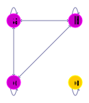
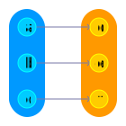
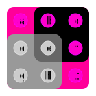
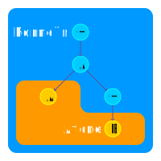

# Mathematik Ⅰ

## Grundlegende Mathematik
### Mengen
Eine Menge ist eine **ungeordnete** Sammlung von Objekten, den Elementen. Man schreibt $m \in M$ um auszudrücken, dass das Objekt $m$ ein Element der Menge $M$ ist. Mit $m \notin M$ wird das Gegeteil ausgedrückt. Mengen können auch andere Mengen enthalten, jedoch nicht sich selbst. Mengen können auf zwei verschiedene Arten definiert werden. Durch Aufzählung der Elemente oder durch deren Charakteristische Eigenschaft.

$$\left\{a, b, c, d\right\}$$

Die Menge, welche keine Elemente enthält wird mit $\emptyset$ oder $\{\}$ bezeichnet.

### Tupel
Ein Tupel ist eine **geordnete** Sammlung von Objekten.
$$\left(a, b, c, d\right)$$

### Relationen
#### Mengen-Relationen
Zwischen zwei Mengen sind folgende Relation definiert.

| Relation        |  Schreibweise   | Beschreibung         |
| :-------------- | :-------------: | :------------------- |
| Gleich          |     $M = N$     | Gleiche Elemente     |
| Teilmenge       | $M \subseteq N$ | Ausschnitt aus Menge |
| Echte-Teilmenge |  $M \subset N$  | Ausschnitt aus Menge |

Falls keine Relation besteht werden die Mengen als **Disjunkt** bezeichnet.
Relationen werden zum Beispiel für Konditionen verwendet.

#### Kartesisches Produkt
Das Kartesische Produkt liefert alle möglichen Kombinationen zwischen den Elementen von Mengen als Tupel.
$$M \times N = \left\{(m, n) | m \in M, n \in N\right\}$$

Das $n$-fache Kartesische Produkt einer Menge mit sich selbst ist wie folgt definiert.
$$M^n = M \times M \times ... \times M$$

#### Relationen
Eine Relation $R$ gibt die Beziehung zwischen bestimmten Objekten an. Sie ist eine Teilmenge eines Kartesischen Produkts.
$$R \subseteq M^n$$

Mit $\left(a, b\right) \in R$ bezeichnet man, dass $a$ mit $b$ in Relation steht. Eine Relation $R$ kann auf verschiedene Mengen bezogen sein und verschiedene Eigenschaften auf den jeweiligen Mengen besitzen.

#### Relationen-Eigenschaften
| Eigenschaft        | Definition                                            | Beschreibung                                                         | Beispiel Graph                         |
| ------------------ | ----------------------------------------------------- | -------------------------------------------------------------------- | -------------------------------------- |
| Reflexiv           | $$\forall a \in M: (a, a) \in R$$                     | Alles steht mit sich selbst in Relation                              |             |
| Symmetrisch        | $$(a,b) \in R \Rightarrow (b,a) \in R$$               | Alle Relationen sind Beidseitig.                                     |          |
| Antisymmetrisch    | $$(a,b), (b,a) \in R \Rightarrow a = b$$              | Alle Relationen sind Einseitig.                                      |      |
| Transitiv          | $$(a,b),(b,c)\in R \Rightarrow (a,c)\in R$$           | Über zwei Relationen verknüpfte Elemente sind auch direkt verknüpft. |            |
| Total              | $$\forall a,b \in M: (a,b) \in R \lor (b,a) \in R$$   | Alles steht mit allem mindestens Einseitig in Relation.              |                |
| Halbordnung        | Reflexiv, <b>Antisymmetrisch</b> und Transitiv.       | -                                                                    |          |
| Totalordnung       | Reflexiv, <b>Antisymmetrisch</b> Transitiv und Total. | Die Relation gibt den Elementen eine Reihenfolge.                    |         |
| Äquivalenzrelation | Reflexiv, <b>Symmetrisch</b> und Transitiv            | Die Relation unterteilt eine Menge in Äquivalenzklassen.             |  |

#### Äquivalenzklassen
Alle Elemente einer Äquivalenzklasse sind Äquivalent.

| Äquivalenzklasse 1                                | Äquivalenzklasse 2                     |
| ------------------------------------------------- | -------------------------------------- |
|             |  |
| $$[a]_R = [b]_R = [c]_R$$ $$[a]_R = \{a, b, c\}$$ | $$[d]_R$$ $$[d]_R = \{d\}$$            |

Die Menge der Äquivalenzklassen lautet wie folgt.

$$M/R = \{\{a, b, c\}, \{d\}\}$$

### Abbildungen
Eine Abbildung bzw. Funktion ist ein Sonderfall einer Relation.
$$f = \left\{\left(m_1, n_1\right), \left(m_2, n_2\right), ...\right\} \subset M \times N$$

Sie weist jedem Element aus einer Menge, dem Definitionsbereich, eine Element aus einer Menge, dem Bildbereich, zu. Formal wird folgende Schreibweise verwendet.

$$f: M \rightarrow N$$
$$m_1 \mapsto n_1$$
$$m_2 \mapsto n_2$$
$$...$$

Um für ein Element $x$ das von der Funktion $f$ zugeordnete Element $y$ zu erhalten wird folgende Notation verwendet.

$$y = f(x)$$

Die Abbildung $id_M$ ist die Identität auf einer Menge $M$. Sie bildet jedes Element der Menge auf das gleiche Element ab.
Mit $f \circ g$ drückt man aus, dass $f$ nach $g$ ausgeführt wird. Wenn $f \circ g = id_N$ und $g \circ f = id_M$ gilt dann sind $f$ und $g$ invers zu einander.

$$f:M \rightarrow N$$
$$m_1 \mapsto n_1$$
$$m_2 \mapsto n_2$$
$$...$$

$$g:N \rightarrow M$$
$$n_1 \mapsto m_1$$
$$n_2 \mapsto m_2$$
$$...$$

Der Bildbereich ist so definiert:

$$Bild(f) = \{f(m) | m \in M\}$$

Mit $Abb(M, N)$ erhält man eine Menge aller Abbildungen von der Menge $M$ zur Menge $N$.

|                              Injektiv                               |                              Surjektiv                              |
| :-----------------------------------------------------------------: | :-----------------------------------------------------------------: |
|                                           |                                          |
| Jedes Element aus dem Bildbereich wird **maximal einmal** getroffen | Jedes Element aus dem Bildbereich wird **minimal einmal** getroffen |
|        $$\forall a,b \in M: f(a) = f(b) \Rightarrow a = b$$         |           $$\forall b \in N: \exists a \in M: f(a) = b$$            |

|                                                     Bijektiv                                                     |
| :--------------------------------------------------------------------------------------------------------------: |
|                                                                                        |
| Jedes Element aus dem Bildbereich wird **genau einmal** getroffen. Bijektive Abbildungen sind immer invertierbar |

### Mengen-Operationen
Um Operationen auf Mengen auszuführen benötigt man ein **Universum** $U$, als Referenz Menge.

| Vereinigung                   | Schnitt                   | Differenz                   | Komplement                   |
| ----------------------------- | ------------------------- | --------------------------- | ---------------------------- |
|  |  |  |  |
| $$M \cup N$$                  | $$M \cap N$$              | $$M \setminus N$$           | $$M^C$$                      |

Die Menge aller Teilmengen der Menge $M$ erhält man wie folgt.
$P(M)=\{m \in U m \subseteq M\}$

### Zahlen Mengen
#### Natürliche Zahlen
Die Menge der Natürlichen Zahlen ist rekursiv definiert. Die Zahl $1$ ist eine Natürliche Zahl.
$$1 \in \mathbb{N}$$
Für jede natürliche Zahl $n$ ist der Nachfolger $\sigma(n)$ auch eine Natürliche Zahl.
$$n \in N \Rightarrow \sigma(n) \in N$$

Für die Menge $\mathbb{N_0}$ gilt zusätzlich.
$$\mathbb{N_0} = \{0\} \cup \mathbb{N}$$
$$\sigma(0) = 1$$

#### Ganze Zahlen
Die Menge der Ganzen Zahlen ist eine Äquivalenzrelation auf den Natürlichen Zahlen.
$$\mathbb{Z} = \left\{((a,b), (c,d)) \in (\mathbb{N_0} \times \mathbb{N_0})^2 | a + d = b + c\right\}$$

#### Restklassen
Auf der Menge $\mathbb{Z}$ kann für ein gewähltes $n \in \mathbb{N}$ eine Restklasse definiert werden.

$$\mathbb{Z}/n\mathbb{Z} = \{(a, b) \in \mathbb{Z} \times \mathbb{Z}| \exists c \in \mathbb{Z}: a - b = c \cdot n\}$$
$$[a]_{\mathbb{Z}/n\mathbb{Z}} + [b]_{\mathbb{Z}/n\mathbb{Z}} = [a + b]_{\mathbb{Z}/n\mathbb{Z}}$$
$$[a]_{\mathbb{Z}/n\mathbb{Z}} - [b]_{\mathbb{Z}/n\mathbb{Z}} = [a - b]_{\mathbb{Z}/n\mathbb{Z}}$$
$$[a]_{\mathbb{Z}/n\mathbb{Z}} \cdot [b]_{\mathbb{Z}/n\mathbb{Z}} = [a \cdot b]_{\mathbb{Z}/n\mathbb{Z}}$$

Diese Restklassen sind Äquivalenzrelationen und können verkürzt dargestellt werden:
$$a + b \equiv c \mod n$$
$$a - b \equiv c \mod n$$
$$a \cdot b \equiv c \mod n$$

Die Besonderheit an Restklassen ist, dass sie nur aus $n$ Elementen bestehen.

#### Rationale Zahlen
Die Menge der Rationalen Zahlen ist eine Äquivalenzrelation auf den Ganzen Zahlen.
$$\mathbb{Q} = \left\{((a,b), (c,d)) \in (\mathbb{Z} \times (\mathbb{Z} \setminus \{0\}))^2 | a \cdot d = b \cdot c\right\}$$

#### Reele Zahlen

### Algebraische Strukturen
Algebraische Strukturen ermöglichen es Gesetze für Operationen auf bestimmten Mengen zu formen. Sie bestehen aus einer Menge und einer oder zwei Operationen.
$$(M, \oplus)$$
$$(M, \oplus, \odot)$$

Operationen können unterschiedliche Eigenschaften haben.

| Eigenschaft       |                                   Definition                                    |
| :---------------- | :-----------------------------------------------------------------------------: |
| Abgeschlossenheit |             $$\forall a, b \in M: \exists c \in M: a \oplus b = c$$             |
| Assoziativ        |    $$\forall a, b, c \in M: a \oplus (b \oplus c) = (a \oplus b) \oplus c$$     |
| Neutral Element   |              $$\exists n \in M: \forall e \in M: e \oplus n = e$$               |
| Inverse Elemente  | $$\exists n \in M: \forall e \in M: \exists e^{-1} \in M: e \oplus e^{-1} = n$$ |
| Kommutativ        |                 $$\forall a,b \in M: a \oplus b = b \oplus a$$                  |
| Distributiv       | $$\forall a,b,c \in M: a \odot (b \oplus c) = (a \odot b) \oplus (a \odot c)$$  |

Die Eigenschaften der Operationen auf der Menge bestimmen die Algebraische Struktur.

#### Vektorraum
Über einem Körper $M$ kann ein Vektorraum $M^n (n \in \mathbb{N_0})$ definiert werden. Elemente $v$ des Vektorraums $M^n$ werden mit $\vec{v}$ bezeichnet um sie von Elementen des Körpers zu unterscheiden. In solchen Vektorräumen sind zwei Operationen definiert.

| Addition                                                                              | Skalarmultiplikation                                                        |
| ------------------------------------------------------------------------------------- | --------------------------------------------------------------------------- |
| $$\oplus: M^n \times M^n \rightarrow M^n$$ $$\vec{a} \oplus \vec{b} \mapsto \vec{c}$$ | $$\odot: M \times M^n \rightarrow M^n$$ $$a \odot \vec{b} \mapsto \vec{c}$$ |
| *(Komponentenweise addiert wie im Körper)*                                            | *(Komponenten skaliert wie im Körper)*                                      |

Ein Untervektorraum ist eine Teilmenge des Vektorraums, welche selbst ein Vektorraum ist.

## Graphen Theorie
Ein Graph $G$ besteht aus einer Knoten-Menge $M$ und einer Kanten-Menge $R$, wobei $M$ eine beliebige Menge und $R$ eine Relation auf $M$ ist.
$$R = M^2$$
$$G = (M, R)$$

Graphen eignen sich zur visualisierung von Relationen.

Ein Graph ist **ungerichtet**, falls die Relation $R$ symmetrisch ist, ansonsten ist der Graph **gerichtet**. Wenn jeder Knoten von jedem Knoten erreichbar ist, wird der Graph als **zusammenhängend** bezeichnet. Ein zusammenhängender Graph ohne Zyklen wird als Baum bezeichnet.

In einem Baum ist der Weg von jedem Knoten zu jedem Knoten eindeutig. In manchen Fällen wird ein Start für einen Baum definiert, die **Wurzel** (orange). Jeder Knoten, welcher nur eine Kante besitzt wird als **Blatt** (lime) bezeichnet. Alle anderen Knoten werden als **Innereknoten** (cyan) bezeichnet.

Die Tiefe eines Baums ist die maximale Länge eines Pfades von der Wurzel zu einem Blatt.

## Sprachen
### Formale Sprachen

### Automaten

### Aussagen Logik
Die Aussagen Logik beschäftigt sich mit Formeln. Formeln bestehen aus, den Symbolen $0$, $1$ den Atomen der Menge $\Sigma$ (Signatur) oder Verknüpfungen von bekannten Formeln mit den fünf definieren Operationen. In Folgenden Beispielen gilt $\Sigma = \{\textcolor{orange}{A}, \textcolor{orange}{B}\}$. Die Menge aller Formeln auf $\Sigma$ wird mit $For0_{\Sigma}$ bezeichnet. 
$$0, 1 \in For0_{\Sigma}$$
$$\Sigma \subseteq For0_{\Sigma}$$
Formeln selber sind nur Zeichenketten und können nicht umgeformt werden.

| Operation   | Schreibweise                                                      | Beschreibung                                                     |
| ----------- | ----------------------------------------------------------------- | ---------------------------------------------------------------- |
| Negation    | $$\neg \textcolor{orange}{A}$$                                    | Gegenteil                                                        |
| Disjunktion | $$(\textcolor{orange}{A} \lor \textcolor{orange}{B})$$            | Eins von beiden Wahr                                             |
| Konjunktion | $$(\textcolor{orange}{A} \land \textcolor{orange}{B})$$           | Beide Wahr                                                       |
| Implikation | $$(\textcolor{orange}{A} \rightarrow \textcolor{orange}{B})$$     | $$\neg(\textcolor{orange}{A} \land \neg \textcolor{orange}{B})$$ |
| Äquivalenz  | $$(\textcolor{orange}{A} \leftrightarrow \textcolor{orange}{B})$$ | Gleichwertig                                                     |

Zu jeder Formel $F$ kann ein Syntaxbaum erstellt werden. Mit ihm kann die Formel leicht in ihre Teilformen $Teilf(F)$ zerlegen werden, wodurch sie ausgewertet werden kann.
Um $Teilf(F)$ zu erhalten geht man einfach den Syntaxbaum durch und konstruiert von jedem Knoten aus abwärts eine Teilformel.
$$Teilf(\neg (\textcolor{orange}{A} \land \neg \textcolor{orange}{B})) = \{\neg (\textcolor{orange}{A} \land \neg \textcolor{orange}{B}), (\textcolor{orange}{A} \land \neg \textcolor{orange}{B}), \textcolor{orange}{A}, \neg \textcolor{orange}{B}, \textcolor{orange}{B}\}$$

$$\neg (\textcolor{orange}{A} \land \neg \textcolor{orange}{B})$$

Um eine Formel auszuwerten benötigt man eine Interpretation $I$, welche den Atomen aus $\Sigma$ die Werte $\textcolor{LimeGreen}{W}$ für Wahr und $\textcolor{red}{F}$ für Falsch zuweist. Mit $val_I$ wird eine Abbildung definiert die nun alle Formeln aus $For0_\Sigma$ auswerten kann, durch eine Rekursive Definition der Operationen (*ausgelassen*).

$$I: \Sigma \rightarrow \{\textcolor{LimeGreen}{W}, \textcolor{red}{F}\}$$
$$\textcolor{orange}{A} \mapsto \textcolor{LimeGreen}{W}$$
$$\textcolor{orange}{B} \mapsto \textcolor{red}{F}$$

$$val_I: For0_\Sigma \rightarrow \{\textcolor{LimeGreen}{W}, \textcolor{red}{F}\}$$
$$0 \mapsto \textcolor{red}{F}$$
$$1 \mapsto \textcolor{LimeGreen}{W}$$
$$\textcolor{orange}{A} \mapsto I(\textcolor{orange}{A})$$
$$...$$

| Eigenschaft     | Beschreibung                                       |
| --------------- | -------------------------------------------------- |
| Modell          | Eine Interpretation wertet die Formel zu Wahr aus. |
| Erfüllbar       | Mindestens eine Interpretation ist Modell.         |
| Allgemeingültig | Alle Interpretationen sind Modell.                 |

Zudem gibt es noch Relationen zwischen Formeln.

| Logische Folgerbarkeit                                                       | Logische Äquivalenz                                                         |
| ---------------------------------------------------------------------------- | --------------------------------------------------------------------------- |
| Modelle für $\textcolor{orange}{A}$ sind Modelle für $\textcolor{orange}{B}$ | $\textcolor{orange}{A}$ und $\textcolor{orange}{B}$ sind logisch Äquivalent |
| $$\textcolor{orange}{A} \models \textcolor{orange}{B}$$                      | $$\textcolor{orange}{A} \equiv \textcolor{orange}{B}$$                      |

#### Normalform
Mit einer Wahrheitstabelle kann man eine Aussagenlogische Formel ausdrücken. Der Ausgang $Y$ kann auch den Wert $\perp$ haben, falls diese Kombination an Eingangs-werten nicht auftritt oder irrelevant ist. Eine Wahrheitstabelle ist wie eine Partielle Abbildung.
$$f: \{\textcolor{red}{F}, \textcolor{LimeGreen}{W}\}^n \rightarrow \{\textcolor{red}{F}, \textcolor{LimeGreen}{W}\}^m$$
$$x_1 \mapsto y_1$$
$$x_2 \mapsto \perp$$

| $\textcolor{orange}{A}$    | $\textcolor{orange}{B}$    | $Y$                        |
| -------------------------- | -------------------------- | -------------------------- |
| $\textcolor{#FF0000}{F}$   | $\textcolor{#FF0000}{F}$   | $\textcolor{LimeGreen}{W}$ |
| $\textcolor{#FF0000}{F}$   | $\textcolor{LimeGreen}{W}$ | $\textcolor{#FF0000}{F}$   |
| $\textcolor{LimeGreen}{W}$ | $\textcolor{#FF0000}{F}$   | $\textcolor{#FF0000}{F}$   |
| $\textcolor{LimeGreen}{W}$ | $\textcolor{LimeGreen}{W}$ | $\textcolor{LimeGreen}{W}$ |

Mit Hilfe der Wahrheitstabelle kann man nun die Normalform bilden, welche sich leicht realisieren lässt. Man unterscheidet zwischen der DNF und KNF.

| Disjunktive Normalform                                                 | Konjunktive Normalform                                               |
| ---------------------------------------------------------------------- | -------------------------------------------------------------------- |
| Disjunktiv-verknüpfte Minterme                                         | Konjunktiv-verknüpfte Maxterme                                       |
| $$DNF = (m_1 \lor m_2 \lor ...)$$                                      | $$KNF = (M_1 \land M_2 \land ...)$$                                  |
| $$m_i = (\textcolor{orange}{A} \land \textcolor{orange}{B} \land...)$$ | $$M_i = (\textcolor{orange}{A} \lor \textcolor{orange}{B} \lor...)$$ |

$$DNF \equiv Y \equiv KNF$$

Um die minimale Normalform zu bekommen kann man das KV-Diagramm verwenden. Dabei werden größtmögliche Rechtecke der Größe $2^n$ gebildet. Diese ergeben die Primimplika(n)te (minimierte Terme). Für die KNF müssen alle Eingänge noch invertiert werden.

| Minterme                                     | Maxterme                                         |
| -------------------------------------------- | ------------------------------------------------ |
| $(\textcolor{#AA00FF}{\neg A \land C})$      | $(\textcolor{#FF00AA}{\neg B \lor \neg \neg C})$ |
| $(\textcolor{#00FFAA}{\neg A \land \neg B})$ | $(\textcolor{#AAFF00}{\neg A \lor \neg \neg D})$ |
| $(\textcolor{#00AAFF}{B \land C \land D})$   | $(\textcolor{#777777}{\neg A \lor \neg \neg B})$ |

| minimale DNF                                                                                                                                                                        | minimale KNF                                                                                                                              |
| ----------------------------------------------------------------------------------------------------------------------------------------------------------------------------------- | ----------------------------------------------------------------------------------------------------------------------------------------- |
| $$Y \equiv (\left(\textcolor{#AA00FF}{\neg A \land C}\right) \lor \left(\textcolor{#00FFAA}{\neg A \land \neg B}\right) \lor \left(\textcolor{#00AAFF}{B \land C \land D}\right))$$ | $$Y \equiv ((\textcolor{#FF00AA}{\neg B \lor C}) \land (\textcolor{#AAFF00}{\neg A \lor D}) \land (\textcolor{#777777}{\neg A \lor B}))$$ |

### Prädikaten Logik
Die Syntax der Aussagen Logik wird in der Prädikaten Logik erweitert durch Prädikate, Terme und Variablen.
Die Signatur $\Sigma$ ist nun ein Tupel und besteht aus der Menge der Prädikatssymbolen $P_\Sigma$, Funktionssymbolen $F_\Sigma$, der Abbildung $\alpha_\Sigma$ und der Menge der Variablen $Var_\Sigma$.
$$\Sigma = (F_\Sigma, P_\Sigma, \alpha_\Sigma, Var_\Sigma)$$

Die Abbildung $\alpha_\Sigma$ ordnet Elementen aus $F_\Sigma$ und $P_\Sigma$ eine Stelligkeit zu.
Null-stellige Prädikate verhalten sich exakt gleich wie Atome aus der Aussagen Logik. Hingegen n-stellige Prädikate erhalten n Terme als Parameter.
Ein Term besteht aus Variablen, n-stelligen Funktionssymbolen und Konstantensymbolen (Null-stellige Funktionssymbole).
Die Menge aller Prädikaten-logischen Formeln wird mit $For_\Sigma$ bezeichnet.
$$0, 1 \in For_\Sigma$$
$$AF_\Sigma \subseteq For_\Sigma$$

Die Atomaren-Formeln ($AF_\Sigma$) bestehen aus Prädikaten oder Prädikaten mit Termen als Parameter.
Die Menge aller möglichen Terme auf $\Sigma$ wird mit $Term_\Sigma$ bezeichnet.
Mit $Teilf$ erhält man alle Teilformeln von einer Formel.
Mit $Teilt$ erhält man alle Teilterme von einer Formel.

$$((\forall x \textcolor{orange}{p_1}(\textcolor{cyan}{f_1}(\textcolor{red}{x})) \land \exists y \textcolor{orange}{p_1}(\textcolor{cyan}{f_2}(\textcolor{red}{y}, \textcolor{green}{x}, \textcolor{cyan}{f_0}))) \lor \textcolor{orange}{p_0})$$

*(Indices stehen für Stelligkeit)*

#### Quantoren
Quantoren bringen eine Variable ein, welche in dem direkt darauf folgendem Block definiert ist. Tritt das gleiche Symbol nochmals auf handelt es sich um eine andere Variable.
Eine Formel in der alle Variablen an einen Quantoren gebunden sind heißt geschlossene Formel.
Man kann frei Auftretende Variablen durch Terme ersetzten.
In diesem Beispiel wird in der Formel $F$, $x \in Var_\Sigma$ durch $t \in Term_\Sigma$ ersetzt.
$$[x/t]F$$

| Existenzquantor                  | Allquantor            |
| -------------------------------- | --------------------- |
| $$\exists x F$$                  | $$\forall x F$$       |
| Es gibt ein $x$ für das $F$ gilt | Für alle $x$ gilt $F$ |

#### Auswertung
Um eine Formel auszuwerten benötigt man eine Struktur $S$, welche aus einer Menge $U$ dem Universum und einer Menge $I$ der Interpretationsfunktion besteht. Zusätzlich benötigt man eine Variablenbelegung $v$ wodurch man eine erweiterte Struktur erhält. Mit $valt_{S,v}$ können Terme auswerten werden. Mit $valf_{S,v}$ können Formeln auswerten werden.
$$S = (U, I)$$

| Formel Auswertung                                                                                                                                                                                                      | Term Auswertung                                                                                                                                                                                                                             | Variablen Auswertung                                                       | Interpretation Auswertung                                                                                                                                                           |
| ---------------------------------------------------------------------------------------------------------------------------------------------------------------------------------------------------------------------- | ------------------------------------------------------------------------------------------------------------------------------------------------------------------------------------------------------------------------------------------- | -------------------------------------------------------------------------- | ----------------------------------------------------------------------------------------------------------------------------------------------------------------------------------- |
| $$valf_{S,v}: For_\Sigma \rightarrow \{F, W\}$$ $$0, 1 \mapsto F, W$$ $$p_0 \mapsto \textcolor{orange}{I}(p_0)$$ $$p_n(t, ...) \mapsto (\textcolor{cyan}{valt_{S,v}}(t), ...) \in \textcolor{orange}{I}(p_n)$$ $$...$$ | $$\textcolor{cyan}{valt_{S,v}}: Term_\Sigma \rightarrow U$$ $$var \mapsto \textcolor{green}{v}(var)$$ $$f_0 \mapsto \textcolor{orange}{I}(f_0)$$ $$f_n(t, ...) \mapsto (\textcolor{orange}{I}(f_n))(\textcolor{cyan}{valt_{S,v}}(t), ...)$$ | $$\textcolor{green}{v}: Var_\Sigma \rightarrow U$$ $$var \mapsto u \in U$$ | $$\textcolor{orange}{I}: F_\Sigma \cup P_\Sigma \rightarrow ...$$ $$p_0 \mapsto F, W$$ $$p_n \mapsto R \subseteq U^n$$ $$f_0 \mapsto u \in U$$ $$f_n \mapsto g: U^n \rightarrow U$$ |

$$valf_{S, v}(\forall x F) = W\text{, wenn für alle } u \in U valf_{S, v_{x}^{u}}(F) \text{ gilt}$$
$$valf_{S, v}(\exists x F) = W\text{, wenn es für mindestens ein } u \in U valf_{S, v_{x}^{u}}(F) \text{ gilt}$$
