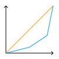
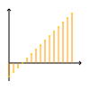
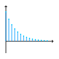
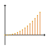
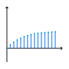
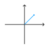
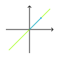

# Mathematik ⅠⅠ
## Statistik
### Kombinatorik
Kombinatorik beschäftigt sich mit der Anzahl an Möglichkeiten Ausschnitte aus einer Menge zu bilden, wobei $n$ die Größe der Menge und $k$ die Größe des Ausschnitss bezeichnet.

| Einschränkung       | Variation (geordnet)  | Kombination (ungeordnet)                       |
| ------------------- | --------------------- | ---------------------------------------------- |
| mit Wiederholungen  | $$\frac{n!}{(n-k)!}$$ | $$\frac{n!}{k! \cdot (n-k)!} = {n \choose k}$$ |
| ohne Wiederholungen | $$n^k$$               | $${n+1-k \choose k}$$                          |

### Statistische Variablen
Bei einer Stichprobe mit dem Umfang $n$ gibt es $n$ Messwerte $x_i$. Die absolute Häufigkeit wird mit $h_i$ bestimmt die relative Häufigkeit mit $f_i$. Die kommulierte Häufigkeit wird mit $H_i$ beziehungsweise $F_i$ bezeichnet.

#### Lorenzkurve
Die Lorenzkurve beschreibt die Konzentration der Verteilung. Es wird die kommulierte relative Häufigkeit $F_i$ gegen die kommulierte relative Merkmalssume $L_i$ gezeichnet.
$$l_i = \frac{h_i \cdot x_i}{\displaystyle\sum_{j=0}^{n}h_j \cdot x_j}$$

#### Maßzahlen
| Modus               | Quantil$_k$                                                           | Arithmetisches Mittel                              | Geometrisches Mittel                                | Harmonisches Mittel                                          | Quadratisches Mittel                                         |
| ------------------- | --------------------------------------------------------------------- | -------------------------------------------------- | --------------------------------------------------- | ------------------------------------------------------------ | ------------------------------------------------------------ |
| Häufigster Messwert | Wert sodass $\frac{k}{4}$ darüber und $\frac{1-k}{k}$ darunter liegen | $$x_a = \frac{\displaystyle\sum_{i=0}^{n}x_i}{n}$$ | $$x_g = \sqrt[n]{\displaystyle\prod_{i=0}^{n}x_i}$$ | $$x_h = \frac{n}{\displaystyle\sum_{i=0}^{n}\frac{1}{x_i}}$$ | $$ x_q = \sqrt{\frac{\displaystyle\sum_{i=0}^{n}x_i^2}{n}}$$ |

#### Streuung
Die Varianz $s^2$ und die Standartabweichung $s$ geben die Streung von Messwerten an.
$$s^2 = (x^2)_a - (x_a)^2$$

## Analysis
### Folgen und Reihen
Eine (Zahlen-)Folge ist eine unendliche geordnete Sammlung an Reellen Zahlen. Sie wird mit einem Buchstaben und einem Index $n \in \mathbb{N}_0$ angegeben. Sie kann auch als ein Tupel ausgeschrieben werden.
$$a: \mathbb{N}_0 \rightarrow \mathbb{R}$$
$$0 \mapsto a_0$$
$$1 \mapsto a_1$$
$$...$$

Eine Folge kann auf die rekursive (Abhängigkeit von vorherigen Gliedern) oder Explizite Art definiert werden.
Eine Reihe ist eine besondere Folge. Bei ihr ist der Abstand zwischen aufeinander folgenden Gliedern gleich dem Wert einer bestimmten Folge an dieser Stelle.

| Arithmetische Folge                                           | Geometrische Folge                                                                | Arithmetische Reihe                                                                                                            | Geometrische Reihe                                                                                                                               |
| ------------------------------------------------------------- | --------------------------------------------------------------------------------- | ------------------------------------------------------------------------------------------------------------------------------ | ------------------------------------------------------------------------------------------------------------------------------------------------ |
| $$\textcolor{orange}{a_{n+1}} = \textcolor{orange}{a_n} + k$$ | $$\textcolor{cyan}{g_{n+1}} = \textcolor{cyan}{g_n} \cdot \textcolor{purple}{q}$$ | $$\displaystyle\sum_{i=0}^{n}\textcolor{orange}{a_i} = \frac{n \cdot (\textcolor{orange}{a_1} + \textcolor{orange}{a_n})}{2}$$ | $$\displaystyle\sum_{i=0}^{n}\textcolor{cyan}{g_i} = \textcolor{cyan}{g_1} \cdot \frac{\textcolor{purple}{q}^n - 1}{\textcolor{purple}{q} - 1}$$ |
|                  |                                       |                                                                                   |                                                                                                      |
#### Konvergenz
Mit Konvergenz kann man Grenzwert-Betrachtungen einer Folge oder Funktion für undefinierte Werte anstellen, wie zum Beispiel welchen Wert eine Folge $a_n$ hat, wenn man für $n$ gegen unendlich strebt. Der Grenzwert wird meist mit $g$ bezeichnet.
$$\displaystyle\lim_{n \rightarrow \infty} (a_n) = g$$

| Notwendiges Kriterium                                                      | Hinreichendes Kriterium                                                                                                                            | Hinreichendes Kriterium                                                                                                 |
| -------------------------------------------------------------------------- | -------------------------------------------------------------------------------------------------------------------------------------------------- | ----------------------------------------------------------------------------------------------------------------------- |
| $$\displaystyle\lim_{n \rightarrow \infty}(\textcolor{#006666}{g_n}) = 0$$ | $$\displaystyle\lim_{n \rightarrow \infty}\left(\left \vert \frac{\textcolor{#006666}{g_{n+1}}}{\textcolor{#006666}{g_n}}\right\vert \right) < 1$$ | $$\displaystyle\lim_{n \rightarrow \infty}\left(\left \vert \sqrt[n]{\textcolor{#006666}{g_n}}\right\vert \right) < 1$$ |

### Differenzial Rechnung
Die Ableitung einer Funktion ist eine Funktion. Die Ableitung gibt die Steigung der Stammfunktion an jedem definierten Punkt an. Die Ableitung von einer Funktion $f$ wird mit $f'$ bezeichnet. Mit der Schreibweise $f^{(n)}$ kann man die $n$-te Ableitung ausdrücken. Mit $\frac{\partial}{\partial x}f$ kann man für Funktionen mit mehreren Variablen angeben, nach welcher Variablen abgeleitet wird.
$$\textcolor{orange}{f}(x) = x^2$$
$$\textcolor{cyan}{f'}(x) = 2 \cdot x$$

$$(x^n)' = n \cdot x^{n-1}$$

$$(\sin(x))' = \cos(x)$$
$$(\cos(x))' = -\sin(x)$$

$$(e^x)' = e^x$$
$$(\ln(x))' = \frac{1}{x}$$

| Verfahren      | Formel                                                                                                                                    |
| -------------- | ----------------------------------------------------------------------------------------------------------------------------------------- |
| Produktregel   | $$f(x) = u(x) \cdot v(x)$$ $$f'(x) = u'(x) \cdot v(x) + u(x) \cdot v'(x)$$                                                                |
| Kettenregel    | $$f(x) = u(v(x))$$ $$f'(x) = v'(x) \cdot u'(v(x))$$                                                                                       |
| Logarithmisch  | $$f(x) = u(x)^{v(x)}$$ $$(\ln(f(x)))' = (v(x) \cdot \ln(u(x)))'$$                                                                         |
| Umkehrfunktion | $$f(x) \text{ umkehrbar}$$ $$f'(x) = \frac{1}{(f^{-1})'(f(x))}$$                                                                          |
| Impliziert     | $$F(x; y) = 0$$ $$\frac{\partial}{\partial x}F + \frac{\partial}{\partial y}F \cdot y' = 0$$                                              |
| Parameter      | $$x(t) \text{, } y(t)$$ $$f'(t) = \frac{y'(t)}{x'(t)}$$                                                                                   |
| Polar          | $$r(\alpha)$$ $$x(\alpha) = r(\alpha) \cdot \cos(\alpha)$$ $$y(\alpha) = r(\alpha) \cdot \sin(\alpha)$$ $$\rightarrow \text{ Parameter}$$ |

#### Taylor Reihen
Eine Taylor Reihe ist eine Potenzreihe, welche eine Funktion an der Stelle $x_0$ annähert. Sie kann verwendet werden um Funktionen wie $\sin$ oder $e^x$ anzunähern. Desto mehr Terme addiert werden, desto genauer wird die Annäherung.
$$f(x) = \displaystyle\sum_{n=0}^{\infty}\frac{f^{(n)}(x_0)}{n!} \cdot (x-x_0)^n$$

#### Regel von L'Hôpital
Mit Ableitungen kann man zuvor unlösbare Grenzwerte berechnen. Bedingung der Grenzwert eines Quotienten von zwei Funktionen strebt einem unbestimmbaren Wert an. (zum Beispiel $\frac{\infty}{\infty}$)
$$\lim_{x \rightarrow x_0}\left(\frac{f(x)}{g(x)}\right) = \lim_{x \rightarrow x_0}\left(\frac{f'(x)}{g'(x)}\right)$$

### Integral Rechnung
Das unbestimmte Integral einer Funktion ist einfach die Stammfunktion. ($C \in \mathbb{R}$)
$$\displaystyle\int f(x) dx = F(x) + C$$

Das bestimmte Integral einer Funktion zwischen zwei Werten ist ein Wert. Der Wert gibt den Flächeninhalt zwischen der Funktion und der x-Achse an (kann auch negativ sein). Das Integral wird mit Hilfe der Stammfunktion berechnet.
$$\displaystyle\int_{x_0}^{x_n} f(x) dx = \left[F(x)\right]_{x_0}^{x_n} = F(x_n) - F(x_0)$$

#### Substitution
$$F(x) = \displaystyle\int f(x)dx$$
$$u := g(x)$$
$$F^*(u) = \displaystyle\int f^*(x, u) \cdot \frac{1}{g'(x)} du = \displaystyle\int f^*(u) du$$

*(Rücksubstitution nicht vergessen)*

#### Partielle Integration
$$F(x) = \displaystyle\int u(x) \cdot v(x)dx$$
$$F(x) = U(x) \cdot v(x) - \displaystyle\int U(x) \cdot v'(x) dx + C$$

#### Partialbruchzerlegung
Darstellung einer echt gebrochen rationalen Funktion als Summe. Mit $n_i$ werden alle Nullstellen von $v(x)$ bezeichnet von denen es $N$ viele verschiedene gibt. Der Grad jeder Nullstelle von $v(x)$ wird mit $g_i$ bezeichnet. Mit $a_{i,j}$ wird eine Konstante beschrieben.
$$f(x) = \frac{u(x)}{v(x)}$$
$$v(x) = \displaystyle\prod_{i=0}^{N}(x-n_i)^{g_i} = \displaystyle\sum_{i=0}^{N}\left(\displaystyle\sum_{j=0}^{g_i}\left(\frac{a_{i,j}}{(x-n_i)^{j+1}}\right)\right)$$
Es wird mit $v(x)$ Multipliziert und auf der rechten Seite werden gemeinsame Exponenten zusammengefasst.
$$f(x) \cdot v(x) = u(x) = (...) + x\cdot (...) + x^2 \cdot (...) + ...$$
Nun kann ein Gleichungssystem aufgestellt werden mit trivialen Werten für $(...)$.
Nachdem die Werte für $a_{i,j}$ bekannt sind kann die Funktion leicht Integriert werden.

#### Uneigentliches integral
$$f(k) \notin \mathbb{R}$$
$$\displaystyle\int_{x_0}^{k}f(x)dx = \lim_{n \rightarrow k}\left(\displaystyle\int_{x_0}^{n}f(x)dx\right)$$

### Kurvenintegrale 1. Art
Bestimmt die Länge $L$ einer Kurve gegeben durch x(t) und y(t). Durch $\rho$ kann zusätzlich eine Dichte gegeben sein.

$$L = \displaystyle\int_{t_0}^{t_n}\rho(x(t), y(t))\sqrt{(x'(t)^2 + (y'(t)^2)}dt$$

### Kurvenintegrale 2. Art
Bestimmt die verrichtete Arbeit $W$ in einem Kraftfeld $\vec{F}$ für einen Weg $C(t)$.

$$W = \displaystyle\int_{t_0}^{t_n}\left(F_x \cdot C_x' + F_y \cdot C_y'\right)dt$$

## Lineare Algebra
### Vektoren
Vektoren sind Teil eines Vektorraums und werden als Tupel dargestellt. Geometrisch können Vektoren auch als Pfeile im Raum verstanden werden.
$$\vec{v} = \begin{pmatrix}v_0\\v_1\\\vdots\end{pmatrix}$$

Sie können addiert und skaliert werden. Das Skalarprodukt zwischen zwei Vektoren ergibt einen Skalar.
$$\vec{v_1} \cdot \vec{v_2} = \displaystyle\sum_{i=0}^{n}v_{1_i} \cdot v_{2_i} = |\vec{a}| \cdot |\vec{b}| \cdot \cos(\alpha)$$

Das Vektorprodukt (*auch Kreuzprodukt*) zweier Vektoren ergibt einen Vektor, welcher orthogonal zu den beiden anderen Vektoren ist. Die Länge des Vektors entspricht der Fläche des Parallelograms, das durch die Vektoren gebildet wird.
$$\vec{a} \times \vec{b} = \left(\begin{array}{c}a_2b_3 - a_3b_2\\a_3b_1 - a_1b_3\\a_1b_2 - a_2b_1\end{array}\right)$$

Ein Einheitsvektor bzw normierter Vekotr ist ein Vektor der länge 1.
$$|\vec{v}| = 1$$

Ein beliebiger Vektor kann normiert werden.
$$norm(\vec{v})$$

#### Basis

Jeder Vektor ist eine Linearkombination aus einer Menge an Vektoren, der Basis. Die Basis enthält die minimale Anzahl an Vektoren um alle Vektoren des Vektorraums zu bilden.

$$\vec{y} = \displaystyle\sum_{i=0}^{n}a_i \cdot \vec{v_i}$$

Eine Menge welche zusätzliche Vektoren enthält wird als Erzeugendensystem bezeichnet.
Aus einem Erzeugendensystem kann man eine Basis errechnen, indem man die Vektoren wie folgt aufschreibt.
$$\left(\begin{array}{c|c|c}v_0 & v_1 & v_2\\\hline1 & 0 & 0\\0 & 1 & 0\\0 & 0 & 1\end{array}\right)$$

Mit Hilfe des Gauß Verfahrens jedoch auf <b>Spalten</b> bezogen, können nun die Vektoren oben zu Nullvektoren umgeformt werden, so weit es geht. Danach kann man unten ablesen, welche Linearkombinationen aus den anfangs Vektoren zu Nullvektoren geführt haben. Daraus kann man schließen, welche Vektoren eine Basis bilden.

Diese Anzahl der Vektoren in der Basis wird als die Dimension bezeichnet. 

#### Lineare Hülle (span)
Die Lineare Hülle ist die Menge aller Linearkombinationen von Vektoren eines Vektorraums. Damit kann Geometrisch gesehen ein Punkt, eine Gerade, eine Ebene, etc. durch den Ursprung beschrieben werden.
$$\text{span}(\vec{v_0}, \vec{v_1}, ..., \vec{v_m}) = \left\{\vec{v} \in K^n \land a_i \in K \left| \vec{v} = \displaystyle\sum_{i=0}^{m} a_i \cdot \vec{v_i}\right.\right\}$$

Eine allgemeine Ebene im drei-dimensionalen Raum braucht drei Punkte um eindeutig bestimmt zu sein. Man kann die Ebene auf verschiedene Arten mathematisch darstellen.

| Parameterform                                           | Koordinatenform                | Normalenform                               |
| ------------------------------------------------------- | ------------------------------ | ------------------------------------------ |
| $f(t, s) = t \cdot \vec{a} + s \cdot \vec{b} + \vec{c}$ | $f: \vec{n} \cdot \vec{x} = d$ | $f: (\vec{x} - \vec{c}) \cdot \vec{n} = 0$ |

Der Normalenvektor $\vec{n}$ ist ein Vektor, welcher orthogonal zu zwei anderen Vektoren liegt. Man kann ihn berechnen, indem man das Vektorprodukt der beiden Vektoren nimmt.
$$\vec{n} = \vec{a} \times \vec{b}$$

Falls man die Steigung in $x_1$ und $x_2$ Richtung kennt, kann man auch folgende Formel anwenden.

$$\vec{n} = \left(\begin{array}{c}\frac{\partial}{\partial x_1}f(x_{1_0}, x_{2_0})\\\frac{\partial}{\partial x_2}f(x_{1_0}, x_{2_0})\\-1\end{array}\right)$$

Diese Art der Berechnung des Normalenvektors bietet sich an um eine Tangentialebene zu bilden.

##### Totales Differenzial
Mit dem totalen Differenzial kann man für komplizierte Funktionen die Änderung in beliebige Richtungen annähern. Dabei gibt $\Delta$ die Änderung der Variablen an.
$$\Delta x_3 \approx \frac{\partial}{\partial x_1}f(x_1, x_2) \cdot \Delta x_1 + \frac{\partial}{\partial x_2}f(x_1, x_2) \cdot \Delta x_2$$

#### Gradient
Für eine Funktion $f$ zeigt der Gradient in Richtung des größten Zuwachses von $f$.
$$\nabla f = grad(f) = \left(\begin{array}{c}\frac{\partial}{\partial x_1}f\\\frac{\partial}{\partial x_1}f\\\vdots\end{array}\right)$$

Mit Hilfe des Gradienten kann man die Ableitung in eine beliebige Richtung $r$ berechnen.
$$\frac{\partial}{\partial r}f(\vec{x}) = \tan(\alpha) = grad(f(\vec{x})) \cdot norm(\vec{r})$$

Um Extremwerte zu bestimmen muss das Gleichungssystem $grad(f(\vec{x_0})) = \vec{0}$ gelten.
$$H(f(\vec{x_0}) = \begin{pmatrix}\frac{\partial^2}{\partial x_1\partial x_1}f(\vec{x_0}) & \frac{\partial^2}{\partial x_1\partial x_2}f(\vec{x_0})\\\frac{\partial^2}{\partial x_2\partial x_1}f(\vec{x_0}) & \frac{\partial^2}{\partial x_2\partial x_2}f(\vec{x_0})\end{pmatrix}$$

Wenn die Eigenwerte der Hessematrix $H(f(\vec{x}))$ positiv sind handelt es sich um ein Minimum, wenn alle negativ sind um ein Maximum und bei positiven und negativen Einträgen um einen Sattelpunkt.

### Lineare Transformationen
#### Matrizen
Matrizen sind Ansammlungen von Vektoren und können genau so addiert und skaliert werden wie Vektoren.
$$A =\begin{pmatrix}\vec{m_1} & \vec{m_2}\end{pmatrix}=\begin{pmatrix}m_{11} & m_{12}\\m_{21} & m_{22}\\\end{pmatrix}$$

Zwischen Matrizen und Vektoren ist eine Multiplikation definiert, jedoch nur einseitig.
$$A \cdot \vec{x} = \begin{pmatrix}\vec{m_1} \cdot \vec{x}\\\vec{m_2} \cdot \vec{x}\\\end{pmatrix}$$

Zudem ist zwischen Matrizen eine Multiplikation definiert.
$$A \cdot B = \begin{pmatrix}A \cdot \vec{b_1} & A \cdot \vec{b_2}\end{pmatrix}$$

Eine lineare Abbildung ist eine transformation, welche auf einem Vektor bzw. Vektorraum angewendet wird.
$$D \rightarrow W$$
$$d_0 \mapsto w_0$$
$$\vdots$$

*Rotationsmatrix*

Eine lineare Abbildung ist eine Matrixmultiplikation. Für sie gilt, dass der Ursprung im Definitionsbereich gleich dem im Bildbereich ist und dass Linear Kombinationen im Definitionsbereich transformiert im Bildbereich erhalten bleiben.

$$f\left(\lambda \cdot \begin{pmatrix}x\\ y\end{pmatrix}\right) = \lambda \cdot f\left(\begin{pmatrix}x\\ y\end{pmatrix}\right)$$

$$f\left(\begin{pmatrix}x_1\\ y_1\end{pmatrix} + \begin{pmatrix}x_2\\ y_2\end{pmatrix}\right) = f\left(\begin{pmatrix}x_1\\ y_1\end{pmatrix}\right) + f\left(\begin{pmatrix}x_2\\ y_2\end{pmatrix}\right)$$

#### Kern und Bild
Der Kern einer linearen Abbildung ist die Menge aller Vektoren, welche auf den Ursprung abgebildet werden. Das Bild einer linearen Abbildung sind alle möglichen Vektoren, welche nach der Transformation noch erreicht werden können.

$$Kern(A) = \left\{A \cdot \vec{v}= \vec{0}\right\}$$

$$Bild(A) = span(\vec{m_1}, \vec{m_2})$$

Die Dimension der Ausgangsmenge $D$ entspricht der Dimension des Kerns und Bildes. Die Dimension des Bildes wird auch Rang genannt.
$$dim(D) = dim(Kern(A)) + dim(Bild(A)) = dim(Kern(A)) + Rang(A)$$

#### Determinate
Die Determinate ist ein Skalar und beschreibt wie sich der Inhalt, welcher von den Einheitsvektoren bestimmt wird, verändert. Nur Quadratische Matrizen haben eine Determinante.
Die Determinate kann auch *negativ* sein.
Wenn sich die Dimension nach der Transformation durch die Matrix verringert, ist die Determinate 0.
$$det(A) \in \mathbb{R}$$

Standartmäßig berechnet man die Determinate, indem man das Gauß Verfahren anwendet. Zum Schluss multipliziert man die Einträge der Diagonalen.

Eine Matrix ist invertierbar, wenn die Spalten eine Basis bilden und die Matrix quadratisch ist. Um das inverse zu erhalten wendet man wieder das Gauß Verfahren an. Danach kann man die Lösung auf der rechten Seite ablesen.
$$\left(\begin{array}{cc|cc}a & b & 1 & 0\\c & d & 0 & 1\end{array}\right)$$

#### Eigenvektoren/Eigenwerte
Die Eigenvektoren einer linearen Abbildung $A$ sind Vektoren $\vec{v}$, welche jeweils vor und nach der transformation den gleichen **span** haben und nicht der Nullvektor sind.
Der Eigenwert ist der Faktor $a$ eines Eigenvektoren.
$$A \cdot \vec{v} = a \cdot \vec{v}$$
$$(A - a \cdot E) \cdot \vec{v} = \vec{0}$$

Die Eigenwerte berechnet man indem man folgende Gleichung löst:
$$det(A - a \cdot E) = 0$$

Danach können die Eigenvektoren durch einsetzen berechnet werden.
