# Mathematik

## Grundlegende Mathematik
### Mengen
Eine Menge ist eine **ungeordnete** Sammlung von Objekten, den Elementen. Man schreibt $m \in M$ um auszudrücken, dass das Objekt $m$ ein Element der Menge $M$ ist. Mit $m \notin M$ wird das Gegeteil ausgedrückt. Mengen können auch andere Mengen enthalten, jedoch nicht sich selbst. Mengen können auf zwei verschiedene Arten definiert werden. Durch Aufzählung der Elemente oder durch deren Charakteristische Eigenschaft.

$$\left\{a, b, c, d\right\}$$

Die Menge, welche keine Elemente enthält wird mit $\emptyset$ oder $\{\}$ bezeichnet.

### Tupel
Ein Tupel ist eine **geordnete** Sammlung von Objekten.
$$\left(a, b, c, d\right)$$

### Relationen
#### Mengen-Relationen
Zwischen zwei Mengen sind folgende Relation definiert.

| Relation        |  Schreibweise   | Beschreibung         |
| :-------------- | :-------------: | :------------------- |
| Gleich          |     $M = N$     | Gleiche Elemente     |
| Teilmenge       | $M \subseteq N$ | Ausschnitt aus Menge |
| Echte-Teilmenge |  $M \subset N$  | Ausschnitt aus Menge |

Falls keine Relation besteht werden die Mengen als **Disjunkt** bezeichnet.
Relationen werden zum Beispiel für Konditionen verwendet.

#### Kartesisches Produkt
Das Kartesische Produkt liefert alle möglichen Kombinationen zwischen den Elementen von Mengen als Tupel.
$$M \times N = \left\{(m, n) | m \in M, n \in N\right\}$$

Das $n$-fache Kartesische Produkt einer Menge mit sich selbst ist wie folgt definiert.
$$M^n = M \times M \times ... \times M$$

#### Relationen
Eine Relation $R$ gibt die Beziehung zwischen bestimmten Objekten an. Sie ist eine Teilmenge eines Kartesischen Produkts.
$$R \subseteq M^n$$

Mit $\left(a, b\right) \in R$ bezeichnet man, dass $a$ mit $b$ in Relation steht. Eine Relation $R$ kann auf verschiedene Mengen bezogen sein und verschiedene Eigenschaften auf den jeweiligen Mengen besitzen.

#### Relationen-Eigenschaften
| Eigenschaft        | Definition                                            | Beschreibung                                                         | Beispiel Graph                         |
| ------------------ | ----------------------------------------------------- | -------------------------------------------------------------------- | -------------------------------------- |
| Reflexiv           | $$\forall a \in M: (a, a) \in R$$                     | Alles steht mit sich selbst in Relation                              |             |
| Symmetrisch        | $$(a,b) \in R \Rightarrow (b,a) \in R$$               | Alle Relationen sind Beidseitig.                                     |          |
| Antisymmetrisch    | $$(a,b), (b,a) \in R \Rightarrow a = b$$              | Alle Relationen sind Einseitig.                                      | 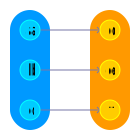     |
| Transitiv          | $$(a,b),(b,c)\in R \Rightarrow (a,c)\in R$$           | Über zwei Relationen verknüpfte Elemente sind auch direkt verknüpft. |            |
| Total              | $$\forall a,b \in M: (a,b) \in R \lor (b,a) \in R$$   | Alles steht mit allem mindestens Einseitig in Relation.              | 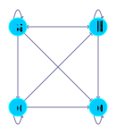               |
| Halbordnung        | Reflexiv, <b>Antisymmetrisch</b> und Transitiv.       | -                                                                    |          |
| Totalordnung       | Reflexiv, <b>Antisymmetrisch</b> Transitiv und Total. | Die Relation gibt den Elementen eine Reihenfolge.                    | 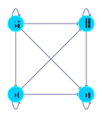        |
| Äquivalenzrelation | Reflexiv, <b>Symmetrisch</b> und Transitiv            | Die Relation unterteilt eine Menge in Äquivalenzklassen.             | 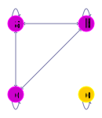 |

#### Äquivalenzklassen
Alle Elemente einer Äquivalenzklasse sind Äquivalent.

| Äquivalenzklasse 1                                | Äquivalenzklasse 2                     |
| ------------------------------------------------- | -------------------------------------- |
| 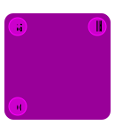            |  |
| $$[a]_R = [b]_R = [c]_R$$ $$[a]_R = \{a, b, c\}$$ | $$[d]_R$$ $$[d]_R = \{d\}$$            |

Die Menge der Äquivalenzklassen lautet wie folgt.

$$M/R = \{\{a, b, c\}, \{d\}\}$$

### Abbildungen
Eine Abbildung bzw. Funktion ist ein Sonderfall einer Relation.
$$f = \left\{\left(m_1, n_1\right), \left(m_2, n_2\right), ...\right\} \subset M \times N$$

Sie weist jedem Element aus einer Menge, dem Definitionsbereich, eine Element aus einer Menge, dem Bildbereich, zu. Formal wird folgende Schreibweise verwendet.

$$f: M \rightarrow N$$
$$m_1 \mapsto n_1$$
$$m_2 \mapsto n_2$$
$$...$$

Um für ein Element $x$ das von der Funktion $f$ zugeordnete Element $y$ zu erhalten wird folgende Notation verwendet.

$$y = f(x)$$

Die Abbildung $id_M$ ist die Identität auf einer Menge $M$. Sie bildet jedes Element der Menge auf das gleiche Element ab.
Mit $f \circ g$ drückt man aus, dass $f$ nach $g$ ausgeführt wird. Wenn $f \circ g = id_N$ und $g \circ f = id_M$ gilt dann sind $f$ und $g$ invers zu einander.

$$f:M \rightarrow N$$
$$m_1 \mapsto n_1$$
$$m_2 \mapsto n_2$$
$$...$$

$$g:N \rightarrow M$$
$$n_1 \mapsto m_1$$
$$n_2 \mapsto m_2$$
$$...$$

Der Bildbereich ist so definiert:

$$Bild(f) = \{f(m) | m \in M\}$$

Mit $Abb(M, N)$ erhält man eine Menge aller Abbildungen von der Menge $M$ zur Menge $N$.

|                              Injektiv                               |                              Surjektiv                              |
| :-----------------------------------------------------------------: | :-----------------------------------------------------------------: |
|                     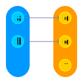                      |                     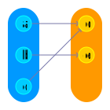                     |
| Jedes Element aus dem Bildbereich wird **maximal einmal** getroffen | Jedes Element aus dem Bildbereich wird **minimal einmal** getroffen |
|        $$\forall a,b \in M: f(a) = f(b) \Rightarrow a = b$$         |           $$\forall b \in N: \exists a \in M: f(a) = b$$            |

|                                                     Bijektiv                                                     |
| :--------------------------------------------------------------------------------------------------------------: |
|                                                                                        |
| Jedes Element aus dem Bildbereich wird **genau einmal** getroffen. Bijektive Abbildungen sind immer invertierbar |

### Mengen-Operationen
Um Operationen auf Mengen auszuführen benötigt man ein **Universum** $U$, als Referenz Menge.

| Vereinigung                   | Schnitt                   | Differenz                   | Komplement                   |
| ----------------------------- | ------------------------- | --------------------------- | ---------------------------- |
|  |  |  |  |
| $$M \cup N$$                  | $$M \cap N$$              | $$M \setminus N$$           | $$M^C$$                      |

Die Menge aller Teilmengen der Menge $M$ erhält man wie folgt.
$P(M)=\{m \in U m \subseteq M\}$

### Zahlen Mengen
#### Natürliche Zahlen
Die Menge der Natürlichen Zahlen ist rekursiv definiert. Die Zahl $1$ ist eine Natürliche Zahl.
$$1 \in \mathbb{N}$$
Für jede natürliche Zahl $n$ ist der Nachfolger $\sigma(n)$ auch eine Natürliche Zahl.
$$n \in N \Rightarrow \sigma(n) \in N$$

Für die Menge $\mathbb{N_0}$ gilt zusätzlich.
$$\mathbb{N_0} = \{0\} \cup \mathbb{N}$$
$$\sigma(0) = 1$$

#### Ganze Zahlen
Die Menge der Ganzen Zahlen ist eine Äquivalenzrelation auf den Natürlichen Zahlen.
$$\mathbb{Z} = \left\{((a,b), (c,d)) \in (\mathbb{N_0} \times \mathbb{N_0})^2 | a + d = b + c\right\}$$

#### Restklassen
Auf der Menge $\mathbb{Z}$ kann für ein gewähltes $n \in \mathbb{N}$ eine Restklasse definiert werden.

$$\mathbb{Z}/n\mathbb{Z} = \{(a, b) \in \mathbb{Z} \times \mathbb{Z}| \exists c \in \mathbb{Z}: a - b = c \cdot n\}$$
$$[a]_{\mathbb{Z}/n\mathbb{Z}} + [b]_{\mathbb{Z}/n\mathbb{Z}} = [a + b]_{\mathbb{Z}/n\mathbb{Z}}$$
$$[a]_{\mathbb{Z}/n\mathbb{Z}} - [b]_{\mathbb{Z}/n\mathbb{Z}} = [a - b]_{\mathbb{Z}/n\mathbb{Z}}$$
$$[a]_{\mathbb{Z}/n\mathbb{Z}} \cdot [b]_{\mathbb{Z}/n\mathbb{Z}} = [a \cdot b]_{\mathbb{Z}/n\mathbb{Z}}$$

Diese Restklassen sind Äquivalenzrelationen und können verkürzt dargestellt werden:
$$a + b \equiv c \mod n$$
$$a - b \equiv c \mod n$$
$$a \cdot b \equiv c \mod n$$

Die Besonderheit an Restklassen ist, dass sie nur aus $n$ Elementen bestehen.

#### Rationale Zahlen
Die Menge der Rationalen Zahlen ist eine Äquivalenzrelation auf den Ganzen Zahlen.
$$\mathbb{Q} = \left\{((a,b), (c,d)) \in (\mathbb{Z} \times (\mathbb{Z} \setminus \{0\}))^2 | a \cdot d = b \cdot c\right\}$$

#### Reele Zahlen

### Algebraische Strukturen
Algebraische Strukturen ermöglichen es Gesetze für Operationen auf bestimmten Mengen zu formen. Sie bestehen aus einer Menge und einer oder zwei Operationen.
$$(M, \oplus)$$
$$(M, \oplus, \odot)$$

Operationen können unterschiedliche Eigenschaften haben.

| Eigenschaft       |                                   Definition                                    |
| :---------------- | :-----------------------------------------------------------------------------: |
| Abgeschlossenheit |             $$\forall a, b \in M: \exists c \in M: a \oplus b = c$$             |
| Assoziativ        |    $$\forall a, b, c \in M: a \oplus (b \oplus c) = (a \oplus b) \oplus c$$     |
| Neutral Element   |              $$\exists n \in M: \forall e \in M: e \oplus n = e$$               |
| Inverse Elemente  | $$\exists n \in M: \forall e \in M: \exists e^{-1} \in M: e \oplus e^{-1} = n$$ |
| Kommutativ        |                 $$\forall a,b \in M: a \oplus b = b \oplus a$$                  |
| Distributiv       | $$\forall a,b,c \in M: a \odot (b \oplus c) = (a \odot b) \oplus (a \odot c)$$  |

Die Eigenschaften der Operationen auf der Menge bestimmen die Algebraische Struktur.

#### Vektorraum
Über einem Körper $M$ kann ein Vektorraum $M^n (n \in \mathbb{N_0})$ definiert werden. Elemente $v$ des Vektorraums $M^n$ werden mit $\vec{v}$ bezeichnet um sie von Elementen des Körpers zu unterscheiden. In solchen Vektorräumen sind zwei Operationen definiert.

| Addition                                                                              | Skalarmultiplikation                                                        |
| ------------------------------------------------------------------------------------- | --------------------------------------------------------------------------- |
| $$\oplus: M^n \times M^n \rightarrow M^n$$ $$\vec{a} \oplus \vec{b} \mapsto \vec{c}$$ | $$\odot: M \times M^n \rightarrow M^n$$ $$a \odot \vec{b} \mapsto \vec{c}$$ |
| *(Komponentenweise addiert wie im Körper)*                                            | *(Komponenten skaliert wie im Körper)*                                      |

Ein Untervektorraum ist eine Teilmenge des Vektorraums, welche selbst ein Vektorraum ist.

## Graphen Theorie
Ein Graph $G$ besteht aus einer Knoten-Menge $M$ und einer Kanten-Menge $R$, wobei $M$ eine beliebige Menge und $R$ eine Relation auf $M$ ist.
$$R = M^2$$
$$G = (M, R)$$

Graphen eignen sich zur visualisierung von Relationen.
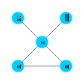

Ein Graph ist **ungerichtet**, falls die Relation $R$ symmetrisch ist, ansonsten ist der Graph **gerichtet**. Wenn jeder Knoten von jedem Knoten erreichbar ist, wird der Graph als **zusammenhängend** bezeichnet. Ein zusammenhängender Graph ohne Zyklen wird als Baum bezeichnet.
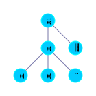

In einem Baum ist der Weg von jedem Knoten zu jedem Knoten eindeutig. In manchen Fällen wird ein Start für einen Baum definiert, die **Wurzel** (orange). Jeder Knoten, welcher nur eine Kante besitzt wird als **Blatt** (lime) bezeichnet. Alle anderen Knoten werden als **Innereknoten** (cyan) bezeichnet.
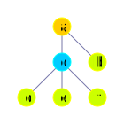

Die Tiefe eines Baums ist die maximale Länge eines Pfades von der Wurzel zu einem Blatt.

## Sprachen
### Formale Sprachen

### Automaten

### Aussagen Logik
Die Aussagen Logik beschäftigt sich mit Formeln. Formeln bestehen aus, den Symbolen $0$, $1$ den Atomen der Menge $\Sigma$ (Signatur) oder Verknüpfungen von bekannten Formeln mit den fünf definieren Operationen. In Folgenden Beispielen gilt $\Sigma = \{\textcolor{orange}{A}, \textcolor{orange}{B}\}$. Die Menge aller Formeln auf $\Sigma$ wird mit $For0_{\Sigma}$ bezeichnet. 
$$0, 1 \in For0_{\Sigma}$$
$$\Sigma \subseteq For0_{\Sigma}$$
Formeln selber sind nur Zeichenketten und können nicht umgeformt werden.

| Operation   | Schreibweise                                                      | Beschreibung                                                     |
| ----------- | ----------------------------------------------------------------- | ---------------------------------------------------------------- |
| Negation    | $$\neg \textcolor{orange}{A}$$                                    | Gegenteil                                                        |
| Disjunktion | $$(\textcolor{orange}{A} \lor \textcolor{orange}{B})$$            | Eins von beiden Wahr                                             |
| Konjunktion | $$(\textcolor{orange}{A} \land \textcolor{orange}{B})$$           | Beide Wahr                                                       |
| Implikation | $$(\textcolor{orange}{A} \rightarrow \textcolor{orange}{B})$$     | $$\neg(\textcolor{orange}{A} \land \neg \textcolor{orange}{B})$$ |
| Äquivalenz  | $$(\textcolor{orange}{A} \leftrightarrow \textcolor{orange}{B})$$ | Gleichwertig                                                     |

Zu jeder Formel $F$ kann ein Syntaxbaum erstellt werden. Mit ihm kann die Formel leicht in ihre Teilformen $Teilf(F)$ zerlegen werden, wodurch sie ausgewertet werden kann.
Um $Teilf(F)$ zu erhalten geht man einfach den Syntaxbaum durch und konstruiert von jedem Knoten aus abwärts eine Teilformel.
$$Teilf(\neg (\textcolor{orange}{A} \land \neg \textcolor{orange}{B})) = \{\neg (\textcolor{orange}{A} \land \neg \textcolor{orange}{B}), (\textcolor{orange}{A} \land \neg \textcolor{orange}{B}), \textcolor{orange}{A}, \neg \textcolor{orange}{B}, \textcolor{orange}{B}\}$$

$$\neg (\textcolor{orange}{A} \land \neg \textcolor{orange}{B})$$

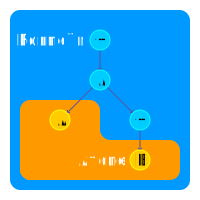

Um eine Formel auszuwerten benötigt man eine Interpretation $I$, welche den Atomen aus $\Sigma$ die Werte $\textcolor{LimeGreen}{W}$ für Wahr und $\textcolor{red}{F}$ für Falsch zuweist. Mit $val_I$ wird eine Abbildung definiert die nun alle Formeln aus $For0_\Sigma$ auswerten kann, durch eine Rekursive Definition der Operationen (*ausgelassen*).

$$I: \Sigma \rightarrow \{\textcolor{LimeGreen}{W}, \textcolor{red}{F}\}$$
$$\textcolor{orange}{A} \mapsto \textcolor{LimeGreen}{W}$$
$$\textcolor{orange}{B} \mapsto \textcolor{red}{F}$$

$$val_I: For0_\Sigma \rightarrow \{\textcolor{LimeGreen}{W}, \textcolor{red}{F}\}$$
$$0 \mapsto \textcolor{red}{F}$$
$$1 \mapsto \textcolor{LimeGreen}{W}$$
$$\textcolor{orange}{A} \mapsto I(\textcolor{orange}{A})$$
$$...$$

| Eigenschaft     | Beschreibung                                       |
| --------------- | -------------------------------------------------- |
| Modell          | Eine Interpretation wertet die Formel zu Wahr aus. |
| Erfüllbar       | Mindestens eine Interpretation ist Modell.         |
| Allgemeingültig | Alle Interpretationen sind Modell.                 |

Zudem gibt es noch Relationen zwischen Formeln.

| Logische Folgerbarkeit                                                       | Logische Äquivalenz                                                         |
| ---------------------------------------------------------------------------- | --------------------------------------------------------------------------- |
| Modelle für $\textcolor{orange}{A}$ sind Modelle für $\textcolor{orange}{B}$ | $\textcolor{orange}{A}$ und $\textcolor{orange}{B}$ sind logisch Äquivalent |
| $$\textcolor{orange}{A} \models \textcolor{orange}{B}$$                      | $$\textcolor{orange}{A} \equiv \textcolor{orange}{B}$$                      |

#### Normalform
Mit einer Wahrheitstabelle kann man eine Aussagenlogische Formel ausdrücken. Der Ausgang $Y$ kann auch den Wert $\perp$ haben, falls diese Kombination an Eingangs-werten nicht auftritt oder irrelevant ist. Eine Wahrheitstabelle ist wie eine Partielle Abbildung.
$$f: \{\textcolor{red}{F}, \textcolor{LimeGreen}{W}\}^n \rightarrow \{\textcolor{red}{F}, \textcolor{LimeGreen}{W}\}^m$$
$$x_1 \mapsto y_1$$
$$x_2 \mapsto \perp$$

| $\textcolor{orange}{A}$    | $\textcolor{orange}{B}$    | $Y$                        |
| -------------------------- | -------------------------- | -------------------------- |
| $\textcolor{#FF0000}{F}$   | $\textcolor{#FF0000}{F}$   | $\textcolor{LimeGreen}{W}$ |
| $\textcolor{#FF0000}{F}$   | $\textcolor{LimeGreen}{W}$ | $\textcolor{#FF0000}{F}$   |
| $\textcolor{LimeGreen}{W}$ | $\textcolor{#FF0000}{F}$   | $\textcolor{#FF0000}{F}$   |
| $\textcolor{LimeGreen}{W}$ | $\textcolor{LimeGreen}{W}$ | $\textcolor{LimeGreen}{W}$ |

Mit Hilfe der Wahrheitstabelle kann man nun die Normalform bilden, welche sich leicht realisieren lässt. Man unterscheidet zwischen der DNF und KNF.

| Disjunktive Normalform                                                 | Konjunktive Normalform                                               |
| ---------------------------------------------------------------------- | -------------------------------------------------------------------- |
| Disjunktiv-verknüpfte Minterme                                         | Konjunktiv-verknüpfte Maxterme                                       |
| $$DNF = (m_1 \lor m_2 \lor ...)$$                                      | $$KNF = (M_1 \land M_2 \land ...)$$                                  |
| $$m_i = (\textcolor{orange}{A} \land \textcolor{orange}{B} \land...)$$ | $$M_i = (\textcolor{orange}{A} \lor \textcolor{orange}{B} \lor...)$$ |

$$DNF \equiv Y \equiv KNF$$

Um die minimale Normalform zu bekommen kann man das KV-Diagramm verwenden. Dabei werden größtmögliche Rechtecke der Größe $2^n$ gebildet. Diese ergeben die Primimplika(n)te (minimierte Terme). Für die KNF müssen alle Eingänge noch invertiert werden.

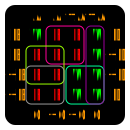

| Minterme                                     | Maxterme                                         |
| -------------------------------------------- | ------------------------------------------------ |
| $(\textcolor{#AA00FF}{\neg A \land C})$      | $(\textcolor{#FF00AA}{\neg B \lor \neg \neg C})$ |
| $(\textcolor{#00FFAA}{\neg A \land \neg B})$ | $(\textcolor{#AAFF00}{\neg A \lor \neg \neg D})$ |
| $(\textcolor{#00AAFF}{B \land C \land D})$   | $(\textcolor{#777777}{\neg A \lor \neg \neg B})$ |

| minimale DNF                                                                                                                                                                        | minimale KNF                                                                                                                              |
| ----------------------------------------------------------------------------------------------------------------------------------------------------------------------------------- | ----------------------------------------------------------------------------------------------------------------------------------------- |
| $$Y \equiv (\left(\textcolor{#AA00FF}{\neg A \land C}\right) \lor \left(\textcolor{#00FFAA}{\neg A \land \neg B}\right) \lor \left(\textcolor{#00AAFF}{B \land C \land D}\right))$$ | $$Y \equiv ((\textcolor{#FF00AA}{\neg B \lor C}) \land (\textcolor{#AAFF00}{\neg A \lor D}) \land (\textcolor{#777777}{\neg A \lor B}))$$ |

### Prädikaten Logik
Die Syntax der Aussagen Logik wird in der Prädikaten Logik erweitert durch Prädikate, Terme und Variablen.
Die Signatur $\Sigma$ ist nun ein Tupel und besteht aus der Menge der Prädikatssymbolen $P_\Sigma$, Funktionssymbolen $F_\Sigma$, der Abbildung $\alpha_\Sigma$ und der Menge der Variablen $Var_\Sigma$.
$$\Sigma = (F_\Sigma, P_\Sigma, \alpha_\Sigma, Var_\Sigma)$$

Die Abbildung $\alpha_\Sigma$ ordnet Elementen aus $F_\Sigma$ und $P_\Sigma$ eine Stelligkeit zu.
Null-stellige Prädikate verhalten sich exakt gleich wie Atome aus der Aussagen Logik. Hingegen n-stellige Prädikate erhalten n Terme als Parameter.
Ein Term besteht aus Variablen, n-stelligen Funktionssymbolen und Konstantensymbolen (Null-stellige Funktionssymbole).
Die Menge aller Prädikaten-logischen Formeln wird mit $For_\Sigma$ bezeichnet.
$$0, 1 \in For_\Sigma$$
$$AF_\Sigma \subseteq For_\Sigma$$

Die Atomaren-Formeln ($AF_\Sigma$) bestehen aus Prädikaten oder Prädikaten mit Termen als Parameter.
Die Menge aller möglichen Terme auf $\Sigma$ wird mit $Term_\Sigma$ bezeichnet.
Mit $Teilf$ erhält man alle Teilformeln von einer Formel.
Mit $Teilt$ erhält man alle Teilterme von einer Formel.

$$((\forall x \textcolor{orange}{p_1}(\textcolor{cyan}{f_1}(\textcolor{red}{x})) \land \exists y \textcolor{orange}{p_1}(\textcolor{cyan}{f_2}(\textcolor{red}{y}, \textcolor{green}{x}, \textcolor{cyan}{f_0}))) \lor \textcolor{orange}{p_0})$$

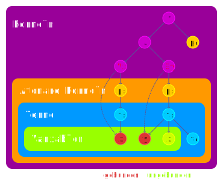

*(Indices stehen für Stelligkeit)*

#### Quantoren
Quantoren bringen eine Variable ein, welche in dem direkt darauf folgendem Block definiert ist. Tritt das gleiche Symbol nochmals auf handelt es sich um eine andere Variable.
Eine Formel in der alle Variablen an einen Quantoren gebunden sind heißt geschlossene Formel.
Man kann frei Auftretende Variablen durch Terme ersetzten.
In diesem Beispiel wird in der Formel $F$, $x \in Var_\Sigma$ durch $t \in Term_\Sigma$ ersetzt.
$$[x/t]F$$

| Existenzquantor                  | Allquantor            |
| -------------------------------- | --------------------- |
| $$\exists x F$$                  | $$\forall x F$$       |
| Es gibt ein $x$ für das $F$ gilt | Für alle $x$ gilt $F$ |

#### Auswertung
Um eine Formel auszuwerten benötigt man eine Struktur $S$, welche aus einer Menge $U$ dem Universum und einer Menge $I$ der Interpretationsfunktion besteht. Zusätzlich benötigt man eine Variablenbelegung $v$ wodurch man eine erweiterte Struktur erhält. Mit $valt_{S,v}$ können Terme auswerten werden. Mit $valf_{S,v}$ können Formeln auswerten werden.
$$S = (U, I)$$

| Formel Auswertung                                                                                                                                                                                                      | Term Auswertung                                                                                                                                                                                                                             | Variablen Auswertung                                                       | Interpretation Auswertung                                                                                                                                                           |
| ---------------------------------------------------------------------------------------------------------------------------------------------------------------------------------------------------------------------- | ------------------------------------------------------------------------------------------------------------------------------------------------------------------------------------------------------------------------------------------- | -------------------------------------------------------------------------- | ----------------------------------------------------------------------------------------------------------------------------------------------------------------------------------- |
| $$valf_{S,v}: For_\Sigma \rightarrow \{F, W\}$$ $$0, 1 \mapsto F, W$$ $$p_0 \mapsto \textcolor{orange}{I}(p_0)$$ $$p_n(t, ...) \mapsto (\textcolor{cyan}{valt_{S,v}}(t), ...) \in \textcolor{orange}{I}(p_n)$$ $$...$$ | $$\textcolor{cyan}{valt_{S,v}}: Term_\Sigma \rightarrow U$$ $$var \mapsto \textcolor{green}{v}(var)$$ $$f_0 \mapsto \textcolor{orange}{I}(f_0)$$ $$f_n(t, ...) \mapsto (\textcolor{orange}{I}(f_n))(\textcolor{cyan}{valt_{S,v}}(t), ...)$$ | $$\textcolor{green}{v}: Var_\Sigma \rightarrow U$$ $$var \mapsto u \in U$$ | $$\textcolor{orange}{I}: F_\Sigma \cup P_\Sigma \rightarrow ...$$ $$p_0 \mapsto F, W$$ $$p_n \mapsto R \subseteq U^n$$ $$f_0 \mapsto u \in U$$ $$f_n \mapsto g: U^n \rightarrow U$$ |

$$valf_{S, v}(\forall x F) = W\text{, wenn für alle } u \in U valf_{S, v_{x}^{u}}(F) \text{ gilt}$$
$$valf_{S, v}(\exists x F) = W\text{, wenn es für mindestens ein } u \in U valf_{S, v_{x}^{u}}(F) \text{ gilt}$$

## Statistik
### Kombinatorik
Kombinatorik beschäftigt sich mit der Anzahl an Möglichkeiten Ausschnitte aus einer Menge zu bilden, wobei $n$ die Größe der Menge und $k$ die Größe des Ausschnitss bezeichnet.
| Einschränkung       | Variation (geordnet)  | Kombination (ungeordnet)                       |
| ------------------- | --------------------- | ---------------------------------------------- |
| mit Wiederholungen  | $$\frac{n!}{(n-k)!}$$ | $$\frac{n!}{k! \cdot (n-k)!} = {n \choose k}$$ |
| ohne Wiederholungen | $$n^k$$               | $${n+1-k \choose k}$$                          |

## Analysis
### Folgen und Reihen
Eine (Zahlen-)Folge ist eine unendliche geordnete Sammlung an Reellen Zahlen. Sie wird mit einem Buchstaben und einem Index $n \in \mathbb{N}_0$ angegeben. Sie kann auch als ein Tupel ausgeschrieben werden.
$$a: \mathbb{N}_0 \rightarrow \mathbb{R}$$
$$0 \mapsto a_0$$
$$1 \mapsto a_1$$
$$...$$

Eine Folge kann auf die rekursive (Abhängigkeit von vorherigen Gliedern) oder Explizite Art definiert werden.
Eine Reihe ist eine besondere Folge. Bei ihr ist der Abstand zwischen aufeinander folgenden Gliedern gleich dem Wert einer bestimmten Folge an dieser Stelle.

| Arithmetische Folge                                           | Geometrische Folge                                                                | Arithmetische Reihe                                                                                                            | Geometrische Reihe                                                                                                                               |
| ------------------------------------------------------------- | --------------------------------------------------------------------------------- | ------------------------------------------------------------------------------------------------------------------------------ | ------------------------------------------------------------------------------------------------------------------------------------------------ |
| $$\textcolor{orange}{a_{n+1}} = \textcolor{orange}{a_n} + k$$ | $$\textcolor{cyan}{g_{n+1}} = \textcolor{cyan}{g_n} \cdot \textcolor{purple}{q}$$ | $$\displaystyle\sum_{i=0}^{n}\textcolor{orange}{a_i} = \frac{n \cdot (\textcolor{orange}{a_1} + \textcolor{orange}{a_n})}{2}$$ | $$\displaystyle\sum_{i=0}^{n}\textcolor{cyan}{g_i} = \textcolor{cyan}{g_1} \cdot \frac{\textcolor{purple}{q}^n - 1}{\textcolor{purple}{q} - 1}$$ |
|                         | 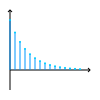                                             | 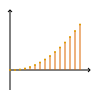                                                                                         |                                                                                                             |
#### Konvergenz
Mit Konvergenz kann man Grenzwert-Betrachtungen einer Folge oder Funktion für undefinierte Werte anstellen, wie zum Beispiel welchen Wert eine Folge $a_n$ hat, wenn man für $n$ gegen unendlich strebt. Der Grenzwert wird meist mit $g$ bezeichnet.
$$\displaystyle\lim_{n \rightarrow \infty} (a_n) = g$$

| Notwendiges Kriterium                                                      | Hinreichendes Kriterium                                                                                                                            | Hinreichendes Kriterium                                                                                                 |
| -------------------------------------------------------------------------- | -------------------------------------------------------------------------------------------------------------------------------------------------- | ----------------------------------------------------------------------------------------------------------------------- |
| $$\displaystyle\lim_{n \rightarrow \infty}(\textcolor{#006666}{g_n}) = 0$$ | $$\displaystyle\lim_{n \rightarrow \infty}\left(\left \vert \frac{\textcolor{#006666}{g_{n+1}}}{\textcolor{#006666}{g_n}}\right\vert \right) < 1$$ | $$\displaystyle\lim_{n \rightarrow \infty}\left(\left \vert \sqrt[n]{\textcolor{#006666}{g_n}}\right\vert \right) < 1$$ |

### Differenzial Rechnung
Die Ableitung einer Funktion ist eine Funktion. Die Ableitung gibt die Steigung der Stammfunktion an jedem definierten Punkt an. Die Ableitung von einer Funktion $f$ wird mit $f'$ bezeichnet. Mit der Schreibweise $f^{(n)}$ kann man die $n$-te Ableitung ausdrücken. Mit $\frac{\partial}{\partial x}f$ kann man für Funktionen mit mehreren Variablen angeben, nach welcher Variablen abgeleitet wird.
$$\textcolor{orange}{f}(x) = x^2$$
$$\textcolor{cyan}{f'}(x) = 2 \cdot x$$

$$(x^n)' = n \cdot x^{n-1}$$

$$(\sin(x))' = \cos(x)$$
$$(\cos(x))' = -\sin(x)$$

$$(e^x)' = e^x$$
$$(\ln(x))' = \frac{1}{x}$$

| Verfahren      | Formel                                                                                                                                    |
| -------------- | ----------------------------------------------------------------------------------------------------------------------------------------- |
| Produktregel   | $$f(x) = u(x) \cdot v(x)$$ $$f'(x) = u'(x) \cdot v(x) + u(x) \cdot v'(x)$$                                                                |
| Kettenregel    | $$f(x) = u(v(x))$$ $$f'(x) = v'(x) \cdot u'(v(x))$$                                                                                       |
| Logarithmisch  | $$f(x) = u(x)^{v(x)}$$ $$(\ln(f(x)))' = (v(x) \cdot \ln(u(x)))'$$                                                                         |
| Umkehrfunktion | $$f(x) \text{ umkehrbar}$$ $$f'(x) = \frac{1}{(f^{-1})'(f(x))}$$                                                                          |
| Impliziert     | $$F(x; y) = u(x) + v(y) = 0$$ $$u'(x) + y' \cdot v(y) = 0$$                                                                               |
| Parameter      | $$x(t) \text{, } y(t)$$ $$f'(t) = \frac{y'(t)}{x'(t)}$$                                                                                   |
| Polar          | $$r(\alpha)$$ $$x(\alpha) = r(\alpha) \cdot \cos(\alpha)$$ $$y(\alpha) = r(\alpha) \cdot \sin(\alpha)$$ $$\rightarrow \text{ Parameter}$$ |

#### Taylor Reihen
Eine Taylor Reihe ist eine Potenzreihe, welche eine Funktion an der Stelle $x_0$ annähert. Sie kann verwendet werden um Funktionen wie $\sin$ oder $e^x$ anzunähern. Desto mehr Terme addiert werden, desto genauer wird die Annäherung.
$$f(x) = \displaystyle\sum_{n=0}^{\infty}\frac{f^{(n)}(x_0)}{n!} \cdot (x-x_0)^n$$

#### Regel von L'Hôpital
Mit Ableitungen kann man zuvor unlösbare Grenzwerte berechnen. Bedingung der Grenzwert eines Quotienten von zwei Funktionen strebt einem unbestimmbaren Wert an. (zum Beispiel $\frac{\infty}{\infty}$)
$$\lim_{x \rightarrow x_0}\left(\frac{f(x)}{g(x)}\right) = \lim_{x \rightarrow x_0}\left(\frac{f'(x)}{g'(x)}\right)$$

### Integral Rechnung
Das unbestimmte Integral einer Funktion ist einfach die Stammfunktion. ($C \in \mathbb{R}$)
$$\displaystyle\int f(x) dx = F(x) + C$$

Das bestimmte Integral einer Funktion zwischen zwei Werten ist ein Wert. Der Wert gibt den Flächeninhalt zwischen der Funktion und der x-Achse an (kann auch negativ sein). Das Integral wird mit Hilfe der Stammfunktion berechnet.
$$\displaystyle\int_{x_0}^{x_n} f(x) dx = \left[F(x)\right]_{x_0}^{x_n} = F(x_n) - F(x_0)$$

#### Substitution
$$F(x) = \displaystyle\int f(x)dx$$
$$u := g(x)$$
$$F^*(u) = \displaystyle\int f^*(x, u) \cdot \frac{1}{g'(x)} du = \displaystyle\int f^*(u) du$$

*(Rücksubstitution nicht vergessen)*

#### Partielle Integration
$$F(x) = \displaystyle\int u(x) \cdot v(x)dx$$
$$F(x) = U(x) \cdot v(x) - \displaystyle\int U(x) \cdot v'(x) dx + C$$

#### Partialbruchzerlegung
Darstellung einer echt gebrochen rationalen Funktion als Summe. Mit $n_i$ werden alle Nullstellen von $v(x)$ bezeichnet von denen es $N$ viele verschiedene gibt. Der Grad jeder Nullstelle von $v(x)$ wird mit $g_i$ bezeichnet. Mit $a_{i,j}$ wird eine Konstante beschrieben.
$$f(x) = \frac{u(x)}{v(x)}$$
$$v(x) = \displaystyle\prod_{i=0}^{N}(x-n_i)^{g_i} = \displaystyle\sum_{i=0}^{N}\left(\displaystyle\sum_{j=0}^{g_i}\left(\frac{a_{i,j}}{(x-n_i)^{j+1}}\right)\right)$$
Es wird mit $v(x)$ Multipliziert und auf der rechten Seite werden gemeinsame Exponenten zusammengefasst.
$$f(x) \cdot v(x) = u(x) = (...) + x\cdot (...) + x^2 \cdot (...) + ...$$
Nun kann ein Gleichungssystem aufgestellt werden mit trivialen Werten für $(...)$.
Nachdem die Werte für $a_{i,j}$ bekannt sind kann die Funktion leicht Integriert werden.

#### Uneigentliches integral
$$f(k) \notin \mathbb{R}$$
$$\displaystyle\int_{x_0}^{k}f(x)dx = \lim_{n \rightarrow k}\left(\displaystyle\int_{x_0}^{n}f(x)dx\right)$$

## Lineare Algebra
### Vektoren
Vektoren sind Teil eines Vektorraums und werden als Tupel dargestellt. Geometrisch können Vektoren auch als Pfeile im Raum verstanden werden.
$$\vec{v} = \begin{pmatrix}v_0\\v_1\\\vdots\end{pmatrix}$$

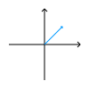

Sie können addiert und skaliert werden. Das Skalarprodukt zwischen zwei Vektoren ergibt einen Skalar.
$$\vec{v_1} \cdot \vec{v_2} = \displaystyle\sum_{i=0}^{n}v_{1_i} \cdot v_{2_i} = |\vec{a}| \cdot |\vec{b}| \cdot \cos(\alpha)$$

Das Vektorprodukt (*auch Kreuzprodukt*) zweier Vektoren ergibt einen Vektor, welcher orthogonal zu den beiden anderen Vektoren ist. Die Länge des Vektors entspricht der Fläche des Parallelograms, das durch die Vektoren gebildet wird.
$$\vec{a} \times \vec{b} = \left(\begin{array}{c}a_2b_3 - a_3b_2\\a_3b_1 - a_1b_3\\a_1b_2 - a_2b_1\end{array}\right)$$

Ein Einheitsvektor bzw normierter Vekotr ist ein Vektor der länge 1.
$$|\vec{v}| = 1$$

Ein beliebiger Vektor kann normiert werden.
$$norm(\vec{v})$$

#### Basis

Jeder Vektor ist eine Linearkombination aus einer Menge an Vektoren, der Basis. Die Basis enthält die minimale Anzahl an Vektoren um alle Vektoren des Vektorraums zu bilden.

$$\vec{y} = \displaystyle\sum_{i=0}^{n}a_i \cdot \vec{v_i}$$

Eine Menge welche zusätzliche Vektoren enthält wird als Erzeugendensystem bezeichnet.
Aus einem Erzeugendensystem kann man eine Basis errechnen, indem man die Vektoren wie folgt aufschreibt.
$$\left(\begin{array}{c|c|c}v_0 & v_1 & v_2\\\hline1 & 0 & 0\\0 & 1 & 0\\0 & 0 & 1\end{array}\right)$$

Mit Hilfe des Gauß Verfahrens jedoch auf <b>Spalten</b> bezogen, können nun die Vektoren oben zu Nullvektoren umgeformt werden, so weit es geht. Danach kann man unten ablesen, welche Linearkombinationen aus den anfangs Vektoren zu Nullvektoren geführt haben. Daraus kann man schließen, welche Vektoren eine Basis bilden.

Diese Anzahl der Vektoren in der Basis wird als die Dimension bezeichnet. 

#### Lineare Hülle (span)
Die Lineare Hülle ist die Menge aller Linearkombinationen von Vektoren eines Vektorraums. Damit kann Geometrisch gesehen ein Punkt, eine Gerade, eine Ebene, etc. durch den Ursprung beschrieben werden.
$$\text{span}(\vec{v_0}, \vec{v_1}, ..., \vec{v_m}) = \left\{\vec{v} \in K^n \land a_i \in K \left| \vec{v} = \displaystyle\sum_{i=0}^{m} a_i \cdot \vec{v_i}\right.\right\}$$

Eine allgemeine Ebene im drei-dimensionalen Raum braucht drei Punkte um eindeutig bestimmt zu sein. Man kann die Ebene auf verschiedene Arten mathematisch darstellen.

| Parameterform                                           | Koordinatenform                | Normalenform                               |
| ------------------------------------------------------- | ------------------------------ | ------------------------------------------ |
| $f(t, s) = t \cdot \vec{a} + s \cdot \vec{b} + \vec{c}$ | $f: \vec{n} \cdot \vec{x} = d$ | $f: (\vec{x} - \vec{c}) \cdot \vec{n} = 0$ |

Der Normalenvektor $\vec{n}$ ist ein Vektor, welcher orthogonal zu zwei anderen Vektoren liegt. Man kann ihn berechnen, indem man das Vektorprodukt der beiden Vektoren nimmt.
$$\vec{n} = \vec{a} \times \vec{b}$$

Falls man die Steigung in $x_1$ und $x_2$ Richtung kennt, kann man auch folgende Formel anwenden.

$$\vec{n} = \left(\begin{array}{c}\frac{\partial}{\partial x_1}f(x_{1_0}, x_{2_0})\\\frac{\partial}{\partial x_2}f(x_{1_0}, x_{2_0})\\-1\end{array}\right)$$

Diese Art der Berechnung des Normalenvektors bietet sich an um eine Tangentialebene zu bilden.

##### Totales Differenzial
Mit dem totalen Differenzial kann man für komplizierte Funktionen die Änderung in beliebige Richtungen annähern. Dabei gibt $\Delta$ die Änderung der Variablen an.
$$\Delta x_3 \approx \frac{\partial}{\partial x_1}f(x_1, x_2) \cdot \Delta x_1 + \frac{\partial}{\partial x_2}f(x_1, x_2) \cdot \Delta x_2$$

#### Gradient
Der Gradient zeigt in Richtung des größten Zuwachses von $f$.
$$\nabla f = grad(f) = \left(\begin{array}{c}\frac{\partial}{\partial x_1}f\\\frac{\partial}{\partial x_1}f\\\vdots\end{array}\right)$$

Mit Hilfe des Gradienten kann man die Ableitung in eine beliebige Richtung $r$ berechnen.
$$\frac{\partial}{\partial r}f(\vec{x}) = \tan(\alpha) = grad(f(\vec{x})) \cdot norm(\vec{r})$$

### Lineare Transformationen
#### Matrizen
Matrizen sind Ansammlungen von Vektoren und können genau so addiert und skaliert werden wie Vektoren.
$$A =\begin{pmatrix}\vec{m_1} & \vec{m_2}\end{pmatrix}=\begin{pmatrix}m_{11} & m_{12}\\m_{21} & m_{22}\\\end{pmatrix}$$

Zwischen Matrizen und Vektoren ist eine Multiplikation definiert, jedoch nur einseitig.
$$A \cdot \vec{x} = \begin{pmatrix}\vec{m_1} \cdot \vec{x}\\\vec{m_2} \cdot \vec{x}\\\end{pmatrix}$$

Zudem ist zwischen Matrizen eine Multiplikation definiert.
$$A \cdot B = \begin{pmatrix}A \cdot \vec{b_1} & A \cdot \vec{b_2}\end{pmatrix}$$

Eine lineare Abbildung ist eine transformation, welche auf einem Vektor bzw. Vektorraum angewendet wird.
$$D \rightarrow W$$
$$d_0 \mapsto w_0$$
$$\vdots$$

*Rotationsmatrix*

Eine lineare Abbildung ist eine Matrixmultiplikation. Für sie gilt, dass der Ursprung im Definitionsbereich gleich dem im Bildbereich ist und dass Linear Kombinationen im Definitionsbereich transformiert im Bildbereich erhalten bleiben.

$$f\left(\lambda \cdot \begin{pmatrix}x\\ y\end{pmatrix}\right) = \lambda \cdot f\left(\begin{pmatrix}x\\ y\end{pmatrix}\right)$$

$$f\left(\begin{pmatrix}x_1\\ y_1\end{pmatrix} + \begin{pmatrix}x_2\\ y_2\end{pmatrix}\right) = f\left(\begin{pmatrix}x_1\\ y_1\end{pmatrix}\right) + f\left(\begin{pmatrix}x_2\\ y_2\end{pmatrix}\right)$$

#### Kern und Bild
Der Kern einer linearen Abbildung ist die Menge aller Vektoren, welche auf den Ursprung abgebildet werden. Das Bild einer linearen Abbildung sind alle möglichen Vektoren, welche nach der Transformation noch erreicht werden können.

$$Kern(A) = \left\{A \cdot \vec{v}= \vec{0}\right\}$$

$$Bild(A) = span(\vec{m_1}, \vec{m_2})$$

Die Dimension der Ausgangsmenge $D$ entspricht der Dimension des Kerns und Bildes. Die Dimension des Bildes wird auch Rang genannt.
$$dim(D) = dim(Kern(A)) + dim(Bild(A)) = dim(Kern(A)) + Rang(A)$$

#### Determinate
Die Determinate ist ein Skalar und beschreibt wie sich der Inhalt, welcher von den Einheitsvektoren bestimmt wird, verändert. Nur Quadratische Matrizen haben eine Determinante.
Die Determinate kann auch *negativ* sein.
Wenn sich die Dimension nach der Transformation durch die Matrix verringert, ist die Determinate 0.
$$det(A) \in \mathbb{R}$$

Standartmäßig berechnet man die Determinate, indem man das Gauß Verfahren anwendet. Zum Schluss multipliziert man die Einträge der Diagonalen.

Eine Matrix ist invertierbar, wenn die Spalten eine Basis bilden und die Matrix quadratisch ist. Um das inverse zu erhalten wendet man wieder das Gauß Verfahren an. Danach kann man die Lösung auf der rechten Seite ablesen.
$$\left(\begin{array}{cc|cc}a & b & 1 & 0\\c & d & 0 & 1\end{array}\right)$$

#### Eigenvektoren/Eigenwerte
Die Eigenvektoren einer linearen Abbildung $A$ sind Vektoren $\vec{v}$, welche jeweils vor und nach der transformation den gleichen **span** haben und nicht der Nullvektor sind.
Der Eigenwert ist der Faktor $a$ eines Eigenvektoren.
$$A \cdot \vec{v} = a \cdot \vec{v}$$
$$(A - a \cdot E) \cdot \vec{v} = \vec{0}$$

Die Eigenwerte berechnet man indem man folgende Gleichung löst:
$$det(A - a \cdot E) = 0$$

Danach können die Eigenvektoren durch einsetzen berechnet werden.
