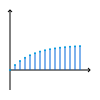

# Mathematik
## Mengen
Eine Menge ist eine **ungeordnete** Sammlung von Objekten, den Elementen. Man schreibt $m \in M$ um auszudrücken, dass das Objekt $m$ ein Element der Menge $M$ ist. Mengen können auch andere Mengen enthalten, jedoch nicht sich selbst. Mengen können auf zwei verschiedene Arten definiert werden. Durch Aufzählung der Elemente oder durch deren Charakteristische Eigenschaft. Zweimal die **gleiche** Menge:
$$\left\{1, 2, 4, 8, 16,...\right\} = \left\{x \in \mathbb{N}_0 | \exists k \in \mathbb{N}_0: x = 2^k\right\}$$
Die Menge, welche keine Elemente enthält wird mit $\emptyset$ bezeichnet.
$$\{\} = \emptyset$$

Mit $n \notin M$ wird ausgedrückt, dass das Objekt $n$ nicht in der Menge $M$ enthalten ist.
Eine **unendliche** Menge heißt Abzählbar, wenn es eine bijektive Abbildung zwischen $\mathbb{N}_0$ und der Menge gibt. Wenn es keine gibt heißt die Menge Überabzählbar.

### Mengen-Relationen

| Relation        |  Schreibweise   | Beschreibung                         |
| :-------------- | :-------------: | :----------------------------------- |
| Gleich          |     $M = N$     | Gleiche Elemente                     |
| Teilmenge       | $M \subseteq N$ | Ausschnitt aus Menge                 |
| Echte-Teilmenge |  $M \subset N$  | Ausschnitt aus Menge                 |
| Disjunkt        |        -        | $M$ und $N$ stehen nicht in Relation |

### Mengen-Operationen
Um Operationen auf Mengen auszuführen benötigt man ein **Universum** $U$, als Referenz Menge.

| Vereinigung                   | Schnitt                   | Differenz                   | Komplement                   |
| ----------------------------- | ------------------------- | --------------------------- | ---------------------------- |
|  |  |  |  |
| $$M \cup N$$                  | $$M \cap N$$              | $$M \setminus N$$           | $$M^C$$                      |

### Kardinalität
Mächtigkeit einer Menge
$|M| \in \mathbb{N}_0$
### Potenzmenge
Menge aller Teilmengen
$P(M)=\{m \in U m \subseteq M\}$

### Kartesisches Produkt
Mit $(a, b, ...)$ bezeichnet man ein Tupel, eine **geordnete** Sammlung an Objekten. Beim Kartesischen Produkt entsteht eine Menge aus Tupeln.

$$M \times N = \{(m,n) | m \in M, n \in N\}$$
$$M^n = M \times M \times ...$$

### Kleenscher Abschluss
$$M^* = M^0 \cup M^1 \cup ...$$

### Positive Hülle
$$M^+ = M^1 \cup M^2 \cup ...$$

## Relationen
Eine Relation gibt eine Beziehung zwischen Objekten an. Sie ist eine Teilmenge eines Kartesischen Produkts.

$$R \subseteq M^n$$

Mit $(a, b) \in R$ bezeichnet man, dass $a$ mit $b$ in Relation steht. Eine Relation $R$ kann auf verschiedene Mengen bezogen sein und verschiedene Eigenschaften auf den jeweiligen Mengen besitzen.

### Eigenschaften Relationen

| Eigenschaft        | Definition                                            | Beschreibung                                                        | Darstellung                            |
| ------------------ | ----------------------------------------------------- | ------------------------------------------------------------------- | -------------------------------------- |
| Reflexiv           | $$\forall a \in M: (a, a) \in R$$                     | Alles steht mit sich selbst in Relation                             |             |
| Symmetrisch        | $$(a,b) \in R \Rightarrow (b,a) \in R$$               | Alle Relationen sind Beidseitig.                                    |          |
| Antisymmetrisch    | $$(a,b), (b,a) \in R \Rightarrow a = b$$              | Alle Relationen sind Einseitig.                                     |      |
| Transitiv          | $$(a,b),(b,c)\in R \Rightarrow (a,c)\in R$$           | Über zwei Relationen verknüpfte Objekte sind auch direkt verknüpft. |            |
| Total              | $$\forall a,b \in M: (a,b) \in R \lor (b,a) \in R$$   | Alles steht mit allem mindestens Einseitig in Relation.             |                |
| Halbordnung        | Reflexiv, <b>Antisymmetrisch</b> und Transitiv.       | -                                                                   |          |
| Totalordnung       | Reflexiv, <b>Antisymmetrisch</b> Transitiv und Total. | -                                                                   |         |
| Äquivalenzrelation | Reflexiv, <b>Symmetrisch</b> und Transitiv            | Die Relation unterteilt eine Menge in Äquivalenzklassen.            |  |

### Äquivalenzklassen

$$[a]_R = [b]_R = [c]_R$$
$$[a]_R = \{a, b, c\}$$

$$[d]_R$$
$$[d]_R = \{d\}$$

Alle Elemente einer Äquivalenzklasse sind Äquivalent.
Die Menge der Äquivalenzklassen lautet:

$$M/R = \{\{a, b, c\}, \{d\}\}$$

## Abbildungen

Eine Abbildung ist eine spezielle Relation. Eine Abbildung weist jedem Element aus einer Menge, dem Definitionsbereich, ein Element aus einer Menge, dem Bildbereich, zu.

$$f:M \rightarrow N$$
$$m_1 \mapsto n_1$$
$$m_2 \mapsto n_2$$
$$...$$

Die Abbildung $id_M$ ist die Identität auf einer Menge $M$. Sie bildet jedes Element der Menge auf das gleiche Element ab.
Mit $f \circ g$ drückt man aus, dass $f$ nach $g$ ausgeführt wird. Wenn $f \circ g = id_N$ und  $g \circ f = id_M$ dann sind $f$ und $g$ invers zu einander.

$$f:M \rightarrow N$$
$$m_1 \mapsto n_1$$
$$m_2 \mapsto n_2$$
$$...$$

$$g:N \rightarrow M$$
$$n_1 \mapsto m_1$$
$$n_2 \mapsto m_2$$
$$...$$

Der Bildbereich ist so definiert:

$$Bild(f) = \{f(m) | \forall m \in M\}$$

Mit $Abb(M, N)$ erhält man eine Menge aller Abbildungen von der Menge $M$ zur Menge $N$.

### Eigenschaften Abbildungen

|                                Injektiv                                |                               Surjektiv                                |
| :--------------------------------------------------------------------: | :--------------------------------------------------------------------: |
|                                              |                     ()                      |
| Jedes Element aus dem Bildbereich wird <b>maximal einmal</b> getroffen | Jedes Element aus dem Bildbereich wird <b>minimal einmal</b> getroffen |
|          $$\forall a,b \in M: f(a) = f(b) \Rightarrow a = b$$          |             $$\forall b \in N: \exists a \in M: f(a) = b$$             |

|                                                      Bijektiv                                                       |
| :-----------------------------------------------------------------------------------------------------------------: |
|                                                                                           |
| Jedes Element aus dem Bildbereich wird <b>genau einmal</b> getroffen. Bijektive Abbildungen sind immer invertierbar |
|                                               Injektiv und Surjektiv                                                |

### Abgeänderte Abbildungen
Eine abgeänderte Abbildung bei der $x$ auf $y$ abbilden soll kann so erstellt werden:
$$f_{x}^{y}: M \rightarrow N$$
$$x \mapsto y$$
$$m_1 \mapsto n_1$$
$$...$$

### Partielle Abbildungen
Eine Partielle Abbildung ist nicht für alle Werte definiert.
$$f: M \rightarrow N$$
$$x \mapsto \perp$$
$$m_1 \mapsto n_1$$
$$...$$

## Algebraische Strukturen
Algebraische Strukturen ermöglichen es Gesetze für Operationen auf bestimmten Mengen zu formen. Sie bestehen aus einer Menge und einer oder zwei Operationen.
$$(M, \oplus)$$
$$(M, \oplus, \odot)$$

### Eigenschaften Algebraischer Strukturen

| Eigenschaft       |                                   Definition                                    |
| :---------------- | :-----------------------------------------------------------------------------: |
| Abgeschlossenheit |             $$\forall a, b \in M: \exists c \in M: a \oplus b = c$$             |
| Assoziativ        |    $$\forall a, b, c \in M: a \oplus (b \oplus c) = (a \oplus b) \oplus c$$     |
| Neutral Element   |              $$\exists n \in M: \forall e \in M: e \oplus n = e$$               |
| Inverse Elemente  | $$\exists n \in M: \forall e \in M: \exists e^{-1} \in M: e \oplus e^{-1} = n$$ |
| Kommutativ        |                 $$\forall a,b \in M: a \oplus b = b \oplus a$$                  |
| Distributiv       | $$\forall a,b,c \in M: a \odot (b \oplus c) = (a \odot b) \oplus (a \odot c)$$  |

### Algebraische Strukturen
Die Eigenschaften der Operationen auf der Menge bestimmen die Algebraische Struktur.

### Vektorraum
Über einem Körper $M$ kann ein Vektorraum $M^n (n \in \mathbb{N})$ definiert werden. In diesem Vektorraum sind zwei Operationen definiert.

#### Addition
$$\oplus: M^n \times M^n \rightarrow M^n$$
$$\vec{a} \oplus \vec{b} \mapsto \vec{c}$$
*(Komponentenweise addiert wie im Körper)*

#### Skalarmultiplikation
$$\odot: M \times M^n \rightarrow M^n$$
$$a \odot \vec{b} \mapsto \vec{c}$$
*(Komponenten skaliert wie im Körper)*

#### Untervektorraum
Ein Untervektorraum ist eine Teilmenge eines Vektorraums, welche selbst ein Vektorraum ist.

### Operationen
#### Ordnung
Die Ordnung eines Elements gibt an, nach wie vielen hintereinander ausführungen der Multiplikation mit sich selbst, das Neutral Element entsteht. Sie ist bedeutend für endliche Körper.
$$a^n = a \odot a \odot a \odot ... = 1$$
$$ord(a) = n$$

## Aussagen Logik
Eine Formel besteht aus, den Symbolen $0$, $1$ den Atomen der Menge $\Sigma$ (Signatur) oder Verknüpfungen von bekannten Formeln mit den fünf definieren Operationen. In Folgenden Beispielen gilt $\Sigma = \{\textcolor{orange}{A}, \textcolor{orange}{B}\}$. Die Menge aller Formeln auf $\Sigma$ wird mit $For0_{\Sigma}$ bezeichnet. 
$$0, 1 \in For0_{\Sigma}$$
$$\Sigma \subseteq For0_{\Sigma}$$
Formeln selber sind nur Zeichenketten und können nicht umgeformt werden.

### Operationen Aussagen Logik

| Operation   | Schreibweise                                                      | Beschreibung                                                     |
| ----------- | ----------------------------------------------------------------- | ---------------------------------------------------------------- |
| Negation    | $$\neg \textcolor{orange}{A}$$                                    | Gegenteil                                                        |
| Disjunktion | $$(\textcolor{orange}{A} \lor \textcolor{orange}{B})$$            | Eins von beiden Wahr                                             |
| Konjunktion | $$(\textcolor{orange}{A} \land \textcolor{orange}{B})$$           | Beide Wahr                                                       |
| Implikation | $$(\textcolor{orange}{A} \rightarrow \textcolor{orange}{B})$$     | $$\neg(\textcolor{orange}{A} \land \neg \textcolor{orange}{B})$$ |
| Äquivalenz  | $$(\textcolor{orange}{A} \leftrightarrow \textcolor{orange}{B})$$ | Gleichwertig                                                     |

### Syntaxbaum

Zu jeder Formel $F$ kann ein Syntaxbaum erstellt werden. Mit ihm kann die Formel leicht in ihre Teilformen $Teilf(F)$ zerlegen werden, wodurch sie ausgewertet werden kann.
Um $Teilf(F)$ zu erhalten geht man einfach den Syntaxbaum durch und konstruiert von jedem Knoten aus abwärts eine Teilformel.
$$Teilf(\neg (\textcolor{orange}{A} \land \neg \textcolor{orange}{B})) = \{\neg (\textcolor{orange}{A} \land \neg \textcolor{orange}{B}), (\textcolor{orange}{A} \land \neg \textcolor{orange}{B}), \textcolor{orange}{A}, \neg \textcolor{orange}{B}, \textcolor{orange}{B}\}$$

$$\neg (\textcolor{orange}{A} \land \neg \textcolor{orange}{B})$$

### Auswertung
Um eine Formel auszuwerten benötigt man eine Interpretation $I$, welche den Atomen aus $\Sigma$ die Werte $\textcolor{LimeGreen}{W}$ für Wahr und $\textcolor{red}{F}$ für Falsch zuweist. Mit $val_I$ wird eine Abbildung definiert die nun alle Formeln aus $For0_\Sigma$ auswerten kann, durch eine Rekursive Definition der Operationen (*ausgelassen*).

$$I: \Sigma \rightarrow \{\textcolor{LimeGreen}{W}, \textcolor{red}{F}\}$$
$$\textcolor{orange}{A} \mapsto \textcolor{LimeGreen}{W}$$
$$\textcolor{orange}{B} \mapsto \textcolor{red}{F}$$

$$val_I: For0_\Sigma \rightarrow \{\textcolor{LimeGreen}{W}, \textcolor{red}{F}\}$$
$$0 \mapsto \textcolor{red}{F}$$
$$1 \mapsto \textcolor{LimeGreen}{W}$$
$$\textcolor{orange}{A} \mapsto I(\textcolor{orange}{A})$$
$$...$$

| Eigenschaft     | Beschreibung                                       |
| --------------- | -------------------------------------------------- |
| Modell          | Eine Interpretation wertet die Formel zu Wahr aus. |
| Erfüllbar       | Mindestens eine Interpretation ist Modell.         |
| Allgemeingültig | Alle Interpretationen sind Modell.                 |

### Relationen Aussagen Logik

| Logische Folgerbarkeit                                                       | Logische Äquivalenz                                                         |
| ---------------------------------------------------------------------------- | --------------------------------------------------------------------------- |
| Modelle für $\textcolor{orange}{A}$ sind Modelle für $\textcolor{orange}{B}$ | $\textcolor{orange}{A}$ und $\textcolor{orange}{B}$ sind logisch Äquivalent |
| $$\textcolor{orange}{A} \models \textcolor{orange}{B}$$                      | $$\textcolor{orange}{A} \equiv \textcolor{orange}{B}$$                      |

### Normalform

Mit einer Wahrheitstabelle kann man eine Aussagenlogische Formel ausdrücken. Der Ausgang $Y$ kann auch den Wert $\perp$ haben, falls diese Kombination an Eingangs-werten nicht auftritt oder irrelevant ist. Eine Wahrheitstabelle ist wie eine Partielle Abbildung.
$$f: \{\textcolor{red}{F}, \textcolor{LimeGreen}{W}\}^n \rightarrow \{\textcolor{red}{F}, \textcolor{LimeGreen}{W}\}^m$$
$$x_1 \mapsto y_1$$
$$x_2 \mapsto \perp$$

| $\textcolor{orange}{A}$    | $\textcolor{orange}{B}$    | $Y$                        |
| -------------------------- | -------------------------- | -------------------------- |
| $\textcolor{#FF0000}{F}$   | $\textcolor{#FF0000}{F}$   | $\textcolor{LimeGreen}{W}$ |
| $\textcolor{#FF0000}{F}$   | $\textcolor{LimeGreen}{W}$ | $\textcolor{#FF0000}{F}$   |
| $\textcolor{LimeGreen}{W}$ | $\textcolor{#FF0000}{F}$   | $\textcolor{#FF0000}{F}$   |
| $\textcolor{LimeGreen}{W}$ | $\textcolor{LimeGreen}{W}$ | $\textcolor{LimeGreen}{W}$ |

Mit Hilfe der Wahrheitstabelle kann man nun die Normalform bilden, welche sich leicht realisieren lässt. Man unterscheidet zwischen der DNF und KNF.

| Disjunktive Normalform                                                 | Konjunktive Normalform                                               |
| ---------------------------------------------------------------------- | -------------------------------------------------------------------- |
| Disjunktiv-verknüpfte Minterme                                         | Konjunktiv-verknüpfte Maxterme                                       |
| $$DNF = (m_1 \lor m_2 \lor ...)$$                                      | $$KNF = (M_1 \land M_2 \land ...)$$                                  |
| $$m_i = (\textcolor{orange}{A} \land \textcolor{orange}{B} \land...)$$ | $$M_i = (\textcolor{orange}{A} \lor \textcolor{orange}{B} \lor...)$$ |

$$DNF \equiv Y \equiv KNF$$

#### KV-Diagramm

Größtmögliche Rechtecke der Größe $2^n$ bilden. Diese ergeben die Primimplika(n)te (minimierte Terme). Für die KNF müssen alle Eingänge noch invertiert werden.

| Minterme                                     | Maxterme                                         |
| -------------------------------------------- | ------------------------------------------------ |
| $(\textcolor{#AA00FF}{\neg A \land C})$      | $(\textcolor{#FF00AA}{\neg B \lor \neg \neg C})$ |
| $(\textcolor{#00FFAA}{\neg A \land \neg B})$ | $(\textcolor{#AAFF00}{\neg A \lor \neg \neg D})$ |
| $(\textcolor{#00AAFF}{B \land C \land D})$   | $(\textcolor{#777777}{\neg A \lor \neg \neg B})$ |

| minimale DNF                                                                                                                                                                        | minimale KNF                                                                                                                              |
| ----------------------------------------------------------------------------------------------------------------------------------------------------------------------------------- | ----------------------------------------------------------------------------------------------------------------------------------------- |
| $$Y \equiv (\left(\textcolor{#AA00FF}{\neg A \land C}\right) \lor \left(\textcolor{#00FFAA}{\neg A \land \neg B}\right) \lor \left(\textcolor{#00AAFF}{B \land C \land D}\right))$$ | $$Y \equiv ((\textcolor{#FF00AA}{\neg B \lor C}) \land (\textcolor{#AAFF00}{\neg A \lor D}) \land (\textcolor{#777777}{\neg A \lor B}))$$ |

#### QMC-Verfahren (DNF)
1. Spalte füllen
2. um eins verschiedene Paare finden
3. in nächste Spalte zusammenfassen
    - Unterschied wird durch $\perp$ ersetzt
4. wiederholen bis keine Paare mehr
5. Paar-lose sind Primimplika(n)te
6. abgleichen und Redundante entfernen

#### QMC Optimierung
QMC ist ein exakter Algorithmus und deswegen langsam.
Ein heuristischer Algorithmus ist deutlich schneller, aber ein wenig ungenau. (ESPRESSO)
Die Ungenauigkeit bezieht sich auf die vollständige Kürzung, es entsteht trotzdem eine valide DNF, nur nicht unbedingt die minimale.

## Prädikaten Logik

Die Syntax der Aussagen Logik wird in der Prädikaten Logik erweitert durch Prädikate, Terme und Variablen.
Die Signatur $\Sigma$ ist nun ein Tupel und besteht aus der Menge der Prädikatssymbolen $P_\Sigma$, Funktionssymbolen $F_\Sigma$, der Abbildung $\alpha_\Sigma$ und der Menge der Variablen $Var_\Sigma$.
$$\Sigma = (F_\Sigma, P_\Sigma, \alpha_\Sigma, Var_\Sigma)$$
Die Abbildung $\alpha_\Sigma$ ordnet Elementen aus $F_\Sigma$ und $P_\Sigma$ eine Stelligkeit zu.
Null-stellige Prädikate verhalten sich exakt gleich wie Atome aus der Aussagen Logik. Hingegen n-stellige Prädikate erhalten n Terme als Parameter.
Ein Term besteht aus Variablen, n-stelligen Funktionssymbolen und Konstantensymbolen (Null-stellige Funktionssymbole).
Die Menge aller Prädikaten-logischen Formeln wird mit $For_\Sigma$ bezeichnet.
$$0, 1 \in For_\Sigma$$
$$AF_\Sigma \subseteq For_\Sigma$$
Die Atomaren-Formeln ($AF_\Sigma$) bestehen aus Prädikaten oder Prädikaten mit Termen als Parameter.
Die Menge aller möglichen Terme auf $\Sigma$ wird mit $Term_\Sigma$ bezeichnet.
Mit $Teilf$ erhält man alle Teilformeln von einer Formel.
Mit $Teilt$ erhält man alle Teilterme von einer Formel.

### Syntaxbaum
$$((\forall x \textcolor{orange}{p_1}(\textcolor{cyan}{f_1}(\textcolor{red}{x})) \land \exists y \textcolor{orange}{p_1}(\textcolor{cyan}{f_2}(\textcolor{red}{y}, \textcolor{green}{x}, \textcolor{cyan}{f_0}))) \lor \textcolor{orange}{p_0})$$

*(Indices stehen für Stelligkeit)*

### Quantoren (Zusätzliche Operationen)

Quantoren bringen eine Variable ein, welche in dem direkt darauf folgendem Block definiert ist. Tritt das gleiche Symbol nochmals auf handelt es sich um eine andere Variable.
Eine Formel in der alle Variablen an einen Quantoren gebunden sind heißt geschlossene Formel.
Man kann frei Auftretende Variablen durch Terme ersetzten.
In diesem Beispiel wird in der Formel $F$, $x \in Var_\Sigma$ durch $t \in Term_\Sigma$ ersetzt.
$$[x/t]F$$

#### Existenzquantor
$$\exists x F$$
Es gibt ein $x$ für das $F$ gilt

#### Allquantor
$$\forall x F$$
Für alle $x$ gilt $F$

### Auswertung
Um eine Formel auszuwerten benötigt man eine Struktur $S$, welche aus einer Menge $U$ dem Universum und einer Menge $I$ der Interpretationsfunktion besteht. Zusätzlich benötigt man eine Variablenbelegung $v$ wodurch man eine erweiterte Struktur erhält. Mit $valt_{S,v}$ können Terme auswerten werden. Mit $valf_{S,v}$ können Formeln auswerten werden.
$$S = (U, I)$$

| Formel Auswertung                                                                                                                                                                                                      | Term Auswertung                                                                                                                                                                                                                             | Variablen Auswertung                                                       | Interpretation Auswertung                                                                                                                                                           |
| ---------------------------------------------------------------------------------------------------------------------------------------------------------------------------------------------------------------------- | ------------------------------------------------------------------------------------------------------------------------------------------------------------------------------------------------------------------------------------------- | -------------------------------------------------------------------------- | ----------------------------------------------------------------------------------------------------------------------------------------------------------------------------------- |
| $$valf_{S,v}: For_\Sigma \rightarrow \{F, W\}$$ $$0, 1 \mapsto F, W$$ $$p_0 \mapsto \textcolor{orange}{I}(p_0)$$ $$p_n(t, ...) \mapsto (\textcolor{cyan}{valt_{S,v}}(t), ...) \in \textcolor{orange}{I}(p_n)$$ $$...$$ | $$\textcolor{cyan}{valt_{S,v}}: Term_\Sigma \rightarrow U$$ $$var \mapsto \textcolor{green}{v}(var)$$ $$f_0 \mapsto \textcolor{orange}{I}(f_0)$$ $$f_n(t, ...) \mapsto (\textcolor{orange}{I}(f_n))(\textcolor{cyan}{valt_{S,v}}(t), ...)$$ | $$\textcolor{green}{v}: Var_\Sigma \rightarrow U$$ $$var \mapsto u \in U$$ | $$\textcolor{orange}{I}: F_\Sigma \cup P_\Sigma \rightarrow ...$$ $$p_0 \mapsto F, W$$ $$p_n \mapsto R \subseteq U^n$$ $$f_0 \mapsto u \in U$$ $$f_n \mapsto g: U^n \rightarrow U$$ |

$$valf_{S, v}(\forall x F) = W\text{, wenn für alle } u \in U valf_{S, v_{x}^{u}}(F) \text{ gilt}$$
$$valf_{S, v}(\exists x F) = W\text{, wenn es für mindestens ein } u \in U valf_{S, v_{x}^{u}}(F) \text{ gilt}$$

### Klausel
Eine Klausel ist eine Mengen-darstellung einer KNF, wobei diese nicht eindeutig rückgängig gemacht werden kann.
$$(A \land (\neg B \lor C))$$
$$\{\{A\}, \{\neg B, C\}\}$$

## Natürliche Zahlen
Die Natürlichen Zahlen sind eine Menge an Zahlen und sind Rekursiv definiert. Für sie gilt:
$$0 \in \mathbb{N}_0$$
Wobei 0 die Erste Natürliche Zahl ist.
Und zusätzlich gilt, der Nachfolger einer Natürlichen Zahl ist auch eine Natürliche Zahl:
$$n \in \mathbb{N}_0 \rightarrow \sigma(n) \in \mathbb{N}_0$$

## Ganze Zahlen

## Rationale Zahlen

## Reele Zahlen

## Moduloarithmetik/Restklassen
Auf der Menge $\mathbb{Z}$ kann für ein gewähltes $n \in \mathbb{Z}$ eine Restklasse definiert werden.
$$\sim_n = \{(a, b) \in \mathbb{Z} \times \mathbb{Z}| \exists c \in \mathbb{Z}: a - b = c \cdot n\}$$
$$[a]_{\sim_n} + [b]_{\sim_n} = [a + b]_{\sim_n}$$
$$[a]_{\sim_n} - [b]_{\sim_n} = [a - b]_{\sim_n}$$
$$[a]_{\sim_n} \cdot [b]_{\sim_n} = [a \cdot b]_{\sim_n}$$
Diese Restklassen sind Äquivalenzrelationen und können verkürzt dargestellt werden:
$$\mathbb{Z}/n\mathbb{Z}$$
$$a + b \equiv c \mod n$$
$$a - b \equiv c \mod n$$
$$a \cdot b \equiv c \mod n$$
Bei Restklassen handelt es sich um kommutative Ringe. Falls $n$ eine Primzahl ist, handelt es sich bei der Restklasse sogar um einen Körper.

### Nullteiler
Wenn $\mathbb{Z}/n\mathbb{Z}$ kein Körper ist, kann es Nullteiler, von 0 verschiedene Zahlen, die multipliziert 0 ergeben, geben:
$$2 \cdot 3 = 6 \equiv 0 \mod 6$$

### Multiplikativ Inverse Elemente
Wenn $\mathbb{Z}/n\mathbb{Z}$ ein Körper ist, findet man zu einer beliebigen Zahl ein Multiplikatives Inverse:
$$2 \cdot 7 = 14 \equiv 1 \mod 13$$

### Primitivwurzeln
Primitivwurzeln sind Zahlen einer Restklasse, welche jede andere Zahl, durch Potenzen von sich, darstellen können.
$$\forall a \exists b: p^b \equiv a \mod n$$
Wenn die Ordnung eines Elements $n-1$ entspricht, ist es eine Primitivwurzel.

### Euklidischer Algorithmus
Der Euklidische Algorithmus liefert den größten gemeinsamen Teiler zweier Zahlen.
$$\text{gcd}(\textcolor{cyan}{128}, \textcolor{orange}{36})$$
$$\textcolor{cyan}{128} = 3 \cdot \textcolor{orange}{36} + \textcolor{purple}{20}$$
$$\textcolor{orange}{36} = 1 \cdot \textcolor{purple}{20} + \textcolor{green}{16}$$
$$\textcolor{purple}{20} = 1 \cdot \textcolor{green}{16} + \textcolor{brown}{4}$$
$$\textcolor{green}{16} = 1 \cdot \textcolor{brown}{4} + 0$$
$$\text{gcd}(\textcolor{cyan}{128}, \textcolor{orange}{36}) = \textcolor{brown}{4}$$

### Erweiterter Euklidischer Algorithmus
Der Erweiterter Euklidischer Algorithmus löst Gleichungen folgender Art (Linearkombination):
$$\text{gcd}(a, b) = x \cdot a + y \cdot b$$
Er wird nach dem Euklidischer Algorithmus ausgeführt.
$$\textcolor{brown}{4} = 1 \cdot \textcolor{purple}{20} - 1 \cdot \textcolor{green}{16}$$
$$\textcolor{brown}{4} = 1 \cdot \textcolor{purple}{20} - 1 \cdot (1 \cdot \textcolor{orange}{36} - 1 \cdot \textcolor{purple}{20})$$
$$\textcolor{brown}{4} = - 1 \cdot \textcolor{orange}{36} + 2 \cdot \textcolor{purple}{20}$$
$$\textcolor{brown}{4} = - 1 \cdot \textcolor{orange}{36} + 2 \cdot (1 \cdot \textcolor{cyan}{128} - 3 \cdot \textcolor{orange}{36})$$
$$\textcolor{brown}{4} = 2 \cdot \textcolor{cyan}{128} - 7 \cdot \textcolor{orange}{36}$$    

## Permutationen
Eine Permutation ist eine bijektive Abbildung von einer endliche Teilmenge der Natürlichen zahlen in sich selbst.
$$X \subset \mathbb{N}$$
$$|X| \in \mathbb{N}$$
$$p: X \rightarrow X$$
Permutationen alternative Schreibweisen:

### Schreibweisen

| Matrix Schreibweise                                                                              | Zyklische Schreibweise                                                                                                                         |
| ------------------------------------------------------------------------------------------------ | ---------------------------------------------------------------------------------------------------------------------------------------------- |
| $$\left(\begin{array}{cccccc}1 & 2 & 3 & 4 & 5 & 6 \\ 2  & 3 & 1 & 5 & 4 & 6\end{array}\right)$$ | $$\left(\begin{array}{ccc}1 & 2 & 3\end{array}\right)\left(\begin{array}{cc}4 & 5\end{array}\right)\left(\begin{array}{c}6\end{array}\right)$$ |

### Ordnung
$$ord(\left(\begin{array}{ccc}1 & 2 & 3\end{array}\right)\left(\begin{array}{cc}4 & 5\end{array}\right)\left(\begin{array}{c}6\end{array}\right)) = \text{lcm}(\left|\left(\begin{array}{ccc}1 & 2 & 3\end{array}\right)\right|, \left|\left(\begin{array}{cc}4 & 5\end{array}\right)\right|, \left|\left(\begin{array}{c}6\end{array}\right)\right|) = \text{lcm}(3, 2, 1) = 6$$

## Folgen und Reihen
Eine (Zahlen-)Folge ist eine unendliche geordnete Sammlung an Reellen Zahlen. Sie wird mit einem Buchstaben und einem Index $n \in \mathbb{N}_0$ angegeben. Sie kann auch als ein Tupel ausgeschrieben werden.
$$a: \mathbb{N}_0 \rightarrow \mathbb{R}$$
$$0 \mapsto a_0$$
$$1 \mapsto a_1$$
$$...$$

Eine Folge kann auf die Rekursive, Abhängigkeit von vorherigen Gliedern, oder Explizite Art definiert werden.
Eine Reihe ist eine besondere Folge. Bei ihr ist der Abstand zwischen aufeinander folgenden Gliedern gleich dem Wert einer bestimmten Folge an dieser Stelle.

### Kategorien

| Arithmetische Folge                                           | Geometrische Folge                                                                | Arithmetische Reihe                                                                                                            | Geometrische Reihe                                                                                                                               |
| ------------------------------------------------------------- | --------------------------------------------------------------------------------- | ------------------------------------------------------------------------------------------------------------------------------ | ------------------------------------------------------------------------------------------------------------------------------------------------ |
| $$\textcolor{orange}{a_{n+1}} = \textcolor{orange}{a_n} + k$$ | $$\textcolor{cyan}{g_{n+1}} = \textcolor{cyan}{g_n} \cdot \textcolor{purple}{q}$$ | $$\displaystyle\sum_{i=0}^{n}\textcolor{orange}{a_i} = \frac{n \cdot (\textcolor{orange}{a_1} + \textcolor{orange}{a_n})}{2}$$ | $$\displaystyle\sum_{i=0}^{n}\textcolor{cyan}{g_i} = \textcolor{cyan}{g_1} \cdot \frac{\textcolor{purple}{q}^n - 1}{\textcolor{purple}{q} - 1}$$ |
|                         |                                              |                                                                                          |                                                                                                             |

### Konvergenz
Mit Konvergenz kann man Grenzwert-Betrachtungen einer Folge oder Funktion für undefinierte Werte anstellen, wie zum Beispiel welchen Wert eine Folge $a_n$ hat, wenn man für $n$ gegen unendlich strebt. Der Grenzwert wird meist mit $g$ bezeichnet.
$$\displaystyle\lim_{n \rightarrow \infty} (a_n) = g$$

### Reihen Konvergenz

| Notwendiges Kriterium                                                      | Hinreichendes Kriterium                                                                                                                            | Hinreichendes Kriterium                                                                                                 |
| -------------------------------------------------------------------------- | -------------------------------------------------------------------------------------------------------------------------------------------------- | ----------------------------------------------------------------------------------------------------------------------- |
| $$\displaystyle\lim_{n \rightarrow \infty}(\textcolor{#006666}{g_n}) = 0$$ | $$\displaystyle\lim_{n \rightarrow \infty}\left(\left \vert \frac{\textcolor{#006666}{g_{n+1}}}{\textcolor{#006666}{g_n}}\right\vert \right) < 1$$ | $$\displaystyle\lim_{n \rightarrow \infty}\left(\left \vert \sqrt[n]{\textcolor{#006666}{g_n}}\right\vert \right) < 1$$ |

### Potenzreihen
Eine Potenzreihe ist ein Polynom, bei dem die Koeffizienten $a_n$ Werte einer Folge oder Reihe sind.
$$p(x) = \displaystyle\sum_{n=0}^{\infty}a_n(x-x_0)^n$$

Potenzreihen konvergieren meist nur in einem bestimmten Wertebereich um $x_0$, dieser ist bestimmt durch dem Konvergenzradius $r$.
$$r = \displaystyle\lim_{n \rightarrow \infty}\left(\left|\frac{a_n}{a_{n+1}}\right|\right)$$

## Differenzialrechnung

Die Ableitung einer Funktion ist eine Funktion. Die Ableitung gibt die Steigung der Stammfunktion an jedem definierten Punkt an. Die Ableitung von einer Funktion $f$ wird mit $f'$ bezeichnet. Mit der Schreibweise $f^{(n)}$ kann man die $n$-te Ableitung ausdrücken. Mit $\frac{\partial}{\partial x}f$ kann man für Funktionen mit mehreren Variablen angeben, nach welcher Variablen abgeleitet wird.
$$\textcolor{orange}{f}(x) = x^2$$
$$\textcolor{cyan}{f'}(x) = 2 \cdot x$$

### Ableitungen
$$(x^n)' = n \cdot x^{n-1}$$

$$(\sin(x))' = \cos(x)$$
$$(\cos(x))' = -\sin(x)$$

$$(e^x)' = e^x$$
$$(\ln(x))' = \frac{1}{x}$$

| Verfahren      | Formel                                                                                                                                    |
| -------------- | ----------------------------------------------------------------------------------------------------------------------------------------- |
| Produktregel   | $$f(x) = u(x) \cdot v(x)$$ $$f'(x) = u'(x) \cdot v(x) + u(x) \cdot v'(x)$$                                                                |
| Kettenregel    | $$f(x) = u(v(x))$$ $$f'(x) = v'(x) \cdot u'(v(x))$$                                                                                       |
| Logarithmisch  | $$f(x) = u(x)^{v(x)}$$ $$(\ln(f(x)))' = (v(x) \cdot \ln(u(x)))'$$                                                                         |
| Umkehrfunktion | $$f(x) \text{ umkehrbar}$$ $$f'(x) = \frac{1}{(f^{-1})'(f(x))}$$                                                                          |
| Impliziert     | $$F(x; y) = u(x) + v(y) = 0$$ $$u'(x) + y' \cdot v(y) = 0$$                                                                               |
| Parameter      | $$x(t) \text{, } y(t)$$ $$f'(t) = \frac{y'(t)}{x'(t)}$$                                                                                   |
| Polar          | $$r(\alpha)$$ $$x(\alpha) = r(\alpha) \cdot \cos(\alpha)$$ $$y(\alpha) = r(\alpha) \cdot \sin(\alpha)$$ $$\rightarrow \text{ Parameter}$$ |

### Taylor Reihen
Eine Taylor Reihe ist eine Potenzreihe, welche eine Funktion an der Stelle $x_0$ annähert. Sie kann verwendet werden um Funktionen wie $\sin$ oder $e^x$ anzunähern. Desto mehr Terme addiert werden, desto genauer wird die Annäherung.
$$f(x) = \displaystyle\sum_{n=0}^{\infty}\frac{f^{(n)}(x_0)}{n!} \cdot (x-x_0)^n$$

Für Funktionen mit zwei Variablen erhält man die Taylor Reihe wie folgt.
$$f(x, y) = \displaystyle\sum_{i=0}^{\infty}\displaystyle\sum_{j=0}^{\infty}\frac{\frac{\partial^{i}}{\partial x^{i}}\frac{\partial^{j}}{\partial y^{j}}f(x_0, y_0)}{x! \cdot y!} \cdot (x - x_0)^{i} \cdot (y - y_0)^{j}$$

### Regel von L'Hôpital
Mit Ableitungen kann man zuvor unlösbare Grenzwerte berechnen. Bedingung der Grenzwert eines Quotienten von zwei Funktionen strebt einem unbestimmbaren Wert an. (zum Beispiel $\frac{\infty}{\infty}$)
$$\lim_{x \rightarrow x_0}\left(\frac{f(x)}{g(x)}\right) = \lim_{x \rightarrow x_0}\left(\frac{f'(x)}{g'(x)}\right)$$

### Tangenten-verfahren (Newton)
Annäherungsverfahren für Nullstellen.
$$x_{n+1} = x_n - \frac{f(x_n)}{f'(x_n)}$$

Bedingung für Startwert $x_0$.
$$\left|\frac{f(x_0) \cdot f''(x_0)}{f'(x_0)}\right| < 1$$

## Integralrechnung
Das unbestimmte Integral einer Funktion ist einfach die Stammfunktion. ($C \in \mathbb{R}$)
$$\displaystyle\int f(x) dx = F(x) + C$$

Das bestimmte Integral einer Funktion zwischen zwei Werten ist ein Wert. Der Wert gibt den Flächeninhalt zwischen der Funktion und der x-Achse an (kann auch negativ sein). Das Integral wird mit Hilfe der Stammfunktion berechnet.
$$\displaystyle\int_{x_0}^{x_n} f(x) dx = \left[F(x)\right]_{x_0}^{x_n} = F(x_n) - F(x_0)$$

### Substitution
$$F(x) = \displaystyle\int f(x)dx$$
$$u := g(x)$$
$$F^*(u) = \displaystyle\int f^*(x, u) \cdot \frac{1}{g'(x)} du = \displaystyle\int f^*(u) du$$

*(Rücksubstitution nicht vergessen)*

### Partielle Integration
$$F(x) = \displaystyle\int u(x) \cdot v(x)dx$$
$$F(x) = U(x) \cdot v(x) - \displaystyle\int U(x) \cdot v'(x) dx + C$$

### Partialbruchzerlegung
Darstellung einer echt gebrochen rationalen Funktion als Summe. Mit $n_i$ werden alle Nullstellen von $v(x)$ bezeichnet von denen es $N$ viele verschiedene gibt. Der Grad jeder Nullstelle von $v(x)$ wird mit $g_i$ bezeichnet. Mit $a_{i,j}$ wird eine Konstante beschrieben.
$$f(x) = \frac{u(x)}{v(x)}$$
$$v(x) = \displaystyle\prod_{i=0}^{N}(x-n_i)^{g_i} = \displaystyle\sum_{i=0}^{N}\left(\displaystyle\sum_{j=0}^{g_i}\left(\frac{a_{i,j}}{(x-n_i)^{j+1}}\right)\right)$$
Es wird mit $v(x)$ Multipliziert und auf der rechten Seite werden gemeinsame Exponenten zusammengefasst.
$$f(x) \cdot v(x) = u(x) = (...) + x\cdot (...) + x^2 \cdot (...) + ...$$
Nun kann ein Gleichungssystem aufgestellt werden mit trivialen Werten für $(...)$.
Nachdem die Werte für $a_{i,j}$ bekannt sind kann die Funktion leicht Integriert werden.

### Trapez-regel
$$\displaystyle\int_{x_0}^{x_n}f(x)dx \approx \left(f(x_0) + f(x_n) + 2\cdot \displaystyle\sum_{i=1}^{n-1}f(x_i)\right) \cdot \frac{x_n - x_0}{2n}$$

### Simpson-regel
$$\displaystyle\int_{x_0}^{x_n}f(x)dx \approx \left(f(x_0) + f(x_n) + 4\cdot \displaystyle\sum_{i=1}^{n-1}f\left(\frac{x_{i-1} + x_{i}}{2}\right) + 2\cdot \displaystyle\sum_{i=1}^{n-1}f(x_i)\right) \cdot \frac{x_n - x_0}{6n}$$

### Uneigentliches integral
$$f(k) \notin \mathbb{R}$$
$$\displaystyle\int_{x_0}^{k}f(x)dx = \lim_{n \rightarrow k}\left(\displaystyle\int_{x_0}^{n}f(x)dx\right)$$

### Rotationskörper

| x-Achse                                                   | y-Achse                                                                        |
| --------------------------------------------------------- | ------------------------------------------------------------------------------ |
| $$V_x = \pi \cdot \displaystyle\int_{x_0}^{x_n}f(x)^2dx$$ | $$V_y = \pi \cdot \displaystyle\int_{f^{-1}(x_0)}^{f^{-1}(x_n)}f^{-1}(x)^2dx$$ |

## Vektorrechnung

Vektoren sind Teil eines Vektorraums und werden als Tupel dargestellt. Geometrisch können Vektoren auch als Pfeile im Raum verstanden werden.
$$\vec{v} = \begin{pmatrix}v_0\\v_1\\\vdots\end{pmatrix}$$

Sie können addiert und skaliert werden. Das Skalarprodukt zwischen zwei Vektoren ergibt einen Skalar.
$$\vec{v_1} \cdot \vec{v_2} = \displaystyle\sum_{i=0}^{n}v_{1_i} \cdot v_{2_i} = |\vec{a}| \cdot |\vec{b}| \cdot \cos(\alpha)$$

Das Vektorprodukt (*auch Kreuzprodukt*) zweier Vektoren ergibt einen Vektor, welcher orthogonal zu den beiden anderen Vektoren ist. Die Länge des Vektors entspricht der Fläche des Parallelograms, das durch die Vektoren gebildet wird.
$$\vec{a} \times \vec{b} = \left(\begin{array}{c}a_2b_3 - a_3b_2\\a_3b_1 - a_1b_3\\a_1b_2 - a_2b_1\end{array}\right)$$

### Lineare Gleichungssysteme

Ein Lineares Gleichungssystem besteht aus mehreren Gleichungen, welche alle zusammen erfüllt sein müssen. 
Es kann durch die erweiterte Koeffizientenmatrix dargestellt werden und mit dem Gauß verfahren gelöst werden.

$$\left(\begin{array}{cc|c}1 & 1 & 2\\2 & 0 & 2\end{array}\right)$$

### Linearkombination

Eine Linearkombination ist eine Summe von vielfachen Vektoren.
$$\vec{y} = \displaystyle\sum_{i=0}^{n}a_i \cdot \vec{v_i}$$
Wenn ein Vektor durch andere Vektoren darstellbar ist, ist dieser Vektor linear abhängig von den anderen Vektoren.
$$1 \cdot \textcolor{#FFAA00}{\left(\begin{array}{c}1\\2\end{array}\right)} + 2 \cdot \textcolor{#00AAFF}{\left(\begin{array}{c}\frac{1}{2}\\-\frac{1}{2}\end{array}\right)} = \textcolor{#AA00FF}{\left(\begin{array}{c}2\\1\end{array}\right)}$$
Ansonsten sind die Vektoren linear unabhängig.

### Lineare Hülle (span)
Die Lineare Hülle ist die Menge aller Linearkombinationen von Vektoren eines Vektorraums. Damit kann Geometrisch gesehen ein Punkt, eine Gerade, eine Ebene, etc. durch den Ursprung beschrieben werden.
$$\text{span}(\vec{v_0}, \vec{v_1}, ..., \vec{v_m}) = \left\{\vec{v} \in K^n \left| \vec{v} = \displaystyle\sum_{i=0}^{m} a_i \cdot \vec{v_i}\right.\right\}$$

### Basis
Die Basis ist eine Teilmenge eines Vektorraums, wobei jeder Vektor eindeutig durch Linearkombinationen gebildet werden kann. Bei nicht Eindeutigkeit ist es nur ein Erzeugendensystem. Die Dimension ist die Mächtigkeit der Basis. Aus einem Erzeugendensystem kann man eine Basis errechnen, indem man die Vektoren wie folgt aufschreibt.
$$\left(\begin{array}{c|c|c}v_0 & v_1 & v_2\\\hline1 & 0 & 0\\0 & 1 & 0\\0 & 0 & 1\end{array}\right)$$

Mit Hilfe des Gauß Verfahrens jedoch auf <b>Spalten</b> bezogen, können nun die Vektoren oben zu Nullvektoren umgeformt werden, so weit es geht. Danach kann man unten ablesen, welche Linearkombinationen aus den anfangs Vektoren zu Nullvektoren geführt haben. Daraus kann man schließen, welche Vektoren eine Basis bilden.

### Ebene
Eine Ebene im drei-dimensionalen Raum braucht drei Punkte um eindeutig bestimmt zu sein.

| Parameterform                                           | Koordinatenform                | Normalenform                               |
| ------------------------------------------------------- | ------------------------------ | ------------------------------------------ |
| $f(t, s) = t \cdot \vec{a} + s \cdot \vec{b} + \vec{c}$ | $f: \vec{n} \cdot \vec{x} = d$ | $f: (\vec{x} - \vec{c}) \cdot \vec{n} = 0$ |

#### Normalenvektor
Der Normalenvektor $\vec{n}$ ist ein Vektor, welcher orthogonal zu zwei anderen Vektoren liegt. Man kann ihn berechnen, indem man das Vektorprodukt der beiden Vektoren nimmt.
$$\vec{n} = \vec{a} \times \vec{b}$$

Falls man die Steigung in $x_1$ und $x_2$ richtung kennt, kann man auch folgende Formel anwenden.

$$\vec{n} = \left(\begin{array}{c}\frac{\partial}{\partial x_1}f(x_{1_0}, x_{2_0})\\\frac{\partial}{\partial x_2}f(x_{1_0}, x_{2_0})\\-1\end{array}\right)$$

Diese Art der Berechnung des Normalenvektors bietet sich an um eine Tangentialebene zu bilden.

#### Totales Differenzial
$$f(x) \approx \displaystyle\sum_{i=1}^{n}$$

### Gradient
Der Gradient zeigt in Richtung des größten Zuwachses von $f$.
$$\nabla f = grad(f) = \left(\begin{array}{c}\frac{\partial}{\partial x_1}f\\\frac{\partial}{\partial x_1}f\\\vdots\end{array}\right)$$

Mit Hilfe des Gradienten kann man die Ableitung in eine beliebige Richtung $r$ berechnen.
$$\frac{\partial}{\partial r}f(\vec{x}) = \tan(\alpha) = grad(f)(\vec{x}) \cdot norm(\vec{a})$$

## Matrizenrechnung
Matrizen sind Ansammlungen von Vektoren und können genau so addiert und skaliert werden wie Vektoren.
$$A =\begin{pmatrix}\vec{m_1} & \vec{m_2}\end{pmatrix}=\begin{pmatrix}m_{11} & m_{12}\\m_{21} & m_{22}\\\end{pmatrix}$$

Zwischen Matrizen und Vektoren ist eine Multiplikation definiert, jedoch nur einseitig.
$$A \cdot \vec{x} = \begin{pmatrix}\vec{m_1} \cdot \vec{x}\\\vec{m_2} \cdot \vec{x}\\\end{pmatrix}$$

Zudem ist zwischen Matrizen eine Multiplikation definiert.
$$A \cdot B = \begin{pmatrix}A \cdot \vec{b_1} & A \cdot \vec{b_2}\end{pmatrix}$$

### Lineare Abbildung (linear transformation)
Eine lineare Abbildung ist eine transformation, welche auf einem Vektor bzw. Vektorraum angewendet wird.
$$D \rightarrow W$$
$$d_0 \mapsto w_0$$
$$\vdots$$

*Rotationsmatrix*

Eine lineare Abbildung ist eine Matrixmultiplikation. Für sie gilt, dass der Ursprung im Definitionsbereich gleich dem im Bildbereich ist und dass Linear Kombinationen im Definitionsbereich transformiert im Bildbereich erhalten bleiben.

$$f\left(\lambda \cdot \begin{pmatrix}x\\ y\end{pmatrix}\right) = \lambda \cdot f\left(\begin{pmatrix}x\\ y\end{pmatrix}\right)$$

$$f\left(\begin{pmatrix}x_1\\ y_1\end{pmatrix} + \begin{pmatrix}x_2\\ y_2\end{pmatrix}\right) = f\left(\begin{pmatrix}x_1\\ y_1\end{pmatrix}\right) + f\left(\begin{pmatrix}x_2\\ y_2\end{pmatrix}\right)$$

### Kern und Bild
Der Kern einer linearen Abbildung ist die Menge aller Vektoren, welche auf den Ursprung abgebildet werden. Das Bild einer linearen Abbildung sind alle möglichen Vektoren, welche nach der Transformation noch erreicht werden können.

$$Kern(A) = \left\{A \cdot \vec{v}= \vec{0}\right\}$$

$$Bild(A) = span(\vec{m_1}, \vec{m_2})$$

Die Dimension der Ausgangsmenge $D$ entspricht der Dimension des Kerns und Bildes. Die Dimension des Bildes wird auch Rang genannt.
$$dim(D) = dim(Kern(A)) + dim(Bild(A)) = dim(Kern(A)) + Rang(A)$$

### Determinate
Die Determinate ist ein Skalar und beschreibt wie sich der Inhalt, welcher von den Einheitsvektoren bestimmt wird, verändert. Nur Quadratische Matrizen haben eine Determinante.
Die Determinate kann auch *negativ* sein.
Wenn sich die Dimension nach der Transformation durch die Matrix verringert, ist die Determinate 0.
$$det(A) \in \mathbb{R}$$

Standartmäßig berechnet man die Determinate, indem man das Gauß Verfahren anwendet. Zum Schluss multipliziert man die Einträge der Diagonalen.

### Laplace'scher Entwicklungssatz
Für jedes beliebige j, gilt die folgende Formel. Wobei mit $A_{ij}$ die Matrix ohne die Zeilen $i$ und die Spalten $j$ gemeint ist.
$$det(A) = \displaystyle\sum_{i=1}^{n}(-1)^{i+j}\cdot a_{ij} det(A_{ij})$$

### Inverse
Eine Matrix ist invertierbar, wenn die Spalten eine Basis bilden und die Matrix quadratisch ist. Um das inverse zu erhalten wendet man wieder das Gauß Verfahren an. Danach kann man die Lösung auf der rechten Seite ablesen.
$$\left(\begin{array}{cc|cc}a & b & 1 & 0\\c & d & 0 & 1\end{array}\right)$$

### Eigenvektoren/Eigenwerte
Die Eigenvektoren einer linearen Abbildung $A$ sind Vektoren $\vec{v}$, welche jeweils vor und nach der transformation den gleichen **span** haben und nicht der Nullvektor sind.
Der Eigenwert ist der Faktor $a$ eines Eigenvektoren.
$$A \cdot \vec{v} = a \cdot \vec{v}$$
$$(A - a \cdot E) \cdot \vec{v} = \vec{0}$$

Die Eigenwerte berechnet man indem man folgende Gleichung löst:
$$det(A - a \cdot E) = 0$$

Danach können die Eigenvektoren durch einsetzen berechnet werden.

## Graphen Theorie

### Bäume

### Graphen

## Formale Sprachen

## Automaten

