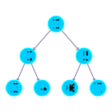

# Programmierung

## Algorithmen
Ein Algorithmus beschreibt den Weg, wie man für eine Eingabe $e \in E$ eine Ausgabe $a \in A$ erhält. Er löst alle Probleme einer bestimmten Klasse an Problemen. Ein Algorithmus funktioniert wie eine Partielle Abbildung, da nicht alle Eingaben nach endlicher Zeit zu einer Ausgabe führen.
$$f: E \rightarrow A$$
$$x \mapsto \perp$$
$$e_1 \mapsto a_1$$
$$...$$

Eine Abbildung heißt berechenbar, wenn es mindestens einen Algorithmus gibt, welcher für jede Eingabe aus dem Wertebereich eine Ausgabe aus dem Bildbereich liefert.

### Komplexität
Die Komplexität beschreibt das Laufzeitverhalten eines Programms, wenn sich die Größe $n$ der Eingabe ändert. Man kann dies als eine Abbildung $f: \mathbb{N} \rightarrow \mathbb{N}$ mit zum Beispiel $n \mapsto n^2$ auffassen.
Mit $O(f)$ wird eine Menge beschrieben, welche alle Laufzeiten enthält, welche etwa gleich oder langsamer sind als $f$.
Mit $\Omega(f)$ wird eine Menge beschrieben, welche alle Laufzeiten enthält, welche etwa gleich oder schneller sind als $f$.
Mit $\Theta(f)$ wird eine Menge beschrieben, welche alle Laufzeiten enthält, welche etwa gleich-schnell sind wie $f$.
$$f_1: \mathbb{N} \rightarrow \mathbb{N}$$
$$n \mapsto n^2 + \lceil \log(n)\rceil$$
$$f_1 \in \Theta(n \mapsto n^2)$$

Ein nicht-deterministischer Algorithmus ist ein Algorithmus, welcher nicht eindeutige Anweisungen hat und immer die **richtige** Anweisung ausführt, welche in dem Moment gebraucht wird. Die Funktionsweise wie der Algorithmus sich entscheidet ist unklar.

| Komplexitätsklasse P                                    | Komplexitätsklasse NP                                         |
| ------------------------------------------------------- | ------------------------------------------------------------- |
| deterministischen Algorithmen in polynomieller Laufzeit | nicht-deterministischen Algorithmen in polynomieller Laufzeit |

$$P \subseteq NP$$

Mit der Reduktion kann man zwei Probleme auf den gleichen Kern führen. Dieser Schritt des Zusammenführen soll in polynomieller Zeit machbar sein. Wenn man ein Problem $A$ auf ein Problem $B$ reduzieren werden kann, ist $B$ mindestens so schwer wie $A$.
$$A \leq B$$

Ein NP-hartes Problem ist ein Problem, welches mindestens so schwer ist wie das schwerste Problem aus NP. Ein NP-hartes Problem ist zum Beispiel <i>3SAT</i>.
$$\forall A \in NP: A \leq B$$

Ein NP-vollständiges Problem ist NP-hart und liegt selbst in NP.

## Datenstrukturen
### Array
Ein Array ist eine geordnete Sammlung, wobei jedes Element schnell über einen Index abgerufen oder verändert werden kann. Arrays können mehrere Dimensionen haben, jedoch muss die Größe eines Arrays bei seiner Erstellung vorgegeben werden und kann nicht verändert werden. Ein Array ähnelt einem Tupel.
$$a = (...)$$

### Liste
Eine Liste ist eine flexiblere Datenstruktur, da die Größe dynamisch verringert oder erweitert werden kann. Listen basieren auf Knoten und Pointern, welche leichter verändert werden können. Die Pointer eines Listen Elements zeigen immer auf den Nachfolger in der Liste, so kann diese iterativ durchlaufen werden.
Eine Liste ähnelt einer total Ordnung.

Eine Liste kann auch bidirektional sein, die Pointer gehen in beide Richtungen. Dadurch kann die Liste einfach in beide Richtungen durchgegangen werden und wird noch flexibler.

### Stack
Ein Stack (auch Stapel oder Keller) ist eine sonder Form einer Liste, bei der nur am Anfang eingefügt und entfernt werden kann. Er funktioniert nach dem Last-in-First-out Prinzip (LIFO)

### Queue
Eine Queue (auch Schlange) ist eine sonder Form einer Liste, bei der nur am Ende eingefügt und am Anfang entfernt werden kann. Sie funktioniert nach dem First-in-First-out Prinzip (FIFO). Eine priority Queue funktioniert ähnlich wie eine normale Queue, jedoch haben Elemente eine Priorität, welche benutzt wird um beim Einfügen manche Elemente weiter vor zu ziehen, damit diese schneller bearbeitet werden.

### Baum
Ein Baum ist eine Erweiterung der Liste. Wie bei der Liste hat jedes Element Nachfolger, jedoch kann ein Baum mehr als nur einen Nachfolger haben. Die maximale Anzahl an Nachfolgern wird mit der Ordnung angegeben.

Ein Baum kann verschiedene Eigenschaften haben.

| balanciert                                                                                            | vollständig                                         | fast vollständig                                      |
| ----------------------------------------------------------------------------------------------------- | --------------------------------------------------- | ----------------------------------------------------- |
| Für jeden Knoten gilt, die Höhe des linken und rechten Teilbaum unterscheidet sich höchstens um eins. | Jede Ebene ist entweder leer oder komplett befüllt. | Beim Zeilenweise ablesen trifft man nicht auf Lücken. |

Ein Baum kann verschieden Durchlaufen werden, man sagt auch Traversieren.

| Pre-Order                    | In-Order                    | Post-Order                    |
| ---------------------------- | --------------------------- | ----------------------------- |
|  |  |  |

Zusätzlich kann man einen Baum als Array darstellen. Der Baum wird Ebenen-weise abgelesen inklusive Lücken. Das Array ermöglicht schnellere Tauschoperationen im Baum, jedoch ist die Struktur statisch.

#### AVL-Baum
Ein AVL-Baum ist ein Baum, welcher nach jeder Operation balanciert wird, wodurch dieser besonders effizient arbeitet. Jeder Knoten speichert die Höhendifferenz der Teilbäume ab. Wenn der Betrag der Höhendifferenz größer als 1 ist wird eine Rotationsoperation durchgeführt.

#### Heap
Ein Heap ist ein fast vollständiger Binärbaum (Baum der Ordnung 2), bei dem alle Nachfolger eines Knotens entweder kleiner (Max Heap) oder größer (Min Heap) sind. Er bildet eine effizientere priority Queue. Elemente werden an das Ende eingefügt und nach oben vertauscht bei Bedarf. Elemente können nur vom Anfang entfernt werden, wonach immer das Element mit dem größeren Wert hoch rutscht. Das Sortierverfahren Heapsort fügt alle Elemente in einen Heap ein. Danach werden die Elemente vom Heap entfernt, wodurch eine sortierte Folge entsteht.

### Graph
Ein Graph beschreiben Beziehungen zwischen Objekten. Mit der gewichtung der Kanten können zum Beispiel Kosten abgebildet werden.

Ein Graph kann als Matrix (Tabelle) dargestellt werden. Ob es eine Kante gibt, beziehungsweise dessen Gewicht, wird in die jeweilige Zeile und Spalte eingetragen. Der Kanten Ursprung bestimmt die Spalte, das Ziel die Zeile.
$$\begin{pmatrix}1 & 1 & 0 & 0\\1 & 1 & 1 & 0\\1 & 0 & 1 & 0\\1 & 1 & 1 & 1\end{pmatrix}$$

Zusätzlich kann ein Graph mit einer Adjazenzliste (2-dimensionale Liste) dargestellt werden. In jeder Spalte werden alle Nachbarn untereinander eingetragen, gegebenenfalls mit deren Gewicht.

| a   | b   | c   | d   |
| --- | --- | --- | --- |
| a   | a   | b   | d   |
| b   | b   | c   |     |
| c   | d   | d   |     |
| d   |     |     |     |

#### Suchalgorithmen
| Depth-First-Search                                                           | Breadth-First-Search                                                                                                                         | Iterative Depth-Search                                                                          |
| ---------------------------------------------------------------------------- | -------------------------------------------------------------------------------------------------------------------------------------------- | ----------------------------------------------------------------------------------------------- |
| Durchlaufen eines Graphen mit einem Stack, Knoten werden nur einmal besucht. | Durchlaufen eines Graphen mit einer Queue, Knoten werden nur einmal besucht. Breadth-First-Search findet den Kürzesten Pfad zu einem Knoten. | Iterativ Tiefergehend suchen. Iterative Depth-Search findet den Kürzesten Pfad zu einem Knoten. |
| hoher Suchbedarf                                                             | hoher Speicherverbrauch                                                                                                                      | Optimum beider                                                                                  |

Mit dem Branch and Bound Verfahren kann man unnötige Äste in einem Baum früh erkennen, indem man immer den besten Wert zwischen speichert und die Suche abbricht wenn der Wert überschritten wird.

#### Minimax
Für ein Spiel mit perfekter Information kann man alle einen Baum aufstellen, wobei Kanten abwechselnd Spielzüge der Spieler sind. Die Blätter enthalten einen niedrigen Wert bei Verlust für Spieler 1 und höheren Wert bei Gewinn. Rekursiv kann für jeder Ebene abwechselnd das Maximum und Minimum der Kinder genommen werden. In der Wurzel bleibt das zu erwartende Resultat übrig.
Da der Minimax-Algorithmus extem schnell aufwendig wird gibt es die Alpha-Beta-Pruning methode. Dabei wird die Suche in einem Teilbaum abgebrochen, falls dieser nicht zum Ergebnis beiträgt, da die Spieler schon einen besseren Pfad nehmen können.

Zur weiteren Optimierung können zwischen Spielstände durch Markow-Ketten bewertet werden. Dabei wird aus einer **großen** Datenbasis die Gewinn-Wahrscheinlichkeit entnommen aufgrund der letzten $n$ Züge.

#### Spannbaum
Der Spannbaum eines Graphen ist ein Baum, welcher alle Knoten eines Graphen durchläuft.

| Algorithmus von Kruskal             | Algorithmus von Prim                                     | Algorithmus von Dijkstra                                                  | A* Algorithmus                                                                             |
| ----------------------------------- | -------------------------------------------------------- | ------------------------------------------------------------------------- | ------------------------------------------------------------------------------------------ |
| 1. Kanten Sortieren                 | 1. Start-Knoten zu Spannbaum hinzufügen                  | 1. Startknoten wird besucht                                               | 1. Startknoten wird besucht                                                                |
| 2. Kanten hintereinander hinzufügen | 2. Jeweils kleinste Kante angrenzend zum Baum hinzufügen | 2. Jeweils kürzester entfernter unbesuchter Nachbar wird besucht          | 2. Jeweils Nachbar mit geringster Summe aus gelaufener und zu erwartender Distanz besuchen |
| 3. Außer es entsteht ein Zyklus     | 3. Außer es entsteht ein Zyklus                          | 3. Vorgänger und Distanzen von Knoten werden gegebenenfalls überschrieben | 3. Vorgänger und Distanzen von Knoten werden gegebenenfalls überschrieben                  |

#### Maximaler Fluss
Der Maximale Fluss beschreibt ein Problem, bei dem man versucht von einem Start-Knoten zu einem End-Knoten so viel Wasser wie möglich durch zu leiten.
Die Gewichte der Kanten sind dabei die maximale Kapazität die eine Leitung halten kann.

| Ford-Fulkerson-Algorithmus                                                                                                                   |
| -------------------------------------------------------------------------------------------------------------------------------------------- |
| 1. Vom Start-Knoten zum End-Knoten werden mögliche Pfade gesucht                                                                             |
| 2. Der Durchfluss auf den Pfaden wird so hoch wie die kleinste Kapazität es erlaubt gesetzt                                                  |
| 3. Pfade können bereits verwendete Kanten auch Rückwerts durchlaufen, wobei dabei der Durchfluss an der Stelle verringert statt erhöht wird. |

Der Maximale Fluss entspricht dem minimalen Schnitt. Es wird ein Schnitt durch nur vollständig verwendete Kanten gesetzt. Die Summe der geschnittenen Kanten entspricht dem Maximalem Fluss.

### Symboltabellen
Eine Symboltabelle speichert Schlüssel-Wert-Paare. Sie ähnelt in der Funktionsweise einer Abbildung. Mit $put$ wird ein Paar hinzugefügt. Mit $get$ erhält man den Wert für einen Schlüssel.

Eine Hashtabelle ist eine Möglichkeit eine Symboltabelle zu realisieren. Aus einem Schlüssel wird mit einer Hashfunktion ein Index berechnet. Mit dem Index kann man den Wert in ein Array an der Stelle des Index einsetzen.

$$hash: M \rightarrow \mathbb{N}_0$$
$$m \mapsto 0$$
$$...$$

#### Kollision
Eine Hashfunktion ist meist nur surjektiv, also kann man für zwei verschiedene Schlüssel den selben Index erhalten. Dies nennt man eine Kollision.

| Lineares Sondieren                                                                              | Quadratisches sondieren                                                                       | Überläufer Verkettung       |
| ----------------------------------------------------------------------------------------------- | --------------------------------------------------------------------------------------------- | --------------------------- |
| Bei Kollision werden Werte so lange nach links verschoben, bis eine freie Stelle gefunden wird. | Bei Kollision werden Werte in Quadratischen Abständen (links und rechts) vom Index eingefügt. | Das Array verwaltet Listen. |

## Dynamische Programmierung
Bei dynamischer Programmierung wird ein Algorithmus in sich überlappende Teilprobleme aufgeteilt. Die Lösungen zu den Teilproblemen wird abgespeichert, wodurch komplexere optimierungs Probleme effizienter gelöst werden.
