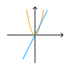

# Technik
## Analog-Digital
| Analoges Signal                           | Digitales Signal                       |
| ----------------------------------------- | -------------------------------------- |
|                 |             |
| Kontinuierlicher Verlauf(Kurve, Fließend) | Diskreter Verlauf(Treppe, Abstufungen) |

Eine Konversion von Analog zu Digital erfolgt durch einen **adc**. Mit der **Abtastung** wird Zeitachse diskretisiert. Mit der **Quantisierung** wird die Werteachse diskretisiert. Die Gegenoperation wird von einem **dac** durchgeführt.

Die Abtastfrequenz $f_A$ muss mindestens doppelt so groß sein, wie die größte Signalfrequenz:
$$f_A \geq 2 \cdot f_{max}$$

Andernfalls können Frequenzen nicht korrekt wiedergegeben werden. (Alias Effekte)

## Codierungen
Ein Bit ist die kleinste Computereinheit und kann den Zustand Wahr oder Falsch haben.
| Einheit  | Bits           |
| -------- | -------------- |
| $Nibble$ | $4Bits$        |
| $Byte$   | $8Bits$        |
| $kB$     | $2^{10} Bytes$ |
| $MB$     | $2^{20} Bytes$ |
| $GB$     | $2^{30} Bytes$ |
| $TB$     | $2^{40} Bytes$ |

### Datentypen
#### Ganzzahlen
Ganzzahlen werden codiert durch Zweierpotenzen
$$1001_{(2)} = 1 \cdot 2^3 + 0 \cdot 2^2 + 0 \cdot 2^1 + 1 \cdot 2^0$$

Um eine Zahl binär zu codieren wird sie durch zwei mit Rest geteilt bis null herauskommt. Danach werden die Reste rückwärts abgelesen.

$$19 : 2 = 9 |R:1$$
$$9 : 2 = 4 |R:1$$
$$4 : 2 = 2 |R:0$$
$$2 : 2 = 1 |R:0$$
$$1 : 2 = 0 |R:1$$
 
$$19_{(10)} = 10011_{(2)}$$

Negativ Zahlen werden durch das **Zweierkomplement** gebildet. Dabei werden die Stellen der Positiven Zahl invertiert und eins addiert.

#### Kommazahlen
| Festkomma     | Gleitkomma             |
| ------------- | ---------------------- |
| einfach       | komplex                |
| ungenau       | genau                  |
| werte-genau   | fließend               |
| eingeschränkt | flexibel               |
| *Komma-fest*  | $\pm$ + Exp + Mantisse |

### Codes
Codes können spezielle Eigenschaften haben.

| Code                   | Beschreibung                                                  | Beispiele                       |
| ---------------------- | ------------------------------------------------------------- | ------------------------------- |
| Symmetrische Codes     | Wertebereich 0 bis 4 ergibt gespiegelt und invertiert 5 bis 9 | *Exzess-3-Code*, *Aiken-Code*   |
| Progressive Codes      | Aufeinander folgende Zahlen unterscheiden sich in einem Bit   | *Gray-Code*, *Glixon-Code*      |
| Gleichgewichtige Codes | Jedes Wort ist gleich lang und hat die gleiche Anzahl an $1$  | *Walking-Code*, *w-aus-m-Codes* |
| Fano-Bedingung         | Jedes Wort im Binärbaum ist in den Blättern des Baums         | *bcd-Code*                      |

Die **Hamming-Distanz** $D$ gibt die minimale Anzahl an unterschieden zwischen zwei beliebigen Wörtern an. Die Anzahl an erkennbaren Fehlern beträgt $D - 1$. Die Anzahl an korrigierbaren Fehler beträgt $\frac{D}{2}$.

Ein weiteres Verfahren zur Fehlererkennung und Korrektur ist die **Blockprüfung**. Mit der Blockprüfung kann ein Code erweitert werden, um die Position von Fehlern zu finden und zu beheben. Es ist die Kombination aus VRC und LRC.

| VRC (vertical redundancy check)                                               | LRC (longitudinal redundancy check)                                            |
| ----------------------------------------------------------------------------- | ------------------------------------------------------------------------------ |
| Prüft die Korrektheit in einem Block nach jeder Zeile, durch ein Paritätsbit. | Prüft die Korrektheit in einem Block nach jeder Spalte, durch ein Paritätsbit. |

*(Paritäts-Festlegung wird im voraus ausgemacht)*

### Kompression
Verlustfreie Kompression komprimiert eine Eingabe ohne Verlust von Informationen. Der Huffman-Code komprimiert beispielsweise Texte verlustfrei.
Informationsreduzierende Codes komprimieren nicht verlustfrei. Diese Kompression wird auf Bild-, Video- und Audiodateien verwendet. Die Kompression kann nicht mehr rückgängig gemacht werden, ist aber in den meisten Fällen auch nicht nötig. Beispiele wären MP3 und JPEG.

## Schaltungen
### Moore's Law
Die Komplexität integrierter Schaltkreise verdoppelt sich regelmäßig (ca. 2 Jahre)

### Logische Gatter
In Logischen Gattern werden die Logischen Werte Wahr und Falsch mit Bereichen definiert. Dabei ist der Bereich näher an $+\infty$ Wahr und der Bereich näher an $-\infty$ Falsch. Zwischen den Bereichen ist ein Sicherheitsabstand, welcher undefiniert ist.

Logische Gatter sind Verknüpfungen aus der Aussagen Logik.

| not-Gatter              | and-Gatter              | or-Gatter              | xor-Gatter              | nand-Gatter              | nor-Gatter              | xnor-Gatter              |
| ----------------------- | ----------------------- | ---------------------- | ----------------------- | ------------------------ | ----------------------- | ------------------------ |
|  |  |  |  |  |  |  |
| Negation                | Konjunktion             | Disjunktion            | Äquivalenz              | Negierte Konjunktion     | Negierte Disjunktion    | Negierte Äquivalenz      |

Eine Menge an Gattern wird als vollständiges System bezeichnet, wenn mit der Menge alle möglichen Gatter gebildet werden können. Die Menge $\{nand\}$ wäre ein mögliches vollständiges System.

### Schaltnetz
Ein Schaltnetz ist eine Zeitunabhängige Funktion, ohne Speicher.
$$f(A, B, ...) = (Y_1, Y_2, ...)$$

### FlipFlops (Schaltwerk)
Ein Schaltwerk ist eine Zeitabhängige Funktion. Dies würd durch **Rückkopplung** der Eingänge erreicht.
$$f(A, B, ..., Y_{n-1, 1}, ...) = (Y_{n, 1}, Y_{n, 2}, ...)$$

#### Nicht-Taktgesteuerte FlipFlops (Basis-FlipFlop)
| FlipFlop     | Schaltung                            | Beschreibung |
| ------------ | ------------------------------------ | ------------ |
| RS NOR-Latch |  |              |

#### Taktgesteuerte FlipFlops
| FlipFlop    | Schaltung                                       | Beschreibung |
| ----------- | ----------------------------------------------- | ------------ |
| RS-FlipFlop |  |              |
| D-FlipFlop  |   |              |

#### Flankengesteuerte FlipFlops
Ein Impulsglied erkennt positive Flanken eines Signals, die Zeitpunkte zu denen ein Signal von Falsch zu Wahr wechselt. Das Impulsglied kann diese Flanken erkennen.

##### Einflankengesteuerte FlipFlops
| FlipFlop    | Schaltung                                             | Beschreibung |
| ----------- | ----------------------------------------------------- | ------------ |
| RS-FlipFlop |  |              |
| D-FlipFlop  |   |              |
| JK-FlipFlop |  |              |

##### Zweiflankengesteuerte FlipFlops
| FlipFlop    | Schaltung                                              | Beschreibung |
| ----------- | ------------------------------------------------------ | ------------ |
| JK-FlipFlop |  |              |

## Computer Hardware
### CPU
Die CPU ist das central processing unit. Es gibt verschiedene Architekturen, jedoch die Aufgaben der CPU sind eindeutig. Sie kontrolliert, steuert und verwendet alle anderen Hardware Komponenten.
Dies funktioniert über Busse, kabel die zwei oder mehr Hardware Komponenten Verbinden.
| Architektur             | Modell | Beschreibung            |
| ----------------------- | ------ | ----------------------- |
| Von-Neumann-Architektur |        | langsam durch einen Bus |
| Harvard-Architektur     |        | schnell aber komplex    |

Grundlegend besitzt eine CPU mindestens einen Kern. Jeder Kern hat ein Memory Managment Unit (MMU), ein Steuerwerk, einen Registersatz und ein Rechenwerk (ALU). Mit Hilfe des Caches können Daten schnell zwischen gespeichert werden. Im Fall von mehreren Kernen gibt es oft einen weiteren Cache, auf den alle Kerne zugreifen können. Die Kerne einer CPU arbeiten echt-parallel.
Die CPU kann in der **Skalare Architektur** nur einen Befehl pro Taktzyklus ausführen. Die **Superskalare Architektur** hingegen führt mehrere Befehle auf einer CPU parallel aus. Es können auch konditionelle Befehle parallel zur Kondition ausgeführt werden, sodass nicht auf das Ergebnis der Kondition gewartet werden muss.

#### Interrupt
Im Gegensatz zum **Polling**, bei dem aktiv gewartet und abgefragt wird, wird bei einem **Interrupt** unterbrochen. Ein Interupt entsteht bei Fehlern, welche vom Betriebssystem abgefangen werden oder durch asynchrone Ereignisse, welche unabhängig vom System sind (Klick). Ein Interrupt wird vom Interrupt Controller ausgelöst, dieser benachrichtigt die CPU, welche daraufhin den Interrupt in der Interrupt service Tabelle nachschaut und die Jeweilige Interrupt service routine aufruft. Falls ein Interrupt länger benötigt wird er als ein deferred interrupt parallel zu den Prozessen ausgeführt. Je nach Priorität werden unterschiedliche Interrupts ausgeführt. Systemcalls sind spezielle Interrupts, welche das Betriebssystem im Kernel-modus auffordern bestimmt Aufgaben auszuführen.

### Speicher
Speicher welche näher an der CPU sind, sind deutlich schneller, jedoch haben diese schon für geringe Mengen Speicherplatz hohe Kosten. Langsamere Speicher sind oft billiger.

| Kategorie        | Beschreibung              | Beispiele     |
| ---------------- | ------------------------- | ------------- |
| Primärspeicher   | interne kurzzeit Speicher | RAM/ROM       |
| Sekundärspeicher | interne langzeit Speicher | SSD/HDD       |
| Tertiärspeicher  | externe Speicher          | CD/Magnetband |

Für optimale Performace wird oft ein großer Block an Daten aus einem Sekundär- oder Tertiärspeicher in den Primärspeicher geladen. Auf der CPU gibt es den Cache, welcher für diese Optimierung allein verwendet wird.

### Motherboard
Das Motherboard enthält eine CPU, welche mit der Northbridge verbunden ist. Diese greift auf den Arbeitsspeicher und Grafikprozeessor zu. Über die Northbridge gelangt man zur Southbridge, welche Externe Anbindungen verwaltet.

### Emulation
Mit einer Emulation kann auf einem beliebigen Gerät ein komplett anderes Gerät simuliert werden, da die Hardware komplett in der Software Nachgebildet wird.

## Betriebssysteme
Das Betriebssystem verwaltet alle Prozesse (Job-Managment), die Leistung und bietet abstrakte Schnittstellen zu der Hardware (Task-Managment). Prozesse werden von einander getrennt und besitzen unterschiedliche Rechte.
Zudem werden Benutzer verwaltet. Ein Benutzer kann maximal Administrator-Rechte besitzen/ausführen. Das Betriebssystem ist im Kernel-modus und hat damit noch höhere Rechte. Es werden auch Daten verwaltet in einem Dateikatalogsystem, wieder mit eingeschränkten Rechten (Data-Managment).

| Betriebssystemkategorien             |
| ------------------------------------ |
| Großrechner                          |
| Serverbetriebssyteme                 |
| Personal Computer Betriebssytem      |
| Echtzeit-Betriebssytem               |
| Embedded Systems                     |
| Betriebssytem für Tablets und Handys |
| Smartcard-Betriebssytem              |

Betriebssysteme können unterschiedlich betrieben werden.

| Betriebsart                            | Beschreibung                                     | Anwendung         |
| -------------------------------------- | ------------------------------------------------ | ----------------- |
| Stapelbetrieb/Batch-Verarbeitung       | nicht-interaktiv (Stapel/Queue abarbeitung)      |                   |
| Dialogbetrieb/Prozessbetrieb           | interaktiv                                       | Personal-Computer |
| Echtzeitbetrieb                        | Verarbeitungszeit festgelegt                     | Automation        |
| Einprogrammbetrieb                     | immer nur ein Programm                           |                   |
| Mehrprogrammbetrieb (Multiprogramming) | mehrere Programme gleichzeitig                   |                   |
| Einbenutzerbetrieb                     | nur ein Nutzer zu bestimmten Zeitpunkt           | Personal-Computer |
| Mehrbenutzerbetrieb                    | mehrere Benutzer gleichzeitig                    | Server            |
| Einprozessorbetrieb                    | ein Prozessor für alles                          |                   |
| Mehrprozessorbetrieb                   | mehrere Prozessoren                              |                   |
| Pipeline                               | wie Fließband - verarbeitung in vielen Stationen |                   |

Das Betriebssystem kann verschieden aufgebaut sein. Beim Monolithischen Kernel werden Module nach Aufgaben gebildet, wodurch diese schneller Arbeiten, aber schlecht zu warten sind. Das Schichtenmodell hingegen sorgt für Struktur, verlangsamt jedoch die Geschwindigkeit. Bei der Mikrokern Architektur gibt es einen minimalen Kernel, welcher nur grundlegende Aufgaben ausführt. Komplexere Aufgaben werden durch einen Prozess ausgeführt.

### Virtualisierung
| Virtualisierung           | Beschreibung                                              |
| ------------------------- | --------------------------------------------------------- |
| Virtuelle Computer        |                                                           |
| Speicher Virtualisierung  | Abstraktion von Speicheradressen (sicherer und einfacher) |
| Anwendungsvirtualisierung |                                                           |
| Virtuelle Prozessumgebung |                                                           |
| Virtuelle Prozessoren     | Java Virtual Machine                                      |
| Netzwerkvirtualisierung   | vLAN                                                      |
|                           |                                                           |

## Netzwerktechnik

