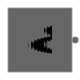

# Technik
## Analog-Digital
| Analoges Signal                            | Digitales Signal                        |
| ------------------------------------------ | --------------------------------------- |
|           |       |
| Kontinuierlicher Verlauf (Kurve, Fließend) | Diskreter Verlauf (Treppe, Abstufungen) |

Eine Konversion von Analog zu Digital erfolgt durch einen **adc**. Mit der **Abtastung** wird Zeitachse diskretisiert. Mit der **Quantisierung** wird die Werteachse diskretisiert. Die Gegenoperation wird von einem **dac** durchgeführt.

Die Abtastfrequenz $f_A$ muss mindestens doppelt so groß sein, wie die größte Signalfrequenz:
$$f_A \geq 2 \cdot f_{max}$$

Andernfalls können Frequenzen nicht korrekt wiedergegeben werden. (Alias Effekte)

## Codierungen
Ein Bit ist die kleinste Computereinheit und kann den Zustand Wahr oder Falsch haben.

| Einheit  | Bits           |
| -------- | -------------- |
| $Nibble$ | $4Bits$        |
| $Byte$   | $8Bits$        |
| $kB$     | $2^{10} Bytes$ |
| $MB$     | $2^{20} Bytes$ |
| $GB$     | $2^{30} Bytes$ |
| $TB$     | $2^{40} Bytes$ |

### Datentypen
#### Ganzzahlen
Ganzzahlen werden codiert durch Zweierpotenzen
$$1001_{(2)} = 1 \cdot 2^3 + 0 \cdot 2^2 + 0 \cdot 2^1 + 1 \cdot 2^0$$

Um eine Zahl binär zu codieren wird sie durch zwei mit Rest geteilt bis null herauskommt. Danach werden die Reste rückwärts abgelesen.

$$19 : 2 = 9 \;\; R:1$$
$$9 : 2 = 4 \;\; R:1$$
$$4 : 2 = 2 \;\; R:0$$
$$2 : 2 = 1 \;\; R:0$$
$$1 : 2 = 0 \;\; R:1$$
 
$$19_{(10)} = 10011_{(2)}$$

Negativ Zahlen werden durch das **Zweierkomplement** gebildet. Dabei werden die Stellen der Positiven Zahl invertiert und eins addiert.

#### Kommazahlen
| Festkomma     | Gleitkomma         |
| ------------- | ------------------ |
| einfach       | komplex            |
| ungenau       | genau              |
| werte-genau   | fließend           |
| eingeschränkt | flexibel           |
| *Komma-fest*  | ± + Exp + Mantisse |

### Codes
Codes können spezielle Eigenschaften haben.

| Code                   | Beschreibung                                                  | Beispiele                       |
| ---------------------- | ------------------------------------------------------------- | ------------------------------- |
| Symmetrische Codes     | Wertebereich 0 bis 4 ergibt gespiegelt und invertiert 5 bis 9 | *Exzess-3-Code*, *Aiken-Code*   |
| Progressive Codes      | Aufeinander folgende Zahlen unterscheiden sich in einem Bit   | *Gray-Code*, *Glixon-Code*      |
| Gleichgewichtige Codes | Jedes Wort ist gleich lang und hat die gleiche Anzahl an $1$  | *Walking-Code*, *w-aus-m-Codes* |
| Fano-Bedingung         | Jedes Wort im Binärbaum ist in den Blättern des Baums         | *bcd-Code*                      |

Die **Hamming-Distanz** $D$ gibt die minimale Anzahl an unterschieden zwischen zwei beliebigen Wörtern an. Die Anzahl an erkennbaren Fehlern beträgt $D - 1$. Die Anzahl an korrigierbaren Fehler beträgt $\frac{D}{2}$.

Ein weiteres Verfahren zur Fehlererkennung und Korrektur ist die **Blockprüfung**. Mit der Blockprüfung kann ein Code erweitert werden, um die Position von Fehlern zu finden und zu beheben. Es ist die Kombination aus VRC und LRC.

| VRC (vertical redundancy check)                                               | LRC (longitudinal redundancy check)                                            |
| ----------------------------------------------------------------------------- | ------------------------------------------------------------------------------ |
| Prüft die Korrektheit in einem Block nach jeder Zeile, durch ein Paritätsbit. | Prüft die Korrektheit in einem Block nach jeder Spalte, durch ein Paritätsbit. |

*(Paritäts-Festlegung wird im voraus ausgemacht)*

### Kompression
Verlustfreie Kompression komprimiert eine Eingabe ohne Verlust von Informationen. Der Huffman-Code komprimiert beispielsweise Texte verlustfrei.
Informationsreduzierende Codes komprimieren nicht verlustfrei. Diese Kompression wird auf Bild-, Video- und Audiodateien verwendet. Die Kompression kann nicht mehr rückgängig gemacht werden, ist aber in den meisten Fällen auch nicht nötig. Beispiele wären MP3 und JPEG.

## Schaltungen
### Moore's Law
Die Komplexität integrierter Schaltkreise verdoppelt sich regelmäßig (ca. 2 Jahre)

### Logische Gatter
In Logischen Gattern werden die Logischen Werte Wahr und Falsch mit Bereichen definiert. Dabei ist der Bereich näher an $+\infty$ Wahr und der Bereich näher an $-\infty$ Falsch. Zwischen den Bereichen ist ein Sicherheitsabstand, welcher undefiniert ist.

Logische Gatter sind Verknüpfungen aus der Aussagen Logik.

| not-Gatter                     | and-Gatter                     | or-Gatter                     | xor-Gatter                     | nand-Gatter                     | nor-Gatter                     | xnor-Gatter                     |
| ------------------------------ | ------------------------------ | ----------------------------- | ------------------------------ | ------------------------------- | ------------------------------ | ------------------------------- |
|  |  |  |  |  |  |  |
| Negation                       | Konjunktion                    | Disjunktion                   | Äquivalenz                     | Negierte Konjunktion            | Negierte Disjunktion           | Negierte Äquivalenz             |

Eine Menge an Gattern wird als vollständiges System bezeichnet, wenn mit der Menge alle möglichen Gatter gebildet werden können. Die Menge $\{nand\}$ wäre ein mögliches vollständiges System.

### Schaltnetz
Ein Schaltnetz ist eine Zeitunabhängige Funktion, ohne Speicher.
$$f(A, B, ...) = (Y_1, Y_2, ...)$$

### FlipFlops (Schaltwerk)
Ein Schaltwerk ist eine Zeitabhängige Funktion. Dies würd durch **Rückkopplung** der Eingänge erreicht.
$$f(A, B, ..., Y_{n-1, 1}, ...) = (Y_{n, 1}, Y_{n, 2}, ...)$$

FlipFlops werden Unterteil in **nicht-taktgesteuert**, **taktgesteuert**, **einflankengesteuert** und **zweiflankengesteuert**. Das einfachste FlipFlop ist die RS-NOR-Latch.

## Computer Hardware
### CPU
Die CPU ist das central processing unit. Es gibt verschiedene Architekturen, jedoch die Aufgaben der CPU sind eindeutig. Sie kontrolliert, steuert und verwendet alle anderen Hardware Komponenten.
Dies funktioniert über Busse, kabel die zwei oder mehr Hardware Komponenten Verbinden.

| Architektur             | Beschreibung                                  |
| ----------------------- | --------------------------------------------- |
| Von-Neumann-Architektur | langsam durch einen Bus                       |
| Harvard-Architektur     | schnell aber komplex, Code und Daten getrennt |

Grundlegend besitzt eine CPU mindestens einen Kern. Jeder Kern hat ein Memory Managment Unit (MMU), ein Steuerwerk, einen Registersatz und ein Rechenwerk (ALU). Mit Hilfe des Caches können Daten schnell zwischen gespeichert werden. Im Fall von mehreren Kernen gibt es oft einen weiteren Cache, auf den alle Kerne zugreifen können. Die Kerne einer CPU arbeiten echt-parallel.
Die CPU kann in der **Skalare Architektur** nur einen Befehl pro Taktzyklus ausführen. Die **Superskalare Architektur** hingegen führt mehrere Befehle auf einer CPU parallel aus. Es können auch konditionelle Befehle parallel zur Kondition ausgeführt werden, sodass nicht auf das Ergebnis der Kondition gewartet werden muss.

| RISC             | CISC             |
| ---------------- | ---------------- |
| simplere Befehle | komplexe Befehle |

#### Interrupt
Im Gegensatz zum **Polling**, bei dem aktiv gewartet und abgefragt wird, wird bei einem **Interrupt** unterbrochen. Ein Interupt entsteht bei Fehlern, welche vom Betriebssystem abgefangen werden oder durch asynchrone Ereignisse, welche unabhängig vom System sind (Klick). Ein Interrupt wird vom Interrupt Controller ausgelöst, dieser benachrichtigt die CPU, welche daraufhin den Interrupt in der Interrupt service Tabelle nachschaut und die Jeweilige Interrupt service routine aufruft. Falls ein Interrupt länger benötigt wird er als ein deferred interrupt parallel zu den Prozessen ausgeführt. Je nach Priorität werden unterschiedliche Interrupts ausgeführt. Systemcalls sind spezielle Interrupts, welche das Betriebssystem im Kernel-modus auffordern bestimmt Aufgaben auszuführen.

### Speicher
Speicher welche näher an der CPU sind, sind deutlich schneller, jedoch haben diese schon für geringe Mengen Speicherplatz hohe Kosten. Langsamere Speicher sind oft billiger.

| Kategorie        | Beschreibung              | Beispiele               |
| ---------------- | ------------------------- | ----------------------- |
| Primärspeicher   | interne kurzzeit Speicher | RAM/ROM (Hauptspeicher) |
| Sekundärspeicher | interne langzeit Speicher | SSD/HDD                 |
| Tertiärspeicher  | externe Speicher          | CD/Magnetband           |

Für optimale Performace wird oft ein großer Block an Daten aus einem Sekundär- oder Tertiärspeicher in den Primärspeicher geladen. Auf der CPU gibt es den Cache, welcher für diese Optimierung allein verwendet wird.

#### Adressraum
Jeder Prozess besitzt einen virtuellen Hauptspeicher, welcher genau so groß wie der gesamte reale Hauptspeicher ist. Die MMU verwaltet den Zugriff auf den realen Hauptspeicher und ordnet jeden Block des virtuellen Hauptspeicher (Page) einen Block im realen Hauptspeicher (Frame) oder Schattenspeicher (Paging Area) zu. Über den TLB kann die MMU die Zuordnung beschleunigen und muss nicht die Paging-Tabelle durchlaufen. Wenn eine Seite aus dem Schattenspeicher angefordert wird, wird über einen Interrput die Seite in den realen Hauptspeicher geladen.

### Motherboard
Das Motherboard enthält eine CPU, welche mit der Northbridge verbunden ist. Diese greift auf den Arbeitsspeicher und Grafikprozessor zu. Über die Northbridge gelangt man zur Southbridge, welche Externe Anbindungen verwaltet.

### Emulation
Mit einer Emulation kann auf einem beliebigen Gerät ein komplett anderes Gerät simuliert werden, da die Hardware komplett in der Software Nachgebildet wird.

## Embedded System
Ein Embedded System ist ein Microcontroller mit begrenzter Funktionalität, welcher generell nur eine einzige Aufgabe besitzt. Diese Aufgabe soll zuverlässig und erfüllt werden.

## Betriebssysteme
Das Betriebssystem verwaltet alle Prozesse (Job-Managment), die Leistung und bietet abstrakte Schnittstellen zu der Hardware (Task-Managment). Prozesse werden von einander getrennt und besitzen unterschiedliche Rechte.
Zudem werden Benutzer verwaltet. Ein Benutzer kann maximal Administrator-Rechte besitzen/ausführen. Das Betriebssystem ist im Kernel-modus und hat damit noch höhere Rechte. Es werden auch Daten verwaltet in einem Dateikatalogsystem, wieder mit eingeschränkten Rechten (Data-Managment).

| Betriebssystemkategorien             |
| ------------------------------------ |
| Großrechner                          |
| Serverbetriebssyteme                 |
| Personal Computer Betriebssytem      |
| Echtzeit-Betriebssytem               |
| Embedded Systems                     |
| Betriebssytem für Tablets und Handys |
| Smartcard-Betriebssytem              |

Betriebssysteme können unterschiedlich betrieben werden.

| Betriebsart                            | Beschreibung                                     | Anwendung         |
| -------------------------------------- | ------------------------------------------------ | ----------------- |
| Stapelbetrieb/Batch-Verarbeitung       | nicht-interaktiv (Stapel/Queue abarbeitung)      |                   |
| Dialogbetrieb/Prozessbetrieb           | interaktiv                                       | Personal-Computer |
| Echtzeitbetrieb                        | Verarbeitungszeit festgelegt                     | Automation        |
| Einprogrammbetrieb                     | immer nur ein Programm                           |                   |
| Mehrprogrammbetrieb (Multiprogramming) | mehrere Programme gleichzeitig                   |                   |
| Einbenutzerbetrieb                     | nur ein Nutzer zu bestimmten Zeitpunkt           | Personal-Computer |
| Mehrbenutzerbetrieb                    | mehrere Benutzer gleichzeitig                    | Server            |
| Einprozessorbetrieb                    | ein Prozessor für alles                          |                   |
| Mehrprozessorbetrieb                   | mehrere Prozessoren                              |                   |
| Pipeline                               | wie Fließband - verarbeitung in vielen Stationen |                   |

Das Betriebssystem kann verschieden aufgebaut sein. Beim Monolithischen Kernel werden Module nach Aufgaben gebildet, wodurch diese schneller Arbeiten, aber schlecht zu warten sind. Das Schichtenmodell hingegen sorgt für Struktur, verlangsamt jedoch die Geschwindigkeit. Bei der Mikrokern Architektur gibt es einen minimalen Kernel, welcher nur grundlegende Aufgaben ausführt. Komplexere Aufgaben werden durch einen Prozess ausgeführt.

### Prozesse
Mit einem Auftrag wird ein Prozess gestartet. Seine Daten werden in den Speicher geladen und eine **PID** wird erstellt. Dieser Prozess kann Teil eines Programms mit mehreren Prozessen sein, oder allein stehend. Für einen Prozess kann ein Thread oder mehrere Treads laufen. Threads eines Prozesses teilen sich den Adressbereich. Jeder Thread hat einen eigenen virtuellen Prozessor. Mehrere virtuelle Prozessoren werden auf einem Prozessor simuliert. Zwischen den virutellen Prozessen wird ständig gewechselt.

Nach der Initialisierung eines Prozess wird dieser in eine Warteschlange eingefügt. Ein Prozess aus der Warteschlange kann im Nutzermodus bearbeitet werden. Falls höhere Rechte erforderlich sind kann, durch einen Interrupt, in den Kernelmodus gewechselt werden. Nachdem ein Prozess für eine Weile bearbeitet wurde kann dieser zurück in die Warteschlange. Falls der Prozess auf ein Ereignis wartet, wird dieser blockiert, bis das Ereignis eintritt. Hierfür wird für jedes mögliche Ereignis eine seperate Warteschlange angelegt. Ein Prozess kann suspendiert werden, falls dieser nicht aktiv genutzt wird. Dadurch werden Resourcen für andere Prozesse frei.

Um zwischen Prozessen zu wechseln muss der Hardware-Kontext vor jedem Wechsel zwischen gespeichert und geladen werden. Der Wechsel zwischen Threads ist einfacher und schneller, da dabei nicht der gesamte Kontext gewechselt werden muss. Der Wechsel zwischen Threads erfordert meist sehr viel Koordination, da sonst Kollisionen zwischen den Threads entstehen. Dabei können entweder unerwartete Ergebnisse auftreten oder die Threads blockieren sich gegenseitig. Um diese Probleme zu lösen gibt es **Semaphore**. Sie verwalten Zeitpunkte in denen ein Thread im kritischen Abschnitt ist. Zu diesen Zeitpunkten kann der Thread nicht unterbrochen werden.

#### Scheduling
Scheduling gibt vor in welcher Reihenfolge die verschiedenen Prozesse laufen sollen, um die Fairness und Durchsatz maximal und Wartezeit minimal zu halten.

### Datenübertragung

| Serial Protocols | Kabel/Busse |             | synchron  | Beschreibung                                      |
| ---------------- | ----------- | ----------- | --------- | ------------------------------------------------- |
| RS-232/RS-485    | 1/...       | halb-duplex | asynchron | Startbit + (Adresse) + Daten + Parität + Stopbit  |
| DMX512           | 1           | simplex     | asynchron | Zyklus durch 512 Adressen                         |
| SPI              | $3 + slave$ | voll-duplex | synchron  | Slave-Select (adressieren) -> Clock & Daten       |
| I$^2$C           | 2           | halb-duplex | synchron  | Clock & Start + Adressen + Daten + Antwort + Stop |

## Netzwerktechnik
### Netzwerke
#### Netzwerk Kategorien
Ein Netzwerk ist ein Zusammenschluss mehrerer Geräte. Dieser Zusammenschluss kann unterschiedlich aussehen.

| Topologie     | Darstellung                              | Beschreibung                  |
| ------------- | ---------------------------------------- | ----------------------------- |
| Linie         |          | Geringste Verkabelung         |
| Bus           |            | Alle verbunden mit Bus        |
| (Token-) Ring |           | Nur mit Token kann man senden |
| Baum          |           | Hierachisch Verkabelt         |
| Stern         |          | Zentral Verkabelt             |
| Vermascht     |      | Enthält Ringe                 |
| Vollvermascht |  | Komplette Verkabelung         |

Die größe des Netzes kann grob kategorisiert werden.

| LAN (local area network) | MAN (metropolian area network) | WAN (wide area network) | GAN (global area network) |
| ------------------------ | ------------------------------ | ----------------------- | ------------------------- |
| Grundstück               | mehrere Grundstücke            | mehrere Städte          | mehrere WAN               |

#### Medien
Die Zusammschlüsse der Unterschiedlichen Geräte funktioniert über unterschiedliche Medien.

| Medium                   | Frequenz        | Übertragungsrate | Shared Medium | Beschreibung                                     |
| ------------------------ | --------------- | ---------------- | ------------- | ------------------------------------------------ |
| Koaxialkabel             |                 | < 10MBit         | shared (Bus)  | veraltet ohne Taktung                            |
| Twisted Pair             |                 | 10M - 100GBit    | nicht shared  | Störsicher                                       |
| Power over Ethernet      |                 |                  | nicht shared  | Stromversorgung über Kabel                       |
| Lichtwellenleiter        |                 | 100M - 1TBit     | nicht shared  | Abhör & Störsicher                               |
| Digital Subscriber Line  | 4 - 30MHz       | 1 - 400MBit      | nicht shared  | Anbindung an Provider (Symmetrisch/Asymmetrisch) |
| Wireless LAN             | 2.4/5/60GHz     | 1M-2GBit         | shared        | Kollisionsanfällig & Bluetooth Shared            |
| DLAN                     | 4 - 30MHz       | 1M-2GBit         | shared        | leicht Abhörbar                                  |
| Bluetooth                | 2.4GHz          | 732k-50GBit      | shared        | WLAN Shared                                      |
| Near Field Communication | 125k/13M/858MHz | 10k-1MBit        | shared        |                                                  |

Anschlüsse können verschieden verwendet werden.

Bei einem Halbduplex Anschluss können Kollisionen entstehen, falls beide Teilnehmer gleichzeitig senden. Diese werden vom anderen erkannt durch CSMA/CD (Carrier-Sense-Multiple-Access Collision Detection). Bei einem shared Medium bei dem Kollisionen nicht erkannt werden können wird CSMA/CA (Carrier-Sense-Multiple-Access Collision Avoidance) verwendet.

#### Netzwerkanbindungen
Netzwerke können unterschiedlich verbunden werden.

| Gerät    | Schicht | Beschreibung                                    | Kollisionsdomäne                 |
| -------- | :-----: | ----------------------------------------------- | -------------------------------- |
| Hub      |    1    | Schickt an alle Teilnehmer                      | Domäne vergrößert sich           |
| Repeater |    1    | Verstärkt Signal                                |                                  |
| Bridge   |    2    | Schaltet nur frei wenn nötig                    | Domäne vergrößert nur wenn nötig |
| Switch   |    2    | Besteht aus Bridges. Schaltet im Notfall zu Hub | mehrere kleine Domänen           |
| Router   |    3    |                                                 |                                  |
| Proxy    |    7    |                                                 |                                  |
| Gateway  |    7    |                                                 |                                  |

##### Switch
Ein Switch verwaltet die MAC-Adressen (3byte Hersteller + 3byte Schnittstellenerkennung) aller Angeschlossenen Geräte. Bei dem Eintreffen eines Ethernet-frame wird dieser weitergeleitet. Dies kann über zwei verschiedene Arten erfolgen

| Store & Forward                               | Cut-Through                  |
| --------------------------------------------- | ---------------------------- |
| Empfangen dann senden (fehler werden erkannt) | Lesen und fast sofort senden |

Bei vLAN unterteilt ein Switch das Netz virtuell. Ethernet-frames werden vom Switch mit tags versehen, welche die Weiterleitung an ausgewählte Ports ermöglicht. Die Tags werden entfernt, sodass die angeschlossenen Geräte das vLAN nicht bemerken. Nur Geräte, die an speziellen taged Ports angeschlossen sind, erhalten die Tags, um beispielsweise das vLAN auf mehrere Switche zu erweitern.

IPv6: 128 Bit
IPv4: 32 Bit

### OSI-Schichtenmodell (Open Systems Interconnection)

| Schicht                                     | Aufgabe                            |
| ------------------------------------------- | ---------------------------------- |
| 7. Anwendungsschicht (Application Layer)    |                                    |
| 6. Darstellungsschicht (Presentation Layer) |                                    |
| 5. Sitzungsschicht (Session Layer)          |                                    |
| 4. Transportschicht (Transport Layer)       | Gibt den Port im Ziel an       TCP |
| 3. Vermittlungsschicht (Network Layer)      | Gibt die Systemweite Adresse an IP |
| 2. Sicherungsschicht (Data Link Layer)      | Gibt die MAC Adresse an            |
| 1. Bitübertragungsschicht (Physical Layer)  | Überträgt die Daten                |

| UDP            | TCP                                   |
| -------------- | ------------------------------------- |
| verbindungslos | verbindungsorientiert                 |
| -              | Aufbau 3 Packete, Abbau 4 Packete     |
| -              | Packete durch Ackknowledge bestätigen |

NAT (Network Adress Translation)
einseitge Übersetzung
DNAT (destination)/SNAT (source)
versteckt private Adressen

Priviligierte Ports: 1-1024 (ftp: 20,21, ssh: 22, dns: 53, dhcp: 67,68, http: 80, https: 443)
Nicht-Priviligierte Ports: 1025-65535

Sitzung
Authentisierung: Identität vorzeigen (wissen, haben)
Authentifizierung: Identität prüfen (zeit/ort, hash)
Autorisierung: Rechte geben/verweigern (netzwerkanmeldung, challenge-response-systeme, 2FA, anmeldeorte)

| PAP                  | CHAP             |
| -------------------- | ---------------- |
| passwort übertragung | hash übertragung |
