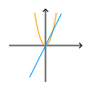

# Technik

## Analog-Digital

| Analoges Signal                           | Digitales Signal                       |
| ----------------------------------------- | -------------------------------------- |
|                 |             |
| Kontinuierlicher Verlauf(Kurve, Fließend) | Diskreter Verlauf(Treppe, Abstufungen) |

### Signal Converter
| Begriffe                 | Beschreibung                                      |
| ------------------------ | ------------------------------------------------- |
| **adc**                  | analog-digital-converter                          |
| **dac**                  | digital-analog-converter                          |
| **Abtastung**            | Zeitachse diskretisieren                          |
| **Quantisierung**        | Werteachse diskretisieren                         |
| **Auflösung**            | $\frac{Werteabstand}{Stufenanzahl}$ (Genauigkeit) |
| **Quantisierungsfehler** | $\pm \frac{Aufloesung}{2}$ (Rundungsfehler)       |

### Abtasttheorem (Nyquist-Shannon)
Abtastfrequenz $f_A$ muss mindestens doppelt so groß sein, wie die größte Signalfrequenz:
$$f_A \geq 2 \cdot f_{max}$$

Andernfalls können Frequenzen nicht korrekt wiedergegeben werden. (Alias Effekte)

### Codierung
**Tetraden Code** = Jede Ziffer mit Nibble codiert

**Maschinenwort** = Bitstream (Folge an Bits)

| Einheit  | Bits           |
| -------- | -------------- |
| $Nibble$ | $4Bits$        |
| $Byte$   | $8Bits$        |
| $kB$     | $2^{10} Bytes$ |
| $MB$     | $2^{20} Bytes$ |
| $GB$     | $2^{30} Bytes$ |
| $TB$     | $2^{40} Bytes$ |

### Komma Codierung
| Festkomma     | Gleitkomma             |
| ------------- | ---------------------- |
| einfach       | komplex                |
| ungenau       | genau                  |
| werte-genau   | fließend               |
| eingeschränkt | flexibel               |
| *Komma-fest*  | $\pm$ + Exp + Mantisse |

### zu Binär

Durch zwei mit Rest teilen bis 0 herauskommt, danach
Reste von unten nach oben ablesen.

$$19 : 2 = 9 |R:1$$
$$9 : 2 = 4 |R:1$$
$$4 : 2 = 2 |R:0$$
$$2 : 2 = 1 |R:0$$
$$1 : 2 = 0 |R:1$$
 
$$19_{(10)} = 10011_{(2)}$$

Nachkommastellen mal Zwei rechnen bis gewünschte Genauigkeit erreicht ist, danach von oben nach unten ganze ablesen.

$$0.41 \cdot 2 =|0|.82$$
$$0.82 \cdot 2 =|1|.64$$
$$0.64 \cdot 2 =|1|.28$$
$$0.28 \cdot 2 =|0|.56$$
$$0.56 \cdot 2 =|1|.12$$
 
$$0.41_{(10)} \approx 0.01101_{(2)}$$

#### Komplement
**Einerkomplement**: alles Invertiert (0 doppelt encodiert, symmetrisch)
 

**Zweierkomplement**: alles Invertiert plus 1 (0 einfach encodiert)

## Codierungen

Ein Zeichenvorrat beschreibt die Menge aller Zeichen, welche in einem Wort verwendet werden können. 
Dabei ist eine Codierung eine Abbildung von einem Zeichenvorrat in einen anderen Zeichenvorrat. In der (Technischen) Informatik ist der Bildbereich meist die Menge $\left\{0, 1\right\}^*$ (Jede Kombination aus 0 und 1). 
$$bcd: [0, 9] \rightarrow \left\{0, 1\right\}^*$$
$$0 \mapsto (0, 0, 0, 0)$$
$$1 \mapsto (0, 0, 0, 1)$$
$$...$$

Bekannte Codes wären 7-Bit ASCII, 8-Bit ASCII und Unicode.

### Eigenschaften (Rechencodes)

| Symmetrische Codes                                            | Progressive Codes                                           | Gleichgewichtige Codes                                       |
| ------------------------------------------------------------- | ----------------------------------------------------------- | ------------------------------------------------------------ |
| Wertebereich 0 bis 4 ergibt gespiegelt und invertiert 5 bis 9 | Aufeinander folgende Zahlen unterscheiden sich in einem Bit | Jedes Wort ist gleich lang und hat die gleiche Anzahl an $1$ |
| *Exzess-3-Code*, *Aiken-Code*                                 | *Gray-Code*, *Glixon-Code*                                  | *Walking-Code*, *w-aus-m-Codes*                              |

### Fano-Bedingung
Kein Wort einer Codierung ist ein Teil eines anderen Worts. Nur Blätter im Binärbaum werden codiert. (präfixfrei)

| $a$  | $b$  | $c$  | $d$  | $e$ | $f$ |
| ---- | ---- | ---- | ---- | --- | --- |
| $00$ | $01$ | $10$ | $11$ | $0$ | $1$ |

Erfüllt Bedingung nicht, wegen $e$, $f$.

| $a$  | $b$  | $c$  | $d$  |
| ---- | ---- | ---- | ---- |
| $00$ | $01$ | $10$ | $11$ |

Fano-Bedingung erfüllt.

### Hamming-Distanz

Die Hamming-Distanz $D_n$ beschreibt den kleinsten Unterschied zwischen allen Codierten Wörtern. Die Wörter $000$ und $010$ unterscheiden sich in einem Zeichen, die Distanz wäre $1$. Codes die eine Korrektur zu lassen heißen Hamming-Codes.

| Hamming-Distanz | Erkannte Fehler | Behebbare Fehler      |
| --------------- | --------------- | --------------------- |
| $D_n$ gerade    | $D_n - 1$       | $\frac{D_n}{2} - 1$   |
| $D_n$ ungerade  | $D_n - 1$       | $\frac{(D_n - 1)}{2}$ |

### Blockprüfung
Mit der Blockprüfung kann ein Code erweitert werden, um die Position von Fehlern zu finden und zu beheben. Es ist die Kombination aus VRC und LRC.

| VRC (vertical redundancy check)                                               | LRC (longitudinal redundancy check)                                            |
| ----------------------------------------------------------------------------- | ------------------------------------------------------------------------------ |
| Prüft die Korrektheit in einem Block nach jeder Zeile, durch ein Paritätsbit. | Prüft die Korrektheit in einem Block nach jeder Spalte, durch ein Paritätsbit. |

*(Paritäts-Festlegung wird im voraus ausgemacht)*

## Datenkompression
### Huffman-Code Algorithmus
Der Huffman-Code Algorithmus erstellt für einen Eingabetext einen Binär-Codierbaum zur codierung und decodierung des Eingabetext. Dabei wird die Häufigkeit von Symbolen gezählt. Symbole mit größster Häufigkeit werden zusammengefasst zu einem Baum.

**brennen**

### Informationsreduzierende Codes
Bei Bild-, Video- und Audiodateien können Information entfernt werden, ohne vom Menschen sicht-/hörbare unterschiede. Die Kompression kann nicht mehr rückgängig gemacht werden, ist aber in den meisten Fällen auch nicht nötig.
 

*MP3*, *JPEG*

## Schaltungen (Schaltnetz)

$\textcolor{red}{F}$ und $\textcolor{LimeGreen}{W}$ werden definiert durch Bereiche statt durch einzelne Werte.
$\textcolor{red}{F}$ ($\textcolor{red}{LOW}$) ist der Bereich, welcher näher an $-\infty$ liegt.
$\textcolor{LimeGreen}{W}$ ($\textcolor{LimeGreen}{HIGH}$) ist der Bereich, welcher näher an $+\infty$ liegt.
Die beiden Bereiche werden von einander getrennt durch einen Sicherheitsabstand in welchem nicht entschieden werden kann ob der Wert $\textcolor{red}{F}$ oder $\textcolor{LimeGreen}{W}$ ist.

### Logische-Gatter

| not-Gatter              | and-Gatter              | or-Gatter              | xor-Gatter              | nand-Gatter              | nor-Gatter              | xnor-Gatter              |
| ----------------------- | ----------------------- | ---------------------- | ----------------------- | ------------------------ | ----------------------- | ------------------------ |
|  |  |  |  |  |  |  |

### Vollständiges System
Ein vollständiges System ist eine Menge an Logischen Gattern mit denen man jede Schaltung Realisieren kann. Die Menge $\{nand\}$ wäre ein mögliches Vollständiges System.

### Schaltnetz
Eingänge und Ausgänge ohne Speicher (Zeitunabhängig)
$$f(A, B, ...) = (Y_1, Y_2, ...)$$

#### Halbaddierer (HA)
Addiert zwei Bits
$S$: Sum, $C$: Carry

#### Volladdierer (VA)
Addiert drei Bits
$S$: Sum, $C$: Carry

Mit beliebig vielen Volladdierern kann man eine beliebig große Additions-Schaltung bauen, indem man sie in einer Reihe zusammen schließt und die Eingänge C mit den Ausgängen C verbindet.
Mit dem fast-carry-Verfahren kann man die Gatterlaufzeit beschränken, welche durch die in Reihe Schließung auftritt.

### Moore's Law
Die Komplexität integrierter Schaltkreise verdoppelt sich regelmäßig (ca. 2 Jahre)

## FlipFlops (Schaltwerk)

Ein FlipFlop ist eine zeitabhängige Schaltung, wegen einer Gedächnisfunktion bzw. eines Zustandsspeicher, durch **Rückkopplung** von den Ausgängen zu den Eingängen.
$$f(A, B, ..., Y_{n-1, 1}, ...) = (Y_{n, 1}, Y_{n, 2}, ...)$$

### Nicht-Taktgesteuerte FlipFlops (Basis-FlipFlop)}
#### RS NOR-Latch

Speichert ein Bit, durch einen Reset $R$ und Set $S$ Eingang. $(R \land S)$ ist ein undefinierter Zustand.

### Taktgesteuerte FlipFlops
#### RS-FlipFlop

Arbeitet wie eine RS NOR-Latch, jedoch nur wenn der Takt auf $\textcolor{LimeGreen}{W}$ ist, sonst wird der Zustand gespeichert.

#### D-FlipFlop

Übernimmt den Zustand von $D$ und speichert diesen Während $T$ den Wert $\textcolor{red}{F}$ hat.

### Flankengesteuerte FlipFlops
#### Impulsglied

Ein Impulsglied erkennt positive Flanken eines Signals, die Zeitpunkte zu denen ein Signal von $\textcolor{red}{F}$ zu $\textcolor{LimeGreen}{W}$ wechselt.

#### Einflankengesteuerte FlipFlops
##### RS-FlipFlop

Arbeitet wie eine RS NOR-Latch , jedoch nur bei positiven Flanken von $T$, sonst wird der Zustand gespeichert.

##### D-FlipFlop

Übernimmt den Zustand von $D$ während der positiven Taktflanken von $T$ und speichert diesen.

##### JK-FlipFlop

Arbeitet genau wie ein Einflankengesteuertes RS-FlipFlop, nur, dass $(R \land S)$ zum toggeln des gespeicherten Bit führt. (Toggle-Modus)

#### Zweiflankengesteuerte FlipFlops
##### JK-FlipFlop

Arbeitet wie ein Einflankengesteuertes JK-FlipFlop, nur, dass es erst bei der negativen Flanke von $T$ das gespeicherte Bit ausgibt. (Retardierend)

### Synthese-Tabelle

Eine Synthese-Tabelle ist eine abgewandelte Wahrheitstabelle um ein FlipFlop platzsparend zu charakterisieren.

| $S$                        | $R$                        | $Q_{n+1}$                  |
| -------------------------- | -------------------------- | -------------------------- |
| $\textcolor{#FF0000}{F}$   | $\textcolor{#FF0000}{F}$   | $Q_n$                      |
| $\textcolor{#FF0000}{F}$   | $\textcolor{LimeGreen}{W}$ | $\textcolor{#FF0000}{F}$   |
| $\textcolor{LimeGreen}{W}$ | $\textcolor{#FF0000}{F}$   | $\textcolor{LimeGreen}{W}$ |
| $\textcolor{LimeGreen}{W}$ | $\textcolor{LimeGreen}{W}$ | $\perp$                    |

*RS-FlipFlop*

## Endliche Automaten (Schaltwerk)

In der Technischen Informatik werden Automaten verwendet um Schaltwerke zu entwerfen. Ein Automat $A$ besteht aus der Menge der Eingangskombinationen $X$, der Ausgangskombinationen $Y$, der Zustandskombinationen $Z$ und der Abbildung der Zustandsübergangsfunktion $\delta$ und der Ausgabefunktion $\lambda$.
$$A = (X, Y, Z, \delta, \lambda)$$
Ein Automat ist ein Modell für Taktgesteuerte FlipFlops, da Automaten schrittweise arbeiten.
Bei der graphischen Darstellung werden Zustände über Übergänge verknüpft. Ein Übergang besteht aus den Eingängen welche anliegen müssen getrennt durch Kommas, danach folgen die Ausgänge.

### Eigenschaften

#### Mealy-Automat
Die Ausgabe kann sich ändern während $T \equiv 0$.
Der Automat ist **ereignisorientiert**.
$$\delta: X \times Z \rightarrow Z$$
$$\lambda: X \times Z \rightarrow Y$$

#### Moore-Automat
Die Ausgabe ist nur durch den Zustand bestimmt.
Der Automat ist **zustandsorientiert**.
$$\delta: X \times Z \rightarrow Z$$
$$\lambda: Z \rightarrow Y$$

#### Medwedjew-Automat
Die Ausgabe ist der Zustand.
$$\delta: X \times Z \rightarrow Z$$
$$\lambda = id_{Z}$$

#### Autonomer-Automat
Es gibt keine Eingänge.
$$X = \left\{()\right\}$$
$$\delta: X \times Z \rightarrow Z$$
$$\lambda: Z \rightarrow Y$$

### Zustandsübergangs-Tabelle
Eine Zustandsübergangs-Tabelle ist eine abgewandelte Wahrheitstabelle um einen Automaten zu charakterisieren.
Das Beispiel rechts ist ein Automat, welcher entscheiden kann, ob eine Eingabe $e \in \{0, 1\}^*$ eine gerade Anzahl an $1$ enthält.

| $X_0$                      | $Z_n$ | $Z_{n+1}$ |
| -------------------------- | ----- | --------- |
| $\textcolor{#FF0000}{F}$   | $z_0$ | $z_0$     |
| $\textcolor{LimeGreen}{W}$ | $z_0$ | $z_1$     |
| $\textcolor{#FF0000}{F}$   | $z_1$ | $z_0$     |
| $\textcolor{LimeGreen}{W}$ | $z_1$ | $z_1$     |

### Synchrone Zähler
Um einen Automaten mit mehreren Zuständen zu realisieren, bildet man, für ein gewähltes FlipFlop, die Charakteristische Gleichung, also die Normalform. Danach bildet man die Normalform von jedem Ausgang einzeln, wobei man bei jedem die Ausgangs-variable nicht kürzen darf.
Im nächsten Schritt wird für jede Normalform der Ausgänge ein Koeffizientenvergleich mit der Normalform des FlipFlops durchgeführt. Dadurch erhält man die Kombination aus Eingängen, welche an den jeweiligen Eingang der FlipFlops kommt.
Um die Schaltung zu realisieren, werden die Eingänge der FlipFlops entsprechend verknüpft und die Clock wird mit allen FlipFlops verbunden.

| Gleichung D-FlipFlop | Gleichung JK-FlipFlop                                      |
| -------------------- | ---------------------------------------------------------- |
| $$Q_{n+1} = D$$      | $$Q_{n+1} = ((J \land \neg Q_n) \lor (\neg K \land Q_n))$$ |

## Betriebssysteme

Das Betriebssystem verwaltet alle Prozesse und bietet abstrakte Schnittstellen zu der Hardware. Zudem werden die Prozesse von einander getrennt und besitzen unterschiedliche Rechte.
Der Benutzer kann maximal Administrator-Rechte besitzen/ausführen. Das Betriebssystem ist im Kernel-modus und hat damit noch höhere Rechte.

### Betriebssystemkategorien
| Betriebssystemkategorie              |
| ------------------------------------ |
| Großrechner                          |
| Serverbetriebssyteme                 |
| Personal Computer Betriebssytem      |
| Echtzeit-Betriebssytem               |
| Embedded Systems                     |
| Betriebssytem für Tablets und Handys |
| Smartcard-Betriebssytem              |

### Betriebsarten

| Betriebsart                      | Beschreibung                                     | Anwendung         |
| -------------------------------- | ------------------------------------------------ | ----------------- |
| Stapelbetrieb/Batch-Verarbeitung | nicht-interaktiv (Stapel/Queue abarbeitung)      |                   |
| Dialogbetrieb/Prozessbetrieb     | interaktiv                                       | Personal-Computer |
| Echtzeitbetrieb                  | Verarbeitungszeit festgelegt                     | Automation        |
| Einprogrammbetrieb               | immer nur ein Programm                           |                   |
| Mehrprogrammbetrieb              | mehrere Programme gleichzeitig                   |                   |
| Einbenutzerbetrieb               | nur ein Nutzer zu bestimmten Zeitpunkt           | Personal-Computer |
| Mehrbenutzerbetrieb              | mehrere Benutzer gleichzeitig                    | Server            |
| Einprozessorbetrieb              | ein Prozessor für alles                          |                   |
| Mehrprozessorbetrieb             | mehrere Prozessoren                              |                   |
| Pipeline                         | wie Fließband - verarbeitung in vielen Stationen |                   |

### Speicherarten

| Kategorie        | Beschreibung              | Beispiele     |
| ---------------- | ------------------------- | ------------- |
| Primärspeicher   | interne kurzzeit Speicher | RAM/ROM       |
| Sekundärspeicher | interne langzeit Speicher | SSD/HDD       |
| Tertiärspeicher  | externe Speicher          | CD/Magnetband |

### Parallelisierung

Ein Computer kann mehrere Prozesse auf verschiedene Arten gleichzeitig zu laufen bringen.

| Quasi-Parallel                         | Parallel                           |
| -------------------------------------- | ---------------------------------- |
| Prozesse auf gleichem Kern abwechselnd | Prozesse auf verschiendenen Kernen |

Die CPU eines Computers kann in der **Skalare Architektur** nur einen Befehl pro Taktzyklus ausführen. Die **Superskalare Architektur** hingegen führt mehrere Befehle auf einer CPU parallel aus. Es können auch konditionelle Befehle parallel zur Kondition ausgeführt werden, sodass nicht auf das Ergebnis der Kondition gewartet werden muss.

### Betriebssystemvirtualisierung

## Netzwerktechnik
### OSI-Schichtenmodell
| Schicht                   | Aufgabe                | system           |
| ------------------------- | ---------------------- | ---------------- |
| 7. Anwendungsschicht      |                        | anwendungssystem |
| 6. Darstellungsschicht    |                        | anwendungssystem |
| 5. Sitzungsschicht        | Anmelden               | anwendungssystem |
| 4. Transportschicht       | Ziel am Computer (PORT)         |                  |
| 3. Vermittlungsschicht    | Weltweite Adressierung () |                  |
| 2. Sicherungsschicht      | Lokale Adressierung (MAC-Adresse)    |                  |
| 1. Bitübertragungsschicht |                        |                  |
| 0. Physikalische Schicht  |                        |                  |

Netzwerktopologien
- (Token-) Ring
- Vermascht (Telefonnetz)
- Stern (typisch)
- Vollvermascht (Ausfallsicher)
- Linie
- Baum
- Bus

- LAN local area Network (grundstück)
- MAN Metropolian Area Network (mehrere Grundstücke)
- WAN Wide Area Network (mehrere Städte)
- GAN Global Area Network (mehrere WAN)

- Serielle Verbindung einfach langsam asynchron
- Ethernet/LAN
- DSL Modem
- WLAN
- DLAN
- Bluetooth
- NFC